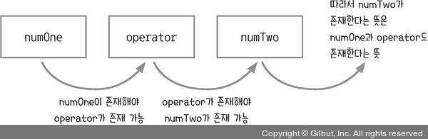
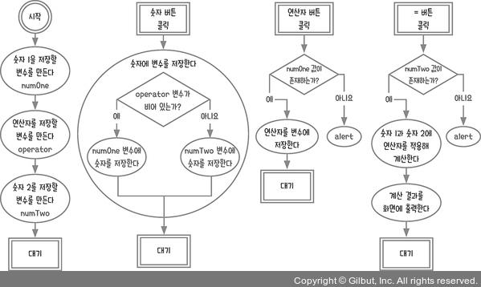
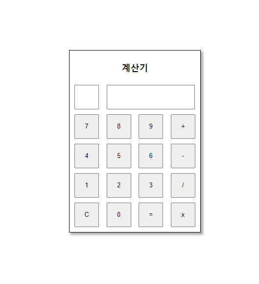
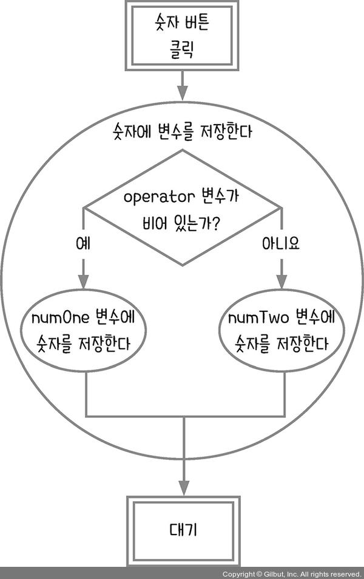
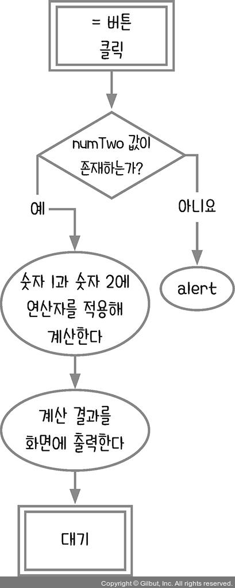
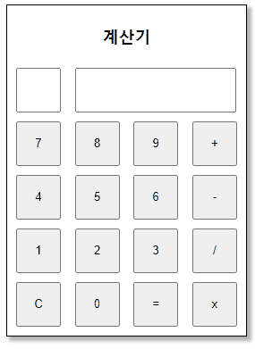

# 4장 함수 사용하기_계산기

- [4.1 순서도 그리기](#41-순서도-그리기)
- [4.2 계산기를 화면 만들고 이벤트 달기](#42-계산기를-화면-만들고-이벤트-달기)
- [4.3 고차 함수로 중복 제거하기](#43-고차-함수로-중복-제거하기)
  - [1분 퀴즈 1번 문제](#1분-퀴즈-1번-문제)
- [4.4 중첩 if 문 줄이기](#44-중첩-if-문-줄이기)
  - [1분 퀴즈 2번 문제](#1분-퀴즈-2번-문제)
- [4.5 결과 계산하기](#45-결과-계산하기)
  - [1분 퀴즈 3번 문제](#1분-퀴즈-3번-문제)
- [4.6 계산기 초기화하기](#46-계산기-초기화하기)
- [마무리 요약](#마무리-요약)
  - [고차 함수 사용하기](#고차-함수-사용하기)
  - [if 문 중첩 제거하기](#if-문-중첩-제거하기)
- [Self Check 연이어 계산하기](#self-check-연이어-계산하기)
  - [소스 코드](#소스-코드)
  - [결과](#결과)

## 4.1 순서도 그리기


단순히 생각하면 위와 같이 그릴 것이다. 자바스크립트 프로그램의 순서도를 만들 때 사용자 이벤트를 기준으로 순서도를 끊어야 한다고 했다. 계산기는 사용자가 숫자나 연산자 버튼을 클릭해 여러 가지 계산을 하는 장치이다. 따라서 클릭 이벤트가 많이 발생한다. 그리고 사용자가 입력한 숫자나 연산자를 저장하고 있어야 = 버튼 클릭 시 결과를 계산할 수 있다.

각각의 경우를 고려해 만든 순서도는 아래와 같다.


'숫자를 변수에 저장한다' 절차에서 숫자 1과 숫자 2중에 어떤 숫자에 저장해야 하는지 판단해야 하는 절차의 순서도는 아래와 같다.


10 - 5를 생각해 보자. 먼저 1을 누르면 숫자 1에 저장하고 연산자를 누르기 전까지 숫자 1에 추가로 저장해야 한다. 문자열 변수를 사용하거나 배열에 담아서 다시 문자열로 만드는 형태로도 할 수 있다.

```js
// 문자열 변수를 사용
const numberOne = '10';
Number(numberOne) === 10; // true

// 숫자를 배열에 담아서 문자열로 변환
[1, 0].join('') === '10'; // true
Number([1, 0].join('')) === 10; // true
```

`join()` 메서드는 배열의 모든 요소를 연결해 하나의 문자열로 만들어준다. 매개변수는 구분할 문자열을 지정하기 위해 구분자를 넣는다. 구분자가 없다면 쉼표로 구분된다. 빈 문자열이면 모든 요소들 사이에 아무 문자도 없이 연결된다.

```js
[1, 0].join() === '1,0'; // true
[1, 0].join('-') === '1-0'; // true
```

이처럼 같은 내용을 구현하더라도 여러 방식으로 구현할 수 있다.

이번에는 숫자를 누르지 않고 연산자 버튼이나 = 버튼을 먼저 누른 경우를 생각해 보자. 이럴 때는 경고 메시지를 띄우거나 입력 처리가 되지 않도록 하면 된다.

연산자 버튼을 누를 때는 숫자 1에 값이 있는지 확인하고, = 버튼을 누를 때는 숫자 2에 값이 있는지 확인하면 된다. 이렇게 변수의 관계와 절차를 생각하면 정리가 된다.



이 내용들을 바탕으로 순서도를 다음과 같이 수정한다.



## 4.2 계산기를 화면 만들고 이벤트 달기

계산기 화면을 만들어야한다. `calculator.html` 파일을 만들고 다음과 같이 코드를 작성한다. 책에 나와있는 코드에서 조금 더 이쁘게 스타일만 잡아놨다.

```html
<!DOCTYPE html>
<html lang="ko">
<head>
  <meta charset="UTF-8">
  <meta http-equiv="X-UA-Compatible" content="IE=edge">
  <meta name="viewport" content="width=device-width, initial-scale=1.0">
  <title>계산기</title>
  <style>
    * { box-sizing: border-box }
    body { margin: 0; padding: 0; }
    .flex { display: flex; height: 100vh; justify-content: center; align-items: center;}
    .content { padding: 5px; border: 1px solid black; box-shadow: 4px 4px 4px 1px rgba(0, 0, 0, 0.3); }
    .title { font-size: large; font-weight: bold; text-align: center; }
    #result { width: 180px; height: 50px; margin: 5px; text-align: right }
    #operator { width: 50px; height: 50px; margin: 5px; text-align: center }
    button { width: 50px; height: 50px; margin: 5px; }
  </style>
</head>

<body>
  <section class="flex">
    <div class="content">
      <p class="title">계산기</p>
      <input readonly id="operator">
      <input readonly type="number" id="result">
      <div class="row">
        <button id="num-7">7</button>
        <button id="num-8">8</button>
        <button id="num-9">9</button>
        <button id="plus">+</button>
      </div>
      <div class="row">
        <button id="num-4">4</button>
        <button id="num-5">5</button>
        <button id="num-6">6</button>
        <button id="minus">-</button>
      </div>
      <div class="row">
        <button id="num-1">1</button>
        <button id="num-2">2</button>
        <button id="num-3">3</button>
        <button id="divide">/</button>
      </div>
      <div class="row">
        <button id="clear">C</button>
        <button id="num-0">0</button>
        <button id="calculate">=</button>
        <button id="multiply">x</button>
      </div>
    </div>
  </section>
  <script>
  </script>
</body>
</html>
```



그리고 이제 각 버튼에 이벤트 리스너를 달아야 한다.

```html
<script>
  let numOne = '';
  let operator = '';
  let numTwo = '';
  const $operator = document.querySelector('#operator');
  const $result = document.querySelector('#result');
  document.querySelector('#num-0').addEventListener('click', () => { });
  document.querySelector('#num-1').addEventListener('click', () => { });
  document.querySelector('#num-2').addEventListener('click', () => { });
  document.querySelector('#num-3').addEventListener('click', () => { });
  document.querySelector('#num-4').addEventListener('click', () => { });
  document.querySelector('#num-5').addEventListener('click', () => { });
  document.querySelector('#num-6').addEventListener('click', () => { });
  document.querySelector('#num-7').addEventListener('click', () => { });
  document.querySelector('#num-8').addEventListener('click', () => { });
  document.querySelector('#num-9').addEventListener('click', () => { });
  document.querySelector('#plus').addEventListener('click', () => { });
  document.querySelector('#minus').addEventListener('click', () => { });
  document.querySelector('#divide').addEventListener('click', () => { });
  document.querySelector('#multiply').addEventListener('click', () => { });
  document.querySelector('#calculate').addEventListener('click', () => { });
  document.querySelector('#clear').addEventListener('click', () => { });
</script>
```



`숫자에 변수를 저장한다` 절차를 다음과 같이 코드를 작성할 수 있다.

```js
document.querySelector('#num-0').addEventListener('click', () => {
  if (operator) {
    numTwo += '0';
  } else {
    numOne += '0';
  }
  $result.value += '0';
});
document.querySelector('#num-1').addEventListener('click', () => { 
  if (operator) {
    numTwo += '1';
  } else {
    numOne += '1';
  }
  $result.value += '1';
});
```

문자열로 더해주어야 자릿수를 이용할 수 있다. 저런 식으로 나머지도 작성한다면 코드가 중복된다.

## 4.3 고차 함수로 중복 제거하기

함수의 특성을 이용하여 코드의 중복을 제거한다.

`고차 함수`란 하나 이상의 함수를 인수를 취하거나 함수를 결과로 반환하는 것을 말한다.

```js
const func = (msg) => {
  return () => {
    console.log(msg);
  }
}

// return 과 중괄호를 생략하면 아래와 같다.
const func2 = (msg) => () => {
  console.log(msg);
}
```

이제 고차 함수를 이용하여 숫자에 대한 클릭 이벤트 리스너를 바꿀 수 있다.

```js
const onClickNumber = (number) => () => {
  if (operator) {
    numTwo = number;
  } else {
    numOne = number;
  }
  $result.value += number;
};
document.querySelector('#num-0').addEventListener('click', onClickNumber('0'));
document.querySelector('#num-1').addEventListener('click', onClickNumber('1'));
/* 이하 동일 ... */
```

위와 같이 할 수도 있지만 버튼 안에 모두 숫자가 들어 있어서 버튼 클릭할 때 내부의 문자를 `event.target.textContent`로 가져와서 작성하면 `onClickNumber` 함수의 코드를 같게 만들 수 있다.

```js
const onClickNumber = (event) => {
  if (operator) {
    numTwo = event.target.textContent;
  } else {
    numOne = event.target.textContent;
  }
  $result.value += event.target.textContent;
};
document.querySelector('#num-0').addEventListener('click', onClickNumber);
document.querySelector('#num-1').addEventListener('click', onClickNumber);
/* 이하 동일 ... */
```

고차 함수를 소개한 이유는 '모든 내부 코드가 같은'함수보다 '대부분 다 비슷한데 특정 부분만 다른'함수가 실무에서는 더 많이 나오기 때문이라고 한다.

연산자 버튼을 누를 때도 다음과 같이 고차 함수를 사용해 연산자를 저장할 수 있다.

```js
const onClickOperator = (op) => () => {
  if (numOne) {
    operator = op;
    $operator.value = op;
  } else {
    alert('숫자를 먼저 입력하세요.');
  }
};

document.querySelector('#plus').addEventListener('click',  onClickOperator('+'));
document.querySelector('#minus').addEventListener('click', onClickOperator('-'));
document.querySelector('#divide').addEventListener('click', onClickOperator('/'));
document.querySelector('#multiply').addEventListener('click', onClickOperator('*'));
```

### 1분 퀴즈 1번 문제

다음의 코드의 console.log 결과를 맞혀 보세요.

```js
const hof = (a) => (b) => (c) => {
  return a + (b * c);
}
const first = hof(3);
const second = first(4);
const third = second(5);
console.log(third);
```

고차 함수를 이해하면 결과가 왜 그렇게 나오는지 알 수 있다. 힌트를 주자면 일반적으로 함수에서는 리턴을 1번만 할 수 있다.

## 4.4 중첩 if 문 줄이기

지금까지 작성한 코드를 실행해보면 두 번째 숫자를 클릭하면 첫 번째 숫자와 합쳐지는 버그가 발생한다. 3 + 4를 수행해보면 알 수 있다. 34가 되어 버린다.

그래서 연산자 버튼을 클릭할 때 화면을 비우는 작업을 추가한다.

```js
const onClickOperator = (op) => () => {
  if (numOne) {
    if (!numTwo) {
      $result.value = '';
    }
    operator = op;
    $operator.value = op;
  } else {
    alert('숫자를 먼저 입력하세요.');
  }
};
```

`중첩 if 문`이란 if문 내부에 if문이 있는 것을 말한다. if 문 중첩은 분기점이 많은 경우 사용한다.

```js
if (조건A) {
  if (조건B) {
    if (조건C) {
    }
  } else {
    if (조건D) {
      // 나는 어느 때 실행되지?
      if (조건E) {
      } else {
        // 나는?
      }
      // 나는?
    } else {
    }
  }
}
```

기존 코드의 중첩을 제거하는 방법은 아래와 같다.

1. if 문 다음에 나오는 공통된 절차를 각 분기점 내부에 넣는다.
2. 분기점에서 짧은 절차부터 실행하게 if 문을 작성한다.
3. 짧은 절차가 끝나면 return(함수 내부의 경우)이나 break(for 문 내부의 경우)로 중단한다.
4. else를 제거한다(이때 중첩 하나가 제거된다).
5. 다음 중첩된 분기점이 나오면 1~4의 과정을 반복한다.

onClickNumber 함수를 예를 들겠다.
첫 번째 단계로 if 문과 상관없이 공통적으로 실행되는 부분은 `$result.value += event.target.textContent;` 이다. 이 부분을 각 분기점 안에 넣는다.

```js
const onClickNumber = (event) => {
  if (operator) {
    if (!numTwo) {
      $result.value = '';
    }
    numTwo += event.target.textContent;
    $result.value += event.target.textContent; // 공통
  } else {
    numOne += event.target.textContent;
    $result.value += event.target.textContent; // 공통
  }
};
```

두 번째 단계로 어떤 분기점의 절차가 더 짧은지 확인한다. operator가 없는 경우의 절차가 더 짧다.

```js
const onClickNumber = (event) => {
  // operator -> !operator
  if (!operator) { 
    numOne += event.target.textContent;
    $result.value += event.target.textContent;
  } else {
    if (!numTwo) {
      $result.value = '';
    }
    numTwo += event.target.textContent;
    $result.value += event.target.textContent;
  }
};
```

세 번째 단계로 !operator일 때 절차가 마무리되면 return으로 함수를 종료한다.

```js
const onClickNumber = (event) => {
  if (!operator) {
    numOne += event.target.textContent;
    $result.value += event.target.textContent;
    return;
  }
  // 이 아래로는 operator가 존재하는 경우에만 실행됨
  if (!numTwo) {
    $result.value = '';
  }
  numTwo += event.target.textContent;
  $result.value += event.target.textContent;
};
```

### 1분 퀴즈 2번 문제

다음 if 문의 중첩을 줄여보세요.

```js
function test() { 
  let result = ''; 
  if (a) { 
    if (!b) { 
      result = 'c'; 
    } 
  } else { 
    result = 'a'; 
  } 
  result += 'b'; 
  return result; 
}
```

위에서 배운 대로 적용하면 아래와 같다.

```js
function test() {
  let result = '';
  if (!a) { // 두 번째 짧은 절차
    result = 'a';
    result += 'b'; // 첫 번째 공통
    return result; // 세 번째 짧은 절차에서 리턴
  } // 네 번쨰 else를 제거
  
  if (!b) {
    result = 'c';
  }
  result += 'b'; // 첫 번째 공통
  return result;
}
```

## 4.5 결과 계산하기

이제 `#calculate` 태그에 이벤트 리스너를 달아 결과를 출력할 차례이다.



문자열을 연산자로 바꿀 수 없다. 하지만 문자열에 따라 다른 연산자를 사용하도록 조건문을 사용해 분기 처리를 할 수 있다.

```js
document.querySelector('#calculate').addEventListener('click', () => {
  if (numTwo) {
    switch (operator) {
      case '+':
        $result.value = parseInt(numOne) + parseInt(numTwo);
        break;
      case '-':
        $result.value = numOne - numTwo;
        break;
      case '*':
        $result.value = numOne * numTwo;
        break;
      case '/':
        $result.value = numOne / numTwo;
        break;
      default:
        break;
    }
  } else {
    alert('숫자를 먼저 입력하세요.');
  }
});
```

더하기의 경우 `parseInt`를 사용하여 문자열과의 더하기가 아닌 숫자로 형 변환하여 더한다.

`eval`함수를 사용하면 문자열을 자바스립트 코드처럼 실행할 수 있다.

```js
eval('1 + 2'); // 3
```

조건문으로 분기 처리한 코드를 아래와 같이 줄일 수 있다.

```js
document.querySelector('#calculate').addEventListener('click', () => {
  if (numTwo) {
    $result.value = eval(numOne + operator + numTwo);
  } else {
    alert('숫자를 먼저 입력하세요.');
  }
});
```

코드가 간단해져서 편리한 기능이지만, eval 함수를 남용하면 해커가 악용할 가능성이 있다고 한다. eval 함수에 문자열을 입력하면 그대로 실행되므로 해커가 이를 통해 우리 프로그램에 위험한 코드를 실행할 수도 있다. 따라서 실무에서는 eval 함수의 사용을 피하는 것이 보안상 안전하다고 한다.

### 1분 퀴즈 3번 문제

`(가)` 부분에 어떤 문자열을 넣으면 alert 창이 실행될까요? 단, eval의 실행을 막은 사이트들도 있으므로 calculator.html을 띄운 창의 콘솔에서 실행해야 합니다.

```js
const str = (가); 
eval('a'+ str +'t("eval은 위험해요")');
```

정답은 `ler`이다. `alert('eval은 위험해요');` 코드와 같고, 실행하면 대화 상자에 'eval은 위험해요' 라는 메시지를 표시한다.

## 4.6 계산기 초기화하기

`#clear` 태그(C 버튼)가 클릭되는 것을 감지할 이벤트 리스너에 모든 것을 초기화하는 코드를 작성한다.

```js
document.querySelector('#clear').addEventListener('click', () => {
  numOne = '';
  operator = '';
  numTwo = '';
  $operator.value = '';
  $result.value = '';
});
```

현재까지 구현된 코드로는 단 한번만 계산할 수 있다.

## 마무리 요약

이 장에서 배운 내용을 정리해 보겠습니다.

### 고차 함수 사용하기

함수를 호출할 때마다 반환 함수를 생성하는 함수를 고차 함수(high order function)라고 합니다.

```js
const func = () => {
  return () => {
    console.log('hello');
  };
};
```

반환된 함수는 다른 변수에 저장할 수 있고, 그 변수에 저장된 함수를 다시 호출할 수 있습니다.

```js
const innerFunc = func();
innerFunc(); // hello
```

반환하는 값을 바꾸고 싶을 때는 매개변수를 사용합니다.

```js
const func = (msg) => {
    return () => {
        console.log(msg);
    };
};
```

화살표 함수 문법에 따라 함수의 본문에서 바로 반환되는 값이 있으면 {와 return을 생략할 수 있습니다.

```js
const func = (msg) => () => {
  console.log(msg);
};
```

### if 문 중첩 제거하기

if 문이 중첩되면 코드를 파악하기 어렵습니다. 다음과 같은 방법으로 if 문의 중첩을 제거합니다.

1. 공통된 절차를 각 분기점 내부에 넣는다.
2. 분기점에서 짧은 절차부터 실행하게 if 문을 작성한다.
3. 짧은 절차가 끝나면 return(함수 내부의 경우)이나 break(for 문 내부의 경우)로 중단한다.
4. else를 제거한다(이때 중첩 하나가 제거된다).
5. 다음 중첩된 분기점이 나올 때 1~4의 과정을 반복한다.

## Self Check 연이어 계산하기

앞에서 만든 계산기는 계산을 단 한 번만 할 수 있습니다. 한 번 계산한 후에는 C 버튼을 눌러 초기화하지 않는 이상 제대로 작동하지 않습니다. 1 + 2 + 4처럼 계산하고 싶다면 코드를 어떻게 수정하면 될까요?

힌트: 1 + 2 + 4를 실제로 계산기에 입력하면 버튼을 1, +, 2, =, +, 4, = 순으로 눌러야 합니다. 두 번째 +를 눌렀을 때 numOne, operator, numTwo 변수가 어떤 값을 갖고 있어야 할지 생각해 보세요.

개인적인 도전으로 아래와 같은 것들을 시도했다.

1. 계산 입력된 숫자나 연산자 미리보기
2. 계산이 끝난 후 연산자가 아닌 숫자를 누르게 되면 숫자가 꼬여버리는 버그 수정

### 소스 코드

```html
<!DOCTYPE html>
<html lang="ko">
<head>
  <meta charset="UTF-8">
  <meta http-equiv="X-UA-Compatible" content="IE=edge">
  <meta name="viewport" content="width=device-width, initial-scale=1.0">
  <title>계산기</title>
  <style>
    * { box-sizing: border-box }
    body { margin: 0; padding: 0; }
    .flex { display: flex; height: 100vh; justify-content: center; align-items: center; }
    .content { 
      padding: 5px; border: 1px solid black; 
      box-shadow: 4px 4px 4px 1px rgba(0, 0, 0, 0.3); 
    }
    .title { font-size: large; font-weight: bold; text-align: center; }
    .number-container { display: inline-block; position: relative; }
    /* preview 문자열이 일정 길이 이상 초과되면 ...으로 표시한다. */
    .preview { 
      position: absolute; top: 3px; left: 10px; margin: 0px; 
      width: 170px; text-align: right; font-size: small; color:gray; 
      white-space: nowrap; overflow: hidden; text-overflow: ellipsis;
    }
    #result { width: 180px; height: 50px; margin: 5px; text-align: right; }
    #operator { width: 50px; height: 50px; margin: 5px; text-align: center; }
    button { width: 50px; height: 50px; margin: 5px; }
  </style>
</head>

<body>
  <section class="flex">
    <div class="content">
      <p class="title">계산기</p>
      <input readonly id="operator">
      <div class="number-container">
        <p class="preview"></p>
        <input readonly type="number" id="result">
      </div>
      <div class="row">
        <button id="num-7">7</button>
        <button id="num-8">8</button>
        <button id="num-9">9</button>
        <button id="plus">+</button>
      </div>
      <div class="row">
        <button id="num-4">4</button>
        <button id="num-5">5</button>
        <button id="num-6">6</button>
        <button id="minus">-</button>
      </div>
      <div class="row">
        <button id="num-1">1</button>
        <button id="num-2">2</button>
        <button id="num-3">3</button>
        <button id="divide">/</button>
      </div>
      <div class="row">
        <button id="clear">C</button>
        <button id="num-0">0</button>
        <button id="calculate">=</button>
        <button id="multiply">x</button>
      </div>
    </div>
  </section>
  <script>
    let numOne = '';
    let operator = '';
    let numTwo = '';
    let isCalculate = false;
    const $operator = document.querySelector('#operator');
    const $result = document.querySelector('#result');
    const $preview = document.querySelector('.preview'); // 계산 입력 미리보기
    const onClickNumber = (event) => {
      if (!operator) {
        /* 
          개인 미션 2. 계산이 끝난 후 연산자가 아닌 숫자를 누르게 되면 
          숫자가 꼬여버리는 버그 수정
          1 + 4 + 5 같이 연산하고자 할 때 1 + 4 = 5 + 5의 순서로 진행하는데
          1 + 4 = 5의 상황에서 숫자를 입력하면 계산이 꼬여버린다.
        */
        if (isCalculate) { 
          clear();
        }
        numOne += event.target.textContent;
        $result.value += event.target.textContent;
        $preview.textContent += event.target.textContent;
        return;
      }
      if (!numTwo) {
        $result.value = '';
      }
      numTwo += event.target.textContent;
      $result.value += event.target.textContent;
      $preview.textContent += event.target.textContent;
    };
    document.querySelector('#num-0').addEventListener('click', onClickNumber);
    document.querySelector('#num-1').addEventListener('click', onClickNumber);
    document.querySelector('#num-2').addEventListener('click', onClickNumber);
    document.querySelector('#num-3').addEventListener('click', onClickNumber);
    document.querySelector('#num-4').addEventListener('click', onClickNumber);
    document.querySelector('#num-5').addEventListener('click', onClickNumber);
    document.querySelector('#num-6').addEventListener('click', onClickNumber);
    document.querySelector('#num-7').addEventListener('click', onClickNumber);
    document.querySelector('#num-8').addEventListener('click', onClickNumber);
    document.querySelector('#num-9').addEventListener('click', onClickNumber);
    const onClickOperator = (op) => () => {
      if (numOne) {
        operator = op;
        $operator.value = op;

        /* 
          개인 미션 1. 계산 입력된 숫자나 연산자 미리보기
          연산자를 +++ 같이 여러번 누르거나, + 에서 - 같이 바꾸는 경우
          기존에 있던 연산자는 지운다. 
        */
        const lastChar = $preview.textContent[$preview.textContent.length - 1];
        if ((/[^0-9]/g).exec(lastChar)) {
          $preview.textContent = $preview.textContent.slice(0, -1)
        }
        $preview.textContent += op;
      } else {
        alert('숫자를 먼저 입력하세요.');
      }
    };
    document.querySelector('#plus').addEventListener('click', onClickOperator('+'));
    document.querySelector('#minus').addEventListener('click', onClickOperator('-'));
    document.querySelector('#divide').addEventListener('click', onClickOperator('/'));
    document.querySelector('#multiply').addEventListener('click', onClickOperator('*'));
    document.querySelector('#calculate').addEventListener('click', (event) => {
      if (numTwo) {
        switch (operator) {
          case '+':
            $result.value = parseInt(numOne) + parseInt(numTwo);
            break;
          case '-':
            $result.value = numOne - numTwo;
            break;
          case '*':
            $result.value = numOne * numTwo;
            break;
          case '/':
            $result.value = numOne / numTwo;
            break;
          default:
            break;
        }
        $operator.value = '=';
        numOne = $result.value;
        numTwo = '';
        operator = '';
        isCalculate = true;
        $preview.textContent += event.target.textContent + $result.value;
      } else {
        alert('숫자를 먼저 입력하세요.');
      }
    });
    const clear = () => {
      numOne = '';
      operator = '';
      numTwo = '';
      $operator.value = '';
      $result.value = '';
      $preview.textContent = '';
      isCalculate = false;
    }
    document.querySelector('#clear').addEventListener('click', clear);
  </script>
</body>
</html>
```

### 결과


