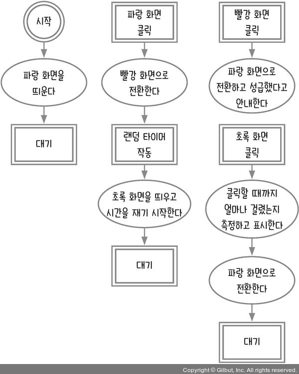
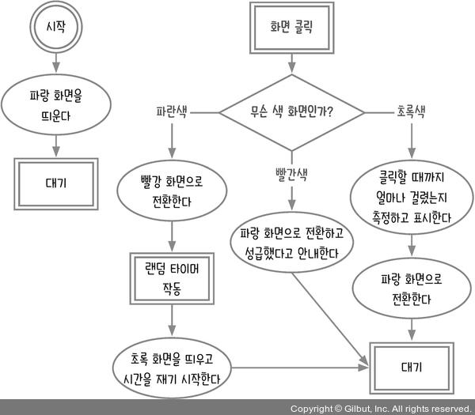
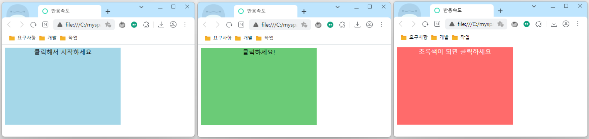
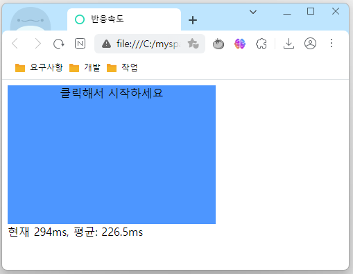
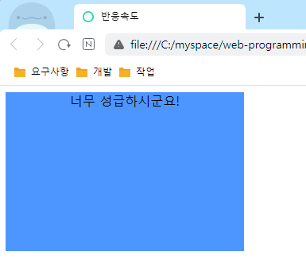
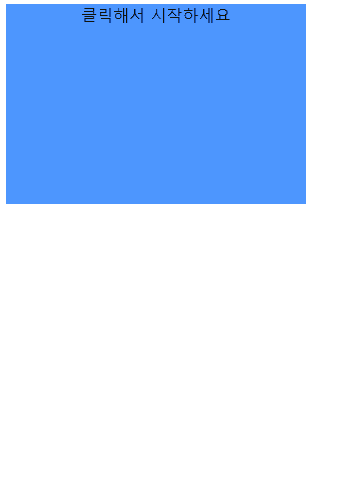

# 8장 Date 사용하기_반응속도 테스트

이 장에서는 반응속도가 얼마나 빠른지 확인하는 반응속도 테스트 프로그램을 만든다. 시간 측정을 위해 Date 객체를 사용한다. 반응속도를 기록하고 평균을 내어 화면에 표시한다.

- [8.1 순서도 그리기](#81-순서도-그리기)
  - [코드 작성](#코드-작성)
- [8.2 클릭할 때 화면 전환하기](#82-클릭할-때-화면-전환하기)
  - [1분 퀴즈 1번 문제](#1분-퀴즈-1번-문제)
- [8.3 반응속도 측정하기](#83-반응속도-측정하기)
  - [1분 퀴즈 2번 문제](#1분-퀴즈-2번-문제)
- [8.4 평균 반응속도 구하기](#84-평균-반응속도-구하기)
  - [1분 퀴즈 3번 문제](#1분-퀴즈-3번-문제)
- [8.5 성급한 클릭 막기](#85-성급한-클릭-막기)
- [마무리 요약](#마무리-요약)
  - [classList](#classlist)
  - [Date](#date)
  - [배열.reduce](#배열reduce)
- [Self Check 속도 순으로 정렬하기](#self-check-속도-순으로-정렬하기)
  - [소스코드](#소스코드)
  - [결과](#결과)

## 8.1 순서도 그리기

사용자는 처음에 대기 화면인 파랑 화면을 보게 된다. 여기서 화면을 한 번 클릭하면 빨강 화면으로 전환되는데, 빨강 화면은 준비 화면을 의미한다.

준비 화면에서는 임의의 시간이 지난 후에 초록 화면으로 자동 전환된다. 초록 화면을 보자마자 클릭하면 초록 화면이 뜬 시각과 클릭한 시각의 차이를 구해 반응속도를 측정한다. 만약 준비 화면(빨강)일 때 클릭하면 성급했다는 메시지가 나오고 다시 클릭하도록 대기 화면(파랑)으로 보낸다.



화면과 관련해서 생각해 볼 점이 있다. 테스트할 때 파랑 화면, 빨강 화면, 초록 화면이 각각 따로 있는 것이 아니라 한 화면에서 색만 바뀐다. 따라서 이벤트를 연결할 대상인 화면은 하나뿐이다. 이를 고려해 다시 순서도를 만들어보자.



### 코드 작성

```html
<!DOCTYPE html>
<html lang="ko">
<head>
  <meta charset="UTF-8">
  <meta http-equiv="X-UA-Compatible" content="IE=edge">
  <meta name="viewport" content="width=device-width, initial-scale=1.0">
  <title>반응속도</title>
  <style>
    #screen {
      width: 300px;
      height: 200px;
      text-align: center;
      user-select: none;
    }
    #screen.waiting {
      background-color: aqua;
    }
    #screen.ready {
      background-color: red;
      color: white;
    }
    #screen.now {
      background-color: greenyellow;
    }
  </style>
</head>
<body>
  <div id="screen" class="waiting">클릭해서 시작하세요</div>
  <div id="result"></div>
  <script>
    const $screen = document.querySelector('#screen');
    const $result = document.querySelector('#result');
  </script>
</body>
</html>
```

CSS로 클래스별 색을 미리 지정해 둡니다. waiting 클래스가 붙으면 대기 화면인 파란색이 되고, ready 클래스가 붙으면 준비 화면인 빨간색이 됩니다. now 클래스가 붙으면 클릭 화면인 초록색이 된다.



## 8.2 클릭할 때 화면 전환하기

태그에 해당 클래스가 들어 있는지 다음 방법으로 알 수 있다.

```js
태그.classList.contains('클래스');
```

해당 클래스가 들어 있다면 true, 들어 있지 않다면 false가 된다. 따라서 다음과 같이 분기 처리를 할 수 있다.

```js
const $screen = document.querySelector('#screen');
const $result = document.querySelector('#result');

$screen.addEventListener('click', function () {
  if ($screen.classList.contains('waiting')) { // 대기 화면
  } else if ($screen.classList.contains('ready')) { // 준비 화면
  } else if ($screen.classList.contains('now')) { // 클릭 화면
  }
});
```

반응속도 테스트는 대기 화면에서 시작하므로 대기 화면을 클릭하면 준비 화면으로 넘어가야 한다. 따라서 waiting 클래스를 제거하고, ready 클래스를 추가하면 된다. 클래스의 추가, 수정, 제거는 다음과 같이 할 수 있다.

```js
태그.classList.add('클래스'); // 추가
태그.classList.replace('기존 클래스', '수정 클래스'); // 수정
태그.classList.remove('클래스'); // 제거
```

이를 코드에 다음과 같이 적용한다.

```js
$screen.addEventListener('click', function () {
  if ($screen.classList.contains('waiting')) { // 대기 화면
    $screen.classList.remove('waiting');
    $screen.classList.add('ready');
    $screen.textContent = '초록색이 되면 클릭하세요';
  } else if ($screen.classList.contains('ready')) { // 준비 화면
  } else if ($screen.classList.contains('now')) { // 클릭 화면
  }
});
```

remove와 add를 하는 대신 replace로 한 번에 바꿔도 된다.

이제 타이머를 작동해 일정 시간이 지난 뒤에 클릭 화면으로 넘어가게 한다. 사용자가 예측하지 못하게 무작위로 시간을 설정 한다. 여기서는 2~3초 사이로 설정 한다.

```js
$screen.addEventListener('click', function () {
  if ($screen.classList.contains('waiting')) { // 대기 화면
    $screen.classList.remove('waiting');
    $screen.classList.add('ready');
    $screen.textContent = '초록색이 되면 클릭하세요';
    setTimeout(function () {
      $screen.classList.remove('ready');
      $screen.classList.add('now');
      $screen.textContent = '클릭하세요!';
    }, Math.floor(Math.random() * 1000) + 2000); // 2000~3000 사이 수
  } else if ($screen.classList.contains('ready')) { // 준비 화면
  } else if ($screen.classList.contains('now')) { // 클릭 화면
  }
});
```

### 1분 퀴즈 1번 문제

다음 태그의 클래스는 어떻게 될까요?

```js
태그.classList.add('hello', 'hi', 'hello', 'bye');
태그.classList.replace('bye', 'seeu');
태그.classList.remove('bye');
```

나의 풀이는 아래와 같다.

첫 번째의 경우 태그에 `hello, hi, bye` 클래스가 추가된다. 중복은 무시된다.
두 번째의 경우 태그에 `bye` 클래스가 `seeu` 클래스로 변경된다.
세 번째의 경우 태그에 제거되는 클래스는 없다. `bye`는 `seeu` 클래스로 변경되어 없기 때문이다.

결론적으로 태그의 클래스는 `hello, hi, seeu`으로 설정 된다.

한 가지 발견된 부분은 `태그.classList.replace` 함수의 경우 변경되었으면 true, 변경되지 않았으면 false를 반환한다.

> 자세한 classList에 대한 내용은 링크를 참고
> <https://developer.mozilla.org/en-US/docs/Web/API/DOMTokenList>

## 8.3 반응속도 측정하기

일정 시간이 지난 후에 클릭 화면으로 전환하면서 현재 시각을 잰다. 이게 시작 시각이 된다. 이후 클릭 화면이 됐을 때 사용자가 한 번 더 클릭하면 그 시각이 종료 시각이 된다. 이때 두 시각의 차가 반응속도가 된다.

현재 시각은 다음과 같이 얻을 수 있다.

```js
new Date();

// 직접 시각을 지정하는 방법 (연, 월, 일, 시, 분, 초)
// 특이하게 월만 0(0이 1월)부터 시작 한다.
new Date(2021, 2, 31); // Wed Mar 31 2021 00:00:00 GMT+0900 (대한민국 표준시)
new Date(2021, 2, 31, 18, 30, 5); // Wed Mar 31 2021 18:30:05 GMT+0900 (대한민국 표준시)
```

new Date끼리 빼면 밀리초 단위로 얼마나 시간 차이가 나는지 나온다.

```js
const $screen = document.querySelector('#screen');
const $result = document.querySelector('#result');
let startTime;
let endTime;

$screen.addEventListener('click', function () {
  if ($screen.classList.contains('waiting')) { // 대기 화면
    $screen.classList.remove('waiting');
    $screen.classList.add('ready');
    $screen.textContent = '초록색이 되면 클릭하세요';
    setTimeout(function () {
      startTime = new Date();
      $screen.classList.remove('ready');
      $screen.classList.add('now');
      $screen.textContent = '클릭하세요!';
    }, Math.floor(Math.random() * 1000) + 2000); // 2000~3000 사이 수
  } else if ($screen.classList.contains('ready')) { // 준비 화면

  } else if ($screen.classList.contains('now')) { // 클릭 화면
    endTime = new Date();
    $result.textContent = `${endTime - startTime}ms`;
    $screen.classList.remove('now');
    $screen.classList.add('waiting');
    $screen.textContent = '클릭해서 시작하세요';
  }
});
```

### 1분 퀴즈 2번 문제

2021년 2월 21일과 2021년 3월 3일은 며칠 차이가 날까요?

나의 풀이는 아래와 같다.

```js
const diff = new Date(2021, 1, 21) - new Date(2021, 2, 3);
const diffDays = Math.abs(diff / 1000 / 60 / 60 / 24);
console.log(diffDays); // 10
```

10일 차이가 난다. `Math.abs`는 주어진 숫자의 절대값으로 반환하는 함수이다.

차이 값이 밀리초(ms)이기 때문에, 초(s) -> 분(m) -> 시간(h) -> 일(d)으로 만들기 위해 값을 나누어야 한다.

## 8.4 평균 반응속도 구하기

이번에는 테스트틀 반복적으로 수행해서 평균 반응속도를 구해보자. 평균 반응속도를 구하려면 기존 반응속도를 모두 기록해야 한다.

```js
const $screen = document.querySelector('#screen');
const $result = document.querySelector('#result');
let startTime;
let endTime;
const records = [];

$screen.addEventListener('click', function () {
  if ($screen.classList.contains('waiting')) { // 대기 화면
    ...
  } else if ($screen.classList.contains('ready')) { // 준비 화면
  } else if ($screen.classList.contains('now')) { // 클릭 화면
    endTime = new Date();
    const current = endTime - startTime;
    records.push(current);
    const average = records.reduce((a, c) => a + c) / records.length;
    $result.textContent = `현재 ${current}ms, 평균: ${average}ms`;
    startTime = null;
    endTime = null;
    $screen.classList.remove('now');
    $screen.classList.add('waiting');
    $screen.textContent = '클릭해서 시작하세요';
  }
});
```

반복해서 측정해야 하므로 측정이 끝날 때마다 startTime과 endTime을 null로 비운다. 평균 반응속도를 측정하면 다음과 같이 나온다.



다음은 배열에 저장된 값들의 평균을 구하는 코드이다. 모든 값을 더한 후 전체 개수로 나누면 된다.

```js
const average = records.reduce((a, c) => a + c) / records.length;
```

`reduce` 함수를 사용했는데, 이 함수는 배열의 값들을 하나의 새로운 값으로 합치는 메서드로 다음과 같이 구성된다.

```js
배열.reduce((누적값, 현잿값) => {
  return 새로운누적값;
}, 초깃값);
```

초깃값이 없으면 배열의 첫 번째 요소가 초깃값이 된다.

```js
[1, 2, 3, 4, 5].reduce((a, c) => {
  return a + c;
}, 0);
```

초깃값이 0이 첫 번째 누적값(a)이 되고, 배열의 첫 번째 요소가 현잿값(c)이 된다. a + c를 한 반환값은 다음 번 누적값이 된다. 이런 식으로 배열의 마지막 요소까지 함수가 반복해서 실행된다.

|||||||
|---|---|---|---|---|---|
|a(누적값)|0|1|3|6|10|
|c(현잿값)|1|2|3|4|5|
|a + c(반환값)|1|3|6|10|15|

마지막으로 반환되는 값인 15가 `reduce`메서드의 결괏값이 된다. 함수는 모든 배열의 요소를 한 번씩 사용하고 있다. 즉, `reduce`메서드는 일종의 반복문 역할을 한다.

이번에는 초깃값을 제공하지 않고 해보겠다. 실행 순서가 어떻게 바뀔까?

```js
[1, 2, 3, 4, 5].reduce((a, c) => {
  return a + c;
});
```

`reduce` 메서드에 초깃값을 제공하지 않았으므로 첫 번째 요소인 1이 초깃값이 된다. 초깃값은 첫 번째 누적값으로 들어간다. 이때는 두 번째 요소부터 `reduce`를 적용하게 된다. 따라서 누적값(a) 1, 현잿값(c) 2인 상태로 함수가 시작된다. 반환값인 3은 다음 번의 누적 값이 된다.

||||||
|---|---|---|---|---|
|a(누적값)|1|3|6|10|
|c(현잿값)|2|3|4|5|
|a + c(반환값)|3|6|10|15|

### 1분 퀴즈 3번 문제

다음 코드의 결괏값을 예상해 보세요.

```js
[1, 2, 3, 4, 5].reduce((a, c) => {
  a[c] = c * 10;
  return a;
}, {});
```

나의 풀이는 다음과 같다.

```js
{ 1: 10, 2: 20, 3: 30, 4: 40, 5: 50 }
```

객체로 초깃값을 설정해서 0번째 인덱스 즉 1 값에 10이 들어간다.

그렇다면 초깃값을 설정하지 않으면 어떻게 될까?

```js
[1, 2, 3, 4, 5].reduce((a, c) => {
  a[c] = c * 10;
  console.log(a, c, a[c]);
  return a;
});
```

리턴되는 값은 계속 1이 된다. 실행 순서를 살펴보자.

```js
1. 초깃값에 `let a = 1`으로 설정된다.
2. 초깃값을 설정하지 않아서 2번째 요소 부터 반복된다.
3. a[2] = 2 * 10; // 콘솔 로그: 1 2 undefined
4. a[3] = 3 * 10; // 콘솔 로그: 1 3 undefined
5. a[4] = 4 * 10; // 콘솔 로그: 1 4 undefined
6. a[5] = 5 * 10; // 콘솔 로그: 1 5 undefined
7. return 1;
```

원하는 값으로 되지 않는 이유를 찾아보자면, 변수의 초깃값이 `number`타입이라서 객체나 배열 형식의 데이터로는 대입할 수 없다.

```js
let a = 30;
a[3] = 10; // 올바르지 못한 대입, 에러는 발생하지 않는다.
console.log(a); // 30

// 위의 a[3]은 undefined이다 아래 코드와 같다.
undefined = 10; // 에러가 발생하지 않는다. 10을 리턴한다.
```

신기한 일이다. undefined에 값을 대입을 해도 에러 나지 않는다. 한 번 더 테스트하고 싶은 궁금증이 생겼다.

```js
const a = undefined = [1, 2, 3];
console.log(a);
```

위 코드에서 `console.log(a)`의 결과가 어떻게 나올지 궁금하지 않는가?
로그에 찍힌 값은 `[1, 2, 3]`이다. 변수에 값을 대입하면 그 값이 리턴되기 때문에 여러 변수를 한 번에 초기화할 수 있다.

```js
let a1 = a2 = a3 = 50;
console.log(a1, a2, a3); // 50, 50, 50
```

## 8.5 성급한 클릭 막기

마음이 급하거나 예측 클릭을 해서 초록 화면이 될 때까지 기다리지 않고 빨간 화면에서 클릭할 때가 있다. 이때는 성급하게 클릭했다는 메시지를 띄워 주고 다시 시도하게 해야 한다. 또한, 초록 화면으로 넘어가는 타이머를 멈추고 대기 화면(파란 화면)으로 보내야 한다.

```js
const $screen = document.querySelector('#screen');
const $result = document.querySelector('#result');
let startTime;
let endTime;
const records = [];
let timeoutId; // timeoutId 추가

$screen.addEventListener('click', function () {
  if ($screen.classList.contains('waiting')) { // 대기 화면
    $screen.classList.remove('waiting');
    $screen.classList.add('ready');
    $screen.textContent = '초록색이 되면 클릭하세요';
    timeoutId = setTimeout(function () { // timeoutId
      startTime = new Date();
      $screen.classList.remove('ready');
      $screen.classList.add('now');
      $screen.textContent = '클릭하세요!';
    }, Math.floor(Math.random() * 1000) + 2000); // 2000~3000 사이 수
  } else if ($screen.classList.contains('ready')) { // 준비 화면
    // 준비 화면에서 클릭하면 타임아웃 중단, 메시지 표시
    clearTimeout(timeoutId);
    $screen.classList.remove('ready');
    $screen.classList.add('waiting');
    $screen.textContent = '너무 성급하시군요!';
  } else if ($screen.classList.contains('now')) { // 클릭 화면
    endTime = new Date();
    const current = endTime - startTime;
    records.push(current);
    const average = records.reduce((a, c) => a + c) / records.length;
    $result.textContent = `현재 ${current}ms, 평균: ${average}ms`;
    startTime = null;
    endTime = null;
    $screen.classList.remove('now');
    $screen.classList.add('waiting');
    $screen.textContent = '클릭해서 시작하세요';
  }
});
```

성급하게 클릭한 경우 아래 화면처럼 나올 것이다.



## 마무리 요약

### classList

태그.classList 객체를 통해 태그에 붙은 클래스를 조작할 수 있습니다. 해당 클래스가 존재하는지 확인하려면 contains 메서드를 사용합니다.

```js
태그.classList.contains('클래스');
```

해당 클래스를 추가하거나 수정 및 제거하려면 각각 add와 replace, remove 메서드를 사용합니다.

```js
태그.classList.add('클래스'); // 추가
태그.classList.replace('기존클래스', '수정클래스'); // 수정
태그.classList.remove('클래스'); // 제거
```

### Date

현재 시각을 알고 싶다면 다음과 같이 실행합니다.

```js
new Date();
```

시각을 직접 지정하고 싶을 때는 인수로 연, 월, 일, 시, 분, 초를 넣습니다. 월은 0부터 시작한다는 점을 기억하세요.

```js
> new Date(2021, 2, 31);
< Wed Mar 31 2021 00:00:00 GMT+0900 (대한민국 표준시)
> new Date(2021, 2, 31, 18, 30, 5);
< Wed Mar 31 2021 18:30:05 GMT+0900 (대한민국 표준시)
두 값을 빼면 시간 차이가 밀리초 단위로 나옵니다.
```

### 배열.reduce

reduce는 배열에 있는 반복 메서드의 일종으로 배열의 요소들을 하나의 값으로 합칩니다.

```js
배열.reduce((누적값, 현잿값) => {
  return 새로운누적값;
}, 초깃값);
```

함수에서 반환되는 값은 다음 번 누적값이 되고, 마지막으로 반환되는 값이 reduce 메서드의 결괏값이 됩니다. 초깃값을 지정하지 않으면 배열의 첫 번째 요소가 초깃값이 됩니다.

## Self Check 속도 순으로 정렬하기

지금까지는 반응속도의 평균만 보여 주었습니다. 추가로 가장 빠른 다섯 번의 시도가 몇 초인지를 보여 주세요. 6번 이상 시도한 경우에도 상위 5개만 보여 주세요.

힌트: 로또 추첨기를 만들 때 사용한 sort 메서드를 사용합니다.

기존의 코드에서 `id`값이 `fast-list`인 `div` 태그 하나를 추가하고, `drawFastList`함수를 추가하여 가장 빠른 다섯 번의 시도의 시간을 표시한다.

### 소스코드

```html
<body>
  <div id="screen" class="waiting">클릭해서 시작하세요</div>
  <div id="result"></div>
  <div id="fast-list"></div>
  <script>
    const $screen = document.querySelector('#screen');
    const $result = document.querySelector('#result');
    const $fastList = document.querySelector('#fast-list');
    let startTime;
    let endTime;
    const records = [];
    let timeoutId; // timeoutId 추가

    /**
     * Self Check 속도 순으로 정렬하기
     * @param {array} records
     */
    const drawFastList = (records) => {
      if (!records || records.length < 1)  return;
      // sort는 원본 배열에 영향을 준다. 깊은 복사로 처리
      const fastList = [...records];
      fastList.sort();
      const length = fastList.length > 5 ? 5 : fastList.length;
      let listStr = '<p>반응 속도 TOP 5</p>\n';
      for (let i = 0; i < length; ++i) {
        listStr += `<p>${i + 1}. ${fastList[i]}ms</p>\n`;
      }
      $fastList.innerHTML = listStr;
    }

    $screen.addEventListener('click', function () {
      if ($screen.classList.contains('waiting')) { // 대기 화면
        $screen.classList.remove('waiting');
        $screen.classList.add('ready');
        $screen.textContent = '초록색이 되면 클릭하세요';
        timeoutId = setTimeout(function () { // timeoutId
          startTime = new Date();
          $screen.classList.remove('ready');
          $screen.classList.add('now');
          $screen.textContent = '클릭하세요!';
        }, Math.floor(Math.random() * 1000) + 2000); // 2000~3000 사이 수
      } else if ($screen.classList.contains('ready')) { // 준비 화면
        // 준비 화면에서 클릭하면 타임아웃 중단, 메시지 표시
        clearTimeout(timeoutId);
        $screen.classList.remove('ready');
        $screen.classList.add('waiting');
        $screen.textContent = '너무 성급하시군요!';
      } else if ($screen.classList.contains('now')) { // 클릭 화면
        endTime = new Date();
        const current = endTime - startTime;
        records.push(current);
        const average = records.reduce((a, c) => a + c) / records.length;
        $result.textContent = `현재 ${current}ms, 평균: ${average}ms`;
        startTime = null;
        endTime = null;
        $screen.classList.remove('now');
        $screen.classList.add('waiting');
        $screen.textContent = '클릭해서 시작하세요';
        drawFastList(records); // 가장 빠른 목록 표시
      }
    });
  </script>
</body>
```

### 결과


