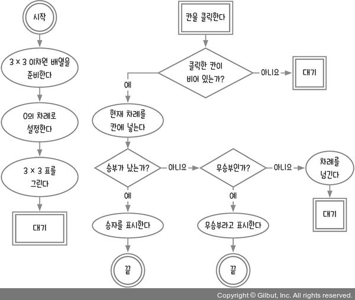
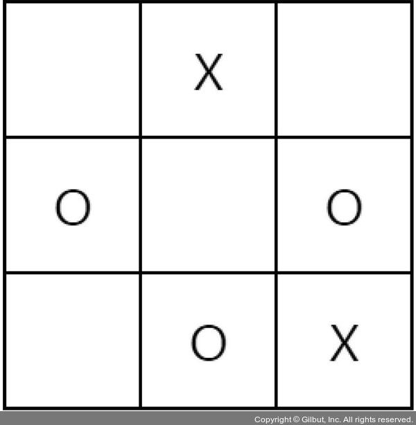
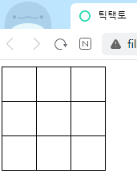
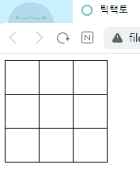

# 9장 이차원 배열 다루기_틱택토 게임

이 장에서는 틱택토 게임을 만든다. 틱택토(tic-tac-toe) 게임은 오목의 축소판인 삼목이라고 보면 된다. 삼목은 바둑판이 아니라 3 x 3 표 위에서 진행한다.

표와 같은 삼목 데이터는 자바스크립트에서 이차원 배열로 표현한다. 틱택토를 만들면서 이차원 배열로 데이터를 관리하고, 배열 데이터를 HTML 하면에 그대로 표시하는 작업을 집중적으로 배워 보자.

- [9.1 순서도 그리기](#91-순서도-그리기)
- [9.2 이차원 배열 다루기\_틱택토](#92-이차원-배열-다루기_틱택토)
- [9.3 표 직접 그리기](#93-표-직접-그리기)
  - [1분 퀴즈 1번 문제](#1분-퀴즈-1번-문제)
  - [1분 퀴즈 2번 문제](#1분-퀴즈-2번-문제)
- [9.4 차례 전환하기](#94-차례-전환하기)
  - [1분 퀴즈 3번 문제](#1분-퀴즈-3번-문제)
- [9.5 승부 판단하기](#95-승부-판단하기)
  - [1분 퀴즈 4번 문제](#1분-퀴즈-4번-문제)
- [마무리 요약](#마무리-요약)
  - [이차원 배열](#이차원-배열)
  - [구조분해 할당](#구조분해-할당)
  - [이벤트 버블링](#이벤트-버블링)
  - [parentNode와 children](#parentnode와-children)
  - [rowIndex와 cellIndex](#rowindex와-cellindex)
  - [유사 배열 객체와 Array.from](#유사-배열-객체와-arrayfrom)
  - [every와 some](#every와-some)
  - [flat](#flat)
- [Self Check 컴퓨터 차례 구현하기](#self-check-컴퓨터-차례-구현하기)
  - [소스코드](#소스코드)
  - [결과](#결과)

## 9.1 순서도 그리기

바둑에 검은 돌과 흰 돌이 있듯이 틱택토에는 O와 X가 있다. 여기서는 혼자 번갈아 가며 O와 X를 넣는 방식으로 진행한다(컴퓨터와 게임을 하는 방법은 셀프체크에서 다룬다).

틱택토 게임의 순서도를 그려보자



```html
<!DOCTYPE html>
<html lang="ko">
<head>
  <meta charset="UTF-8">
  <meta http-equiv="X-UA-Compatible" content="IE=edge">
  <meta name="viewport" content="width=device-width, initial-scale=1.0">
  <title>틱택토</title>
  <style>
    table {
      border-collapse: collapse;
    }
  
    td {
      border: 1px solid black;
      width: 40px;
      height: 40px;
      text-align: center;
    }
  </style>
</head>

<body>
<script>
</script>
</body>
</html>
```

## 9.2 이차원 배열 다루기_틱택토

왜 이차원 배열을 사용해야 하는지 틱택토의 형태를 보면 알 수 있다.



이와 같은 표를 자바스크립트로 표시하면 다음과 같다.

```js
[
  [null, 'X', null],
  ['O', null, 'O'],
  [null, 'O', 'X'],
]
```

배열 안에 배열이 들어 있어서 이를 **이차원 배열**이라고 한다. 빈칸은 null로 표현하지만, 이 데이터는 화면과 연결되어 있지 않다. 화면과 연결하려면 값을 저장하기보다는 칸을 나나태는 td 태그를 변수에 할당해 배열에 저장하는 것이 낫다.

HTML로 보면 앞의 표는 다음과 같다.

```html
<table>
  <tr>
    <td id="td00"></td>
    <td id="td01">X</td>
    <td id="td02"></td>
  </tr>
  <tr>
    <td id="td10">O</td>
    <td id="td11"></td>
    <td id="td12">O</td>
  </tr>
  <tr>
    <td id="td20"></td>
    <td id="td21">O</td>
    <td id="td22">X</td>
  </tr>
</table>
```

table이 전체 표를 담당하는 태그이고, tr은 표의 가로줄, td는 각 칸을 담당한다. 칸을 구별하려고 칸별로 아이디를 붙였다. 3줄 3칸으로 이루어진 표이므로 td 태그들을 이차원 배열로 구성하면 다음과 같다.

```js
[
  [td00, td01, td02],
  [td10, td11, td12],
  [td20, td21, td22],
]
```

앞의 코드는 실제 코드가 아니라 이러한 형식으로 구성하면 된다는 것을 보여 주기 위한 임의 코드이다.

td00부터 td22까지의 변수는 document.querySelector('아이디')의 결과물이라고 보면 된다. 이렇게 태그들을 저장하고 태그 안의 값은 textContent로 가져온다.

## 9.3 표 직접 그리기

이제 표를 직접 그려보자. 표를 그리면서 각 칸(td 태그)을 이차원 배열에 담아야 한다.

```html
<script>
  const { body } = document;
  const $table = document.createElement('table');
  const $result = document.createElement('div'); // 결과창
</script>
```

첫 줄의 코드는 **구조분해 할당**(destructuring assignment)이라는 문법을 사용한 것이다. 객체 내부의 속성과 할당하는 변수명이 같을 때 이렇게 코드를 줄여 쓸 수 있다. 원래 코드는 다음와 같다.

```js
const body = document.body;
```

하나의 속성만 구조분해 할당하면 이 문법을 사용하는 의미가 잘 와닿지 않으니 다음과 같이 여러 개의 속성을 변수에 넣는 경우를 살펴보자.

```js
const obj = { a: 1, b: 2 };
const { a, b } = obj; // 다음 두 줄을 이렇게 한 줄로 표현 가능
const a = obj.a;
const b = obj.b;
```

여러 줄에 걸쳐 할당하는 코드를 한 줄로 줄일 수 있어서 매우 편리하다.

### 1분 퀴즈 1번 문제

다음 객체에서 a, c, e 속성을 구조분해 할당 문법으로 변수에 할당해 보세요.

```js
const obj = {
  a: 'hello',
  b: {
    c: 'hi',
    d: { e: 'wow'},
  },
};
```

나의 풀이는 아래와 같다.

```js
const obj = {
  a: 'hello',
  b: {
    c: 'hi',
    d: { e: 'wow'},
  },
};

const { a, b: { c, d: { e } } } = obj;
console.log(a, c, e); // hello hi wow
```

> 구조 분해 할당에 대한 자세한 내용은 아래 링크를 참고
> <https://developer.mozilla.org/ko/docs/Web/JavaScript/Reference/Operators/Destructuring_assignment>

코드로 돌아가 나머지 부분을 완성해보자.

```js
const { body } = document;
const $table = document.createElement('table');
const $result = document.createElement('div'); // 결과창
const rows = [];

for (let i = 1; i <= 3; i++) {
  const $tr = document.createElement('tr');
  const cells = [];
  for (let j = 1; j <= 3; j++) {
    const $td = document.createElement('td');
    cells.push($td);
    $tr.appendChild($td);
  }
  rows.push(cells);
  $table.appendChild($tr);
}
body.appendChild($table);
body.appendChild($result);
```

줄을 담당하는 rows 배열을 만들고 td 태그를 3 x 3 모양으로 배열에 추가한다. HTML을 실행하면 다음과 같이 빈 표가 화면에 나온다.



### 1분 퀴즈 2번 문제

5(줄) × 4(칸) 이차원 배열을 만들어 보세요. 배열의 요소는 모두 1로 만듭니다.

나의 풀이는 다음과 같다. 위에서 작성한 코드 처럼 2중 for 문을 이용해서 해도 되지만, 더 간단한 방법으로 풀었다.

```js
const cells = new Array(4).fill(1);
const rows = [];
for (let i = 0; i < 5; ++i) {
  rows.push([...cells]);
}
console.log(rows);
// [
//   [ 1, 1, 1, 1 ],
//   [ 1, 1, 1, 1 ],
//   [ 1, 1, 1, 1 ],
//   [ 1, 1, 1, 1 ],
//   [ 1, 1, 1, 1 ]
// ]
```

## 9.4 차례 전환하기

클릭한 칸에 O를 입력하게 하려면 td 태그에 클릭 이벤트 리스너를 붙여야 한다. 실제 화면에 태그가 표시되기 전이라도 이벤트 리스너를 미리 붙일 수 있다.

```js
...
const rows = [];
let turn = 'O';

const callback = (event) => {
  if (event.target.textContent !== '') { // 칸이 이미 채워져 있는가?
    console.log('빈칸이 아닙니다.');
  } else { // 빈칸이면
    console.log('빈칸입니다');
    event.target.textContent = turn;
  }
};

for (let i = 1; i <= 3; i++) {
  const $tr = document.createElement('tr');
  const cells = [];
  for (let j = 1; j <= 3; j++) {
    const $td = document.createElement('td');
    $td.addEventListener('click', callback); // 클릭 이벤트 추가
    cells.push($td);
    $tr.appendChild($td);
  }
  rows.push(cells);
  $table.appendChild($tr);
}
body.appendChild($table);
body.appendChild($result);
```

한 번 O를 넣은 칸이면 다시 넣지 않도록 점검하는 코드도 추가되었다. 입력 모양이 O 아니면 X이므로 누구의 차례(turn)인지는 O 또는 X로 구분 한다.

이번에는 O와 X를 번갈아 가며 그려 본다. callback 함수 마지막에서 turn이 O면 X로, X면 O로 바꾼다.

```js
const callback = (event) => {
  if (event.target.textContent !== '') { // 칸이 이미 채워져 있는가?
    console.log('빈칸이 아닙니다.');
  } else { // 빈칸이면
    console.log('빈칸입니다');
    event.target.textContent = turn;
    turn = turn === 'X' ? 'O' : 'X'; // O <-> X 전환
  }
};
```

조건부 연산자를 사용하여 O와 X를 전환했다.


현재 9개의 `td`태그에 클릭 이벤트 리스너가 달려 있다. 나중에 이벤트 리스너를 제거할 상황이 생기면 9개의 이벤트 리스너를 일일이 제거해야 한다. 그래서 이벤트 리스너를 한번에 달고 제거할 수 있도록 바꿔보자.

```js
for (let i = 1; i <= 3; i += 1) {
  const $tr = document.createElement('tr');
  const cells = [];
  for (let j = 1; j <= 3; j += 1) {
    const $td = document.createElement('td');
    cells.push($td);
    $tr.appendChild($td);
  }
  rows.push(cells);
  $table.appendChild($tr);
  $table.addEventListener('click', callback);
}
body.appendChild($table);
body.appendChild($result);
```

`td`태그 대신에 `table`태그 하나에만 클릭 이벤트를 달았다. 그런데 동일하게 작동한다. 그 이유는 `event.target`이 바뀌지 않기 때문이다. `event.target`은 이벤트가 발생한 직접적인 대상이다.

이벤트가 발생한 태그가 아닌 이벤트를 연결한 태그에 접근하고 싶다면 `event.currentTarget`을 사용하면 된다.

**이벤트 버블링**(event bubbling)이라는 개념을 이해하면 `td`태그에 이벤트를 연결하지 않았는데 이벤트가 호출된 이유를 알 수 있다. `td`의 부모 태그는 `tr`이고, `tr`의 부모 태그는 `table`이다. `td`태그를 클릭하면 `td`태그에서 click 이벤트가 발생한다. 신기하게도 `td`태그의 부모인 `tr`태그에서도 동일한 이벤트가 발생하고 `table`태그에서도 발생한다.

HTML에서는 이벤트가 발생할 때 부모 태그에도 순차적으로 동일한 이벤트가 발생한다. 이처럼 이벤트가 부모 태그로 퍼져나가는 현상이 수면으로 올라가는 물방울 모양과 비슷하다고 해서 이벤트 버블링이라는 이름이 붙었다.

> 이벤트 버블링과 캡처링에 대한 자세한 정보는 아래 링크를 참고
> <https://developer.mozilla.org/ko/docs/Learn/JavaScript/Building_blocks/Events#%EC%9D%B4%EB%B2%A4%ED%8A%B8_%EB%B2%84%EB%B8%94%EB%A7%81%EA%B3%BC_%EC%BA%A1%EC%B2%98>
> <https://ko.javascript.info/bubbling-and-capturing>

### 1분 퀴즈 3번 문제

버튼을 클릭할 때 'hello, event bubbling'을 alert 하게 다음 코드를 수정하세요. 단, 이벤트 리스너를 button 태그에 달아서는 안 됩니다.

```html
<header>
  <div>
    <button>클릭</button>
  </div>
</header>
<script>
</script>
```

나의 풀이는 아래와 같다.

```html
<button onclick="alert('hello, event bubbling')">클릭</button>
```

버튼의 `onclick` 프로퍼티를 통해 클릭 이벤트를 쉽게 추가할 수 있다.

## 9.5 승부 판단하기

이제 번갈아 가며 칸을 채운 뒤 승자를 판단해 보자. 가로줄이나 세로줄, 대각선에 같은 모양이 나오면 승리이다. 승자가 가려졌다면 승자를 표시하고, 만약 9칸을 다 채웠는데 승자가 없다면 무승부라는 메시지를 표시한다.

먼저 승자인지 판단하는 `checkWinner`함수를 만든다.

```js
const checkWinner = (target) => {
  let rowIndex;
  let cellIndex;
  rows.forEach((row, ri) => {
    row.forEach((cell, ci) => {
      if (cell === target) {
        rowIndex = ri;
        cellIndex = ci;
      }
    });
  });
  // 세 칸 다 채워졌나?
  let hasWinner = false;
  // 가로줄 검사
  if (
    rows[rowIndex][0].textContent === turn &&
    rows[rowIndex][1].textContent === turn &&
    rows[rowIndex][2].textContent === turn
  ) {
    hasWinner = true;
  }
  // 세로줄 검사
  if (
    rows[0][cellIndex].textContent   === turn &&
    rows[1][cellIndex].textContent === turn &&
    rows[2][cellIndex].textContent === turn
  ) {
    hasWinner = true;
  }
  // 대각선 검사
  if (
    rows[0][0].textContent === turn &&
    rows[1][1].textContent === turn &&
    rows[2][2].textContent === turn
  ) {
    hasWinner = true;
  }
  if (
    rows[0][2].textContent === turn &&
    rows[1][1].textContent === turn &&
    rows[2][0].textContent === turn
  ) {
    hasWinner = true;
  }
  return hasWinner;
};

const callback = (event) => {
  if (event.target.textContent !== '') { // 칸이 이미 채워져 있는가?
    console.log('빈칸이 아닙니다.');
    return;
  }
  // 빈칸이면
  console.log('빈칸입니다');
  event.target.textContent = turn;
  const hasWinner = checkWinner(event.target);
  // 승자가 있으면
  if (hasWinner) {
    $result.textContent = `${turn}님이 승리!`;
    $table.removeEventListener('click', callback);
    return;
  }
  // 승자가 없으면
  turn = turn === 'X' ? 'O' : 'X';
};
```

내가 지금 클릭한 칸을 기준으로 가로줄, 세로줄, 대각선으로 세 칸이 맞는지 확인하여 승자를 판단한다.

몇 번째 줄, 몇 번째 칸인지 알아내는 더 쉬운 방법이 있다. `rowIndex`와 `cellIndex`를 구하는 코드를 다음 코드로 교체한다.

```js
const rowIndex = target.parentNode.rowIndex;
const cellIndex = target.cellIndex;
```

`parentNode`는 현재 태그의 부모 태그를 선택하는 속성이다. `target`이 `td`태그이니 `target.parentNode`는 `tr`태그가 된다. `tr`태그는 `rowIndex`라는 속성을 제공하고 `td`태그는 `cellIndex`라는 속성을 제공한다.
따라서 이 코드로 줄 수와 칸 수를 쉽게 알아낼 수 있었다.

`parentNode`의 반대 개념으로 `children`이라는 속성이 있다. 자식 태그를 얻어 오는 속성이다. 부모 태그는 하나지만, 자식 태그는 여러 개이므로 배열과 같은 모양의 띈다.

`태그.children`은 배열처럼 생긴 객체이다. `{ 0: td, 1: td, 2: td, length: 3 }`과 같은 모양을 가진 객체이다. `children[0]`, `children[1]`, `children.length`처럼 사용할 수 있어서 배열로 착각하기 쉽다. 이런 객체를 **유사 배열 객체**(array-like object)라고 한다.

유사 배열 객체에 `indexOf`메서드를 사용하려면 어떻게 해야 할까? `Array.from`메서드로 유사 배열 객체를 진짜 배열로 바꾸면 된다.

```js
const checkWinner = (target) => {
  const rowIndex = target.parentNode.rowIndex;
  const cellIndex = target.cellIndex;
  // console.log(target.parentNode.children);
  // console.log(target.parentNode.children.indexOf(target));
  console.log(Array.from(target.parentNode.children));
  console.log(Array.from(target.parentNode.children).indexOf(target));
  // 세 칸 다 채워졌나?
  let hasWinner = false;
  ...
}
```

다시 돌아가서, 승자가 없는 경우의 코드를 작성해보자. 승자가 없는 경우에는 무승부인지 검사하면 된다. 9칸에 모두 `textContent`가 들어 있으면 무승부이다.

```js
const callback = (event) => {
  ...
  // 승자가 없으면
  let draw = true;
  rows.forEach((row) => {
    row.forEach((cell) => {
      if (!cell.textContent) {
        draw = false;
      }
    });
  });
  if (draw) {
    $result.textContent = `무승부`;
    return;
  }
  turn = turn === 'X' ? 'O' : 'X';
};
```

이차원 배열을 사용할 때 이처럼 반복문(forEach)을 두 번 중첩해서 쓰게 되는데, 이차원 배열이 이 배열 안에 배열이 들어 있는 구조라 그렇다. 모든 칸이 채워져 있는지 판단할 때는 기본적으로 draw를 true로 놓고, 한 칸이라도 빈칸이 있다면 draw를 false로 바꾼다.


앞의 코드와 같이 반복문을 사용해 모든 칸에 textContent가 들어 있는지 검사할 수도 있지만, 배열의 메서드를 사용하면 훨씬 더 간단하게 검사할 수 있다.

```js
const callback = (event) => {
  ...
  // 승자가 없으면
  const draw = rows.flat().every((cell) => cell.textContent);
  if (draw) {
    $result.textContent = `무승부`;
    return;
  }
  turn = turn === 'X' ? 'O' : 'X';
};
```

`flat`메서드는 배열의 차원을 낮추는 메서드로, n차원 배열을 n-1차원 배열로 낮춘다. 이차원 배열이라면 일차원 배열로 바뀐다. 일차원 배열은 flat을 적용해도 일차원 배열로 남아 있는다. 매개변수에 평탄화할 때 사용할 깊이 값을 설정할 수 있다. 옵션이며 기본 값은 1이다. 인자로 `Infinity`값을 넣으면 어떤 차원의 배열이든 일차원 배열로 바뀐다.

```js
const array = [[1, 2, 3], [4, 5, 6], [7, 8, 9]];
array.flat(); // [1, 2, 3, 4, 5, 6, 7, 8, 9]
const array2 = [1, 2, 3, [[4, 5, 6], [7, 8, 9]]];
array2.flat(); // [1, 2, 3, [4, 5, 6], [7, 8, 9]]
```

> flat 메서드에 대한 자세한 내용은 아래 링크 참조
> <https://developer.mozilla.org/ko/docs/Web/JavaScript/Reference/Global_Objects/Array/flat>

`every`메서드는 반복문의 일종으로 요소를 순회하면서 조건 함수의 반환값이 모두 `true`이면 `every`메서드도 `true`를 반환한다. 조건 함수의 반환값이 하나라도 `false`이면 `every`메서드의 반환값도 `false`가 된다.

```js
배열.every(조건함수);
```

`every`메서드는 일반 반복문보다 더 효율적이다. `every`는 조건에 만족하지 않는 요소를 하나라도 찾으면 바로 반복을 중단한다.

> every 메서드에 대한 자세한 내용은 아래 링크 참조
> <https://developer.mozilla.org/ko/docs/Web/JavaScript/Reference/Global_Objects/Array/every>

### 1분 퀴즈 4번 문제

다음 배열에서 한 칸이라도 null이 들어 있으면 true를 반환하고, 아니면 false를 출력하는 코드를 작성하세요.

```js
const array = [1, 'hello', null, undefined, false];
```

나의 풀이는 다음과 같다.

```js
const array = [1, 'hello', null, undefined, false];
const containNull = array.some((value) => value === null);
console.log(containNull); // true
```

`every`는 모든 값이 조건에 맞아야 `true`를 반환하지만, `some`메서드는 하나라도 조건을 통과한다면 `true`를 반환한다.

> some에 대한 자세한 내용은 아래 링크 참조
> <https://developer.mozilla.org/ko/docs/Web/JavaScript/Reference/Global_Objects/Array/some>

## 마무리 요약

### 이차원 배열

배열 안에 배열이 있을 때 이차원 배열이라고 합니다. 배열이 몇 번 중첩됐느냐에 따라 몇 차원 배열인지 정해집니다. 표와 비슷한 모양이어서 실무에서 많이 사용합니다.

```js
[
  [null, 'X', null],
  ['O', null, 'X'],
  [null, 'O', 'X'],
]
```

### 구조분해 할당

객체 내부의 속성과 할당하는 변수명이 같을 때 다음과 같이 줄여서 쓸 수 있습니다.

```js
const { body } = document;
const body = document.body;
```

여러 속성을 한 번에 변수에 할당할 수도 있습니다.

```js
const obj = { a: 1, b: 2 };
const { a, b } = obj; // 다음 두 줄을 이렇게 한 줄로 표현 가능
const a = obj.a;
const b = obj.b;
```

9장 예제에는 나오지 않았지만, 배열도 다음과 같이 줄여 쓸 수 있습니다.

```js
const array = [1, 2, 5];
const [one, two, five] = array; // 다음 세 줄을 이렇게 한 줄로 표현 가능
const one = array[0];
const two = array[1];
const five = array[2];
```

### 이벤트 버블링

이벤트 버블링(event bubbling)은 이벤트가 발생할 때 부모 태그에도 동일한 이벤트가 발생하는 현상을 말합니다. td의 부모 태그는 tr이고, tr의 부모 태그는 table입니다. td 태그를 클릭하면 td 태그에 click 이벤트가 발생하고, td 태그의 부모인 tr 태그와 tr 태그의 부모인 table 태그에도 발생합니다. 즉, td 태그에서 발생한 click 이벤트가 table 태그까지 전달됩니다.

이벤트 버블링 현상이 일어나면 이벤트 리스너 콜백 함수의 event.target은 이벤트가 발생한 태그로 바뀌므로 주의해야 합니다. 이벤트가 발생한 태그가 아닌 이벤트를 연결한 태그에 접근하고 싶다면 event.currentTarget을 사용합니다.

### parentNode와 children

현재 태그의 부모 태그를 찾고 싶을 때는 parentNode를 사용합니다. 다음과 같은 HTML이 있다고 가정합시다.

```html
<table>
  <tr>
    <td id="td00"></td>
    <td id="td01">X</td>
    <td id="td02"></td>
  </tr>
</table>
```

tr 태그의 부모는 table 태그입니다.

```js
document.querySelector('tr').parentNode; // table 태그
```

자식 태그를 찾으려면 children 속성을 사용합니다. 자식 태그는 여러 개일 수 있으므로 children 속성은 배열 모양의 값이 됩니다. 단, 진짜 배열은 아니고 배열 모양의 객체입니다.

```js
document.querySelector('tr').children; // { 0: td, 1: td, 2: td }
```

### rowIndex와 cellIndex

tr 태그는 몇 번째 줄인지를 알려 주는 rowIndex라는 속성을 제공하고, td 태그는 몇 번째 칸인지를 알려 주는 cellIndex라는 속성을 제공합니다.

```js
const rowIndex = $tr.rowIndex;
const cellIndex = $td.cellIndex;
```

### 유사 배열 객체와 Array.from

4번에 나온 children 속성 같은, 배열 모양의 객체를 유사 배열 객체(array-like object)라고 합니다. 배열이 아니므로 배열 메서드를 사용할 수 없습니다. 배열 메서드를 사용하고 싶다면 Array.from 메서드로 유사 배열 객체를 배열로 바꿉니다.

```js
Array.from($tr.children).indexOf($td);
```

문자열도 Array.from 메서드를 사용해 배열로 바꿀 수 있습니다.

```js
Array.from('123'); // ['1', '2', '3']
```

### every와 some

배열에서 모든 값이 조건에 해당하는지 판단하려면 every 메서드를 사용하고, 하나라도 조건에 해당하는지 판단하려면 some 메서드를 사용합니다(some 메서드는 1분 퀴즈 4 해설 참고).

```js
배열.every(조건함수);
배열.some(조건함수);
```

일반 반복문을 사용하면 끝까지 탐색하지만, every와 some 메서드는 조건이 충족 또는 불충족되면 멈추므로 일반 반복문보다 효율적인 경우가 많습니다. every는 하나라도 조건을 만족하지 않는 요소(조건 함수가 false를 return)를 찾으면 반복을 중단하고, some은 하나라도 조건을 만족하는 요소(조건 함수가 true를 return)를 찾으면 반복을 중단합니다.

### flat

flat은 배열의 차원을 한 단계 낮추는 메서드로, n차원 배열을 n-1차원 배열로 낮춥니다. 이차원 배열이라면 일차원 배열로 바뀝니다. 차원을 낮추는 게 배열을 평평하게 만드는 것처럼 보여서 flat이라는 이름이 붙었습니다. 일차원 배열은 flat을 적용해도 그대로 일차원 배열이 됩니다.

```js
const array = [[1, 2, 3], [4, 5, 6], [7, 8, 9]];
array.flat(); // [1, 2, 3, 4, 5, 6, 7, 8, 9]
const array2 = [1, 2, 3, [[4, 5, 6], [7, 8, 9]]];
array2.flat(); // [1, 2, 3, [4, 5, 6], [7, 8, 9]]
```

## Self Check 컴퓨터 차례 구현하기

지금까지는 혼자서 O와 X의 역할을 번갈아 했습니다. 혼자서 게임을 하면 재미없으니 X의 역할은 컴퓨터가 하도록 만들어 봅시다. 이기기 위한 최선의 전략까지 구현하기는 아직 어려우므로 컴퓨터가 비어 있는 칸에 무작위로 X를 입력하게 합니다.

힌트: 컴퓨터의 차례는 callback 함수 안에 구현합니다. rows 배열에서 비어 있는 칸들도 추리면 되겠죠?

### 소스코드

기존 소스코드에서 `callback`함수 안의 내용만 바꿔주면 된다. 그리고 승리와 무승부에 대한 결과를 표시하는 기능이 중복되어 함수로 `showResult`함수로 묶었다.

```js
...
const callback = (event) => {
  if (event.target.textContent !== '') { // 칸이 이미 채워져 있는가?
    console.log('빈칸이 아닙니다.');
    return;
  }
  // 빈칸이면
  console.log('빈칸입니다');
  event.target.textContent = turn;
  if(showResult(checkWinner(event.target))) return;
  turn = turn === 'X' ? 'O' : 'X';

  // Self Check 컴퓨터 차례 구현하기
  if (turn === 'X') {
    const emptyCellList = rows.flat().filter((cell) => !cell.textContent);
    const randomCell = emptyCellList[Math.floor(Math.random() * emptyCellList.length)];
    randomCell.textContent = turn;
    if(showResult(checkWinner(randomCell))) return;
    turn = turn === 'X' ? 'O' : 'X';
  }
};

const showResult = (hasWinner) => {
  // 승자가 있으면
  if (hasWinner) {
    $result.textContent = `${turn}님이 승리!`;
    $table.removeEventListener('click', callback);
    return true;
  }
  // 무승부라면
  const draw = rows.flat().every((cell) => cell.textContent);
  if (draw) {
    $result.textContent = `무승부`;
    return true;
  }
  return false;
}
...
```

### 결과


