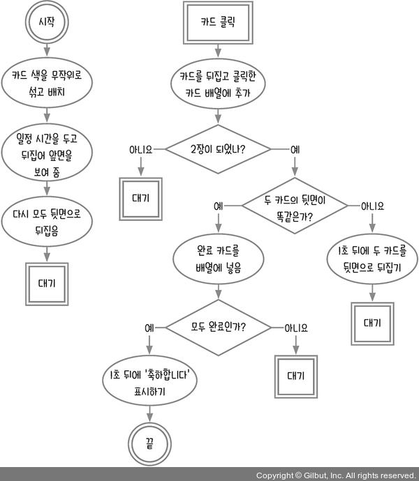
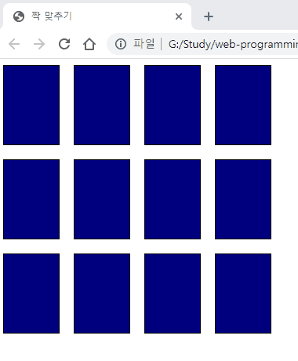
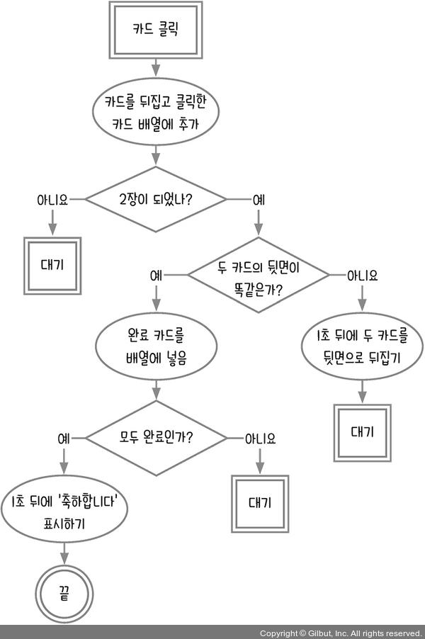
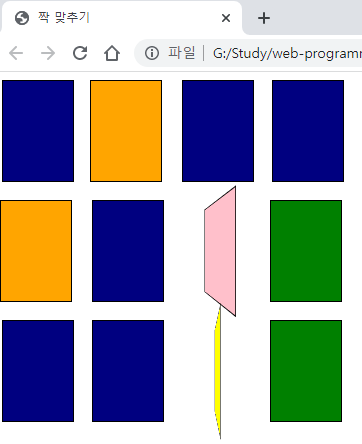
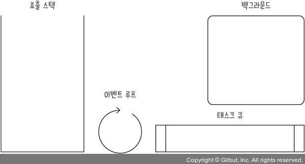
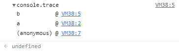
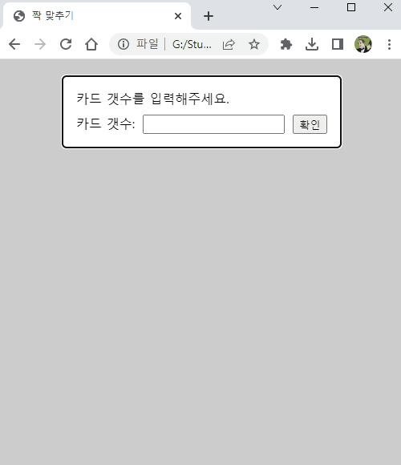

# 11장 이벤트 루프 이해하기_카드 짝 맞추기 게임

이 장에서는 카드 짝 맞추기 게임을 만들며 비동기 코드를 더 깊게 들여보는 시간을 가진다. 짝 맞추기 게임은 다음과 같다. 12장의 카드가 있고, 두 장씩 서로 색이 같다. 모든 카드의 색을 보여 주며 잠깐 동안 카드 짝을 외울 수 있는 시간을 주고 나서, 카드를 다시 전부 뒤지은 뒤 짝을 맞추게 한다. 많은 카드를 실시간으로 뒤집어야 하는 만큼, 자바스크립트 코드가 돌아가는 순서를 정확하게 알아야 한다.


- [11.1 순서도 그리기](#111-순서도-그리기)
- [11.2 카드 생성하기](#112-카드-생성하기)
- [11.3 카드 잠깐 보여 줬다 뒤집기](#113-카드-잠깐-보여-줬다-뒤집기)
- [11.4 카드 클릭해 짝 맞추기](#114-카드-클릭해-짝-맞추기)
- [11.5 효과 발생 중 카드 클릭 막기](#115-효과-발생-중-카드-클릭-막기)
  - [호출 스택과 이벤트 루프](#호출-스택과-이벤트-루프)
  - [1분 퀴즈 1번 문제](#1분-퀴즈-1번-문제)
- [마무리 요약](#마무리-요약)
  - [호출 스택](#호출-스택)
  - [이벤트 루프](#이벤트-루프)
- [Self Check 몇 초 걸렸는지 확인하기](#self-check-몇-초-걸렸는지-확인하기)
  - [소스코드](#소스코드)
  - [결과](#결과)


## 11.1 순서도 그리기

카드 짝 맞추기 게임의 순서도는 다음과 같다.



2장씩 카드를 뒤집어 2장의 카드 색이 같으면 완료 목록에 넣고, 다르면 다시 뒤집는다. 12장의 카드를 모두 맞추면 성공이다.

처음에 끝말잇기나 계산기, 숫자야구 게임을 만들 때는 철저하게 하나의 작업을 하나의 절차로 만들어서 나열했지만 이제는 서로 관련 있는 절차는 가능한 하나의 절차로 묶고, 복잡한 비동기 절차나 조건문 절차에서만 순서도를 분리한다.

서로 관련 있는 절차를 하나의 절차로 묶는 것을 일일이 각각의 작업을 절차로 그리기 귀찮아서 그랬다고 해석할 수도 있지만, 반대로 프로그래밍 사고력이 늘었다고 해석할 수도 있다. 관련 있는 절차라면 몇 줄이 됐든 하나의 함수로 만들면 되니까 굳이 여러 개의 원을 그릴 필요가 없다.

심지어 간단한 비동기 함수는 굳이 순서도에 표시하지 않고 하나의 원으로 표현할 수 있는 경지에 다다랐을 수도 있다. 이렇게 조금씩 순서도에 익숙해지다 보면 직접 그린 순서도는 점점 더 짧아지고, 머릿속에서 채우는 부분은 점점 더 늘어나게 된다. 그러다가 결국에는 생각만으로 순서도를 그리는 경지에 오르게 된다. 이 경지에 오를 때까지 조금 더 순서도 그리기를 해보자.

다음과 같이 HTML 코드를 작성하자.

```html
<!DOCTYPE html>
<html lang="ko">
<head>
  <meta charset="UTF-8">
  <meta http-equiv="X-UA-Compatible" content="IE=edge">
  <meta name="viewport" content="width=device-width, initial-scale=1.0">
  <title>짝 맞추기</title>
  <style>
    .card {
      display: inline-block;
      margin-right: 20px;
      margin-bottom: 20px;
      width: 70px;
      height: 100px;
      perspective: 140px;
    }

    .card-inner {
      position: relative;
      width: 100%;
      height: 100%;
      text-align: center;
      transition: transform 0.8s;
      transform-style: preserve-3d;
    }

    .card.flipped .card-inner {
      transform: rotateY(180deg);
    }

    .card-front {
      background: navy;
    }

    .card-front, .card-back {
      position: absolute;
      width: 100%;
      height: 100%;
      border: 1px solid black;
      backface-visibility: hidden;
    }

    .card-back {
      transform: rotateY(180deg);
    }
  </style>
</head>

<body>
  <div id="wrapper"></div>
  <script>
    const $wrapper = document.querySelector('#wrapper');
  </script>
</body>

</html>
```

카드 뒤집기 효과는 CSS를 사용하면 쉽게 표현할 수 있다. 카드에 flipped 클래스를 추가하면 카드가 앞면으로 뒤집히고, flipped 클래스를 제거하면 카드가 뒷면으로 뒤집힌다.

물론 자바스크립트로도 카드 뒤집기 효과를 구현할 수 있지만, 원래 CSS가 디자인을 담당하므로 CSS로 표현 가능한 디자인 영역은 최대한 CSS만 사용해서 구현하는 것이 편하다.

## 11.2 카드 생성하기

12장의 카드를 생성하고, 2장씩 색이 같으므로 6가지 색이 필요하다. 여기서는 빨강(red), 주황(orange), 노랑(yellow), 초록(green), 하양(white), 분홍(pink)을 사용하겠다. 6가지 색은 앞면의 색이 되고, 뒷면은 남색(navy) 한 가지이다.

6가지 색을 두 번 복사해서 이어 붙이면 12장이 된다. 다만, 카드의 순서를 매번 다르게 무작위로 섞어야 하니, 6장에서 사용했던 피셔-예이츠 셔플 알고리즘을 사용한다.

```html
<script>
  const $wrapper = document.querySelector('#wrapper');

  const total = 12;
  const colors = ['red', 'orange', 'yellow', 'green', 'white', 'pink'];
  let colorCopy = colors.concat(colors);
  let shuffled = [];

  function shuffle() { // 피셔-예이츠 셔플
    for (let i = 0; colorCopy.length > 0; i += 1) {
      const randomIndex = Math.floor(Math.random() * colorCopy.length);
      shuffled = shuffled.concat(colorCopy.splice(randomIndex, 1));
    }
  }

  function createCard(i) {
    const card = document.createElement('div');
    card.className = 'card'; // .card 태그 생성
    const cardInner = document.createElement('div');
    cardInner.className = 'card-inner'; // .card-inner 태그 생성
    const cardFront = document.createElement('div');
    cardFront.className = 'card-front'; // .card-front 태그 생성
    const cardBack = document.createElement('div');
    cardBack.className = 'card-back'; // .card-back 태그 생성
    cardBack.style.backgroundColor = shuffled[i];
    cardInner.appendChild(cardFront);
    cardInner.appendChild(cardBack);
    card.appendChild(cardInner);
    return card;
  }

  function startGame() {
    shuffle();
    for (let i = 0; i < total; i += 1) {
      const card = createCard(i);
      $wrapper.appendChild(card);
    }
  }
  startGame();
</script>
```

전체 카드 개수를 저장한 `total`변수와 6가지 색을 저장한 `colors`변수가 있다. 그리고 `colors`변수를 수정하지 않고 `colorCopy`변수에 6가지 색을 두 번 복사해서 저장하였다.

`startGame`함수로 게임이 시작된다. 게임이 시작되면 카드를 섞고(shuffle), 12개의 카드를 생성(createCard)한다. `shuffled`로부터 카드 색상을 가져와 태그의 `backgroundColor`CSS 속성에 넣는다. 이렇게 만든 카드는 최종적으로 `$wrapper`태그 안으로 들어간다.

실행해 보면 브라우저 크기에 따라 카드 배치가 달라진다. 브라우저의 크기가 크더라도 4 x 3의 형태로 배치 되도록 CSS에 속성을 추가하자.

```html
<style>
#wrapper {
  display: grid;
  grid-template-columns: repeat(4, 90px);
}
...
</style>
```


## 11.3 카드 잠깐 보여 줬다 뒤집기

3초 동안 카드 앞면을 보여주고 뒷면으로 뒤집는다. 카드 뒤집기는 `flipped`클래스를 넣거나 빼는 것으로 할 수 있다. `flipped`클래스를 추가하면 앞면이 보이고, 빼면 뒷면이 보인다.

시각적인 효과를 위해 카드별로 조금씩 시차를 두고 뒤집는다. 카드가 생성되자마자 바로 앞면을 보여 주고 일정 시간 후 다시 뒤집으므로 이 과정은 `startGame`함수 안에 작성한다.

```js
function startGame() {
  shuffle();
  for (let i = 0; i < total; i += 1) {
    const card = createCard(i);
    $wrapper.appendChild(card);
  }

  document.querySelectorAll('.card').forEach((card, index) => { // 초반 카드 공개
    setTimeout(() => {
      card.classList.add('flipped');
    }, 1000 + 100 * index);
  });

  setTimeout(() => { // 카드 감추기
    document.querySelectorAll('.card').forEach((card) => {
      card.classList.remove('flipped');
    });
  }, 5000);
}
```

첫 번째 `setTimeout`의 밀리초 부분(1000 + 100 * index)을 보면, 첫 번째 카드는 게임 시작으로부터 1초, 두 번째 카드는 1.1초, 세 번째 카드는 1.2초, 열두 번째 카드는 2.1초 뒤에 뒤집도록 되어있다. 이렇게 살짝 다르게 시간을 주면 시각적인 효과가 훨씬 좋아진다.



게임 시작으로부터 2.1초 뒤에 마지막 카드가 뒤집히니 3초 정도의 외우는 시간을 주기 위해 게임 시작으로부터 5초 후에 카드를 다시 뒷면으로 뒤집는다.

## 11.4 카드 클릭해 짝 맞추기

이제 카드를 클릭해 짝을 맞춰보자. 2장의 카드를 뒤집어 색이 일치하면 그대로 놔두고, 색이 일치하지 않으면 둘 다 뒤집는다. 모든 카드가 앞면이 되면 짝 맞추기가 성공한 것이므로 '축하합니다!'라는 메시지를 표시한다.

생성한 카드 태그에 클릭 이벤트 리스너를 붙이면 된다. 이제 순서도에 따라 카드를 클릭할 때의 절차를 구현해 보자.



먼저 카드를 클릭하면 해당 카드를 뒤집고 클릭한 카드 배열에 추가한다. 그리고 클릭한 카드 배열에 2장이 들어있는지 체크한다.

```js
const $wrapper = document.querySelector('#wrapper');

const total = 12;
const colors = ['red', 'orange', 'yellow', 'green', 'white', 'pink'];
let colorCopy = colors.concat(colors);
let shuffled = [];
let clicked = []; // 클릭한 카드를 담을 배열

function shuffle() {...}

function createCard(i) {...}

function onClickCard() {
  this.classList.toggle('flipped');
  clicked.push(this); // 클릭한 카드를 담음
  if (clicked.length !== 2) { // 클릭한 카드가 2개가 아니면
    return;
  }
}

function startGame() {
  shuffle();
  for (let i = 0; i < total; i += 1) {
    const card = createCard(i);
    card.addEventListener('click', onClickCard); // 클릭 이벤트 추가
    $wrapper.appendChild(card);
  }
  ...
}
```

`this` 또는 `event.target`(이때는 `onClickCard`함수의 매개변수에 `event`도 넣어야 함)으로 클릭한 카드에 접근할 수 있다. `onClickCard`는 화살표 함수가 아니라서 `this`가 클릭한 카드가 된다. if 문에 의한 들여 쓰기를 최소화하기 위해 if 문 중첩을 줄이는 기법을 적용했다(잊어버렸다면 4장을 복습하세요).

return 아랫부분은 클릭한 카드의 개수가 두 개일 때만 실행된다. 이때 두 카드의 앞면이 똑같은지 비교하면 되므로 `태그.style.backgroundColor`를 비교한다.

```js
function onClickCard() {
  this.classList.toggle('flipped');
  clicked.push(this);
  if (clicked.length !== 2) {
    return;
  }
  const firstBackColor = clicked[0].querySelector('.card-back').style.backgroundColor;
  const secondBackColor = clicked[1].querySelector('.card-back').style.backgroundColor;
  if (firstBackColor === secondBackColor) { // 두 카드가 같은 카드면
    return;
  }
  // 두 카드가 다르면
}
```

두 카드가 같으면 클릭 배열에서 완료 배열로 옮기고, 두 카드가 다르면 클릭 배열에서 빼고 뒷면으로 뒤집는 코드를 넣어 보자. 이를 위해 추가로 완료 배열 변수(completed)를 선언한다.

```js
const $wrapper = document.querySelector('#wrapper');

...
let clicked = [];
let completed = []; // 두 카드가 같은 경우 추가되는 완료 배열

function shuffle() {...}

function createCard(i) {...}

function onClickCard() {
  ...
  if (firstBackColor === secondBackColor) { // 두 카드가 같은 카드면
    completed.push(clicked[0]);
    completed.push(clicked[1]);
    clicked = [];
    return;
  }
  // 두 카드가 다르면
  clicked[0].classList.remove('flipped');
  clicked[1].classList.remove('flipped');
  clicked = [];
}
```

두 카드가 다르면 `flipped`클래스를 제거하고, 두 카드가 같으면 `flipped`클래스를 제거하지 않아서 카드가 계속 앞면인 상태로 남아 있는다.

앞의 코드를 실행해 보면 두 카드가 다른 경우 두 번째 카드는 아예 뒤집히지 않는다. 두 카드가 다르더라도 두 번째 카드도 앞면을 보여 줬다가 다시 뒷면으로 되돌아가야 한다. 이는 두 번째 카드의 앞면을 보이기도 전에 `flipped`클래스가 제거돼서 그렇다. 따라서 앞면을 보일 수 있는 충분한 시간을 확보해야 한다. 0.5초 뒤에 뒤집어지도록 변경한다.

```js
function onClickCard() {
  ...
  // 두 카드가 다르면
  setTimeout(() => {
    clicked[0].classList.remove('flipped');
    clicked[1].classList.remove('flipped');
    clicked = [];
  }, 500);
}
```



마지막으로 모든 카드(12장)가 짝이 맞춰졌는지 확인한다. 모두 앞면이라면 '축하합니다!'라고 표시하는 `alert` 창을 띄우자. 그리고 12장의 카드를 모두 맞추고 나면 모든 카드가 앞면을 보여야 하기 때문에 카드가 뒤집힐 때까지 충분한 시간(1초)를 주고 `alert` 창을 띄운다.. 그리고 `alert` 창이 뜬 후에 게임을 초기화해서 다시 실행할 수 있게 하는 `resetGame`함수도 추가한다.

```js
function onClickCard() {
  ...
  if (firstBackColor === secondBackColor) { // 두 카드가 같은 카드면
    completed.push(clicked[0]);
    completed.push(clicked[1]);
    clicked = [];
    if (completed.length !== total) {
      return;
    }
    setTimeout(() => {
      alert(`축하합니다!`);
      resetGame();
    }, 1000);
    return;
  }
  ...
}

function startGame() {...}

function resetGame() {
  $wrapper.innerHTML = '';
  colorCopy = colors.concat(colors);
  shuffled = [];
  completed = [];
  startGame();
}
```

## 11.5 효과 발생 중 카드 클릭 막기

발생한 버그를 잡아야 한다.

1. 처음에 카드를 잠깐 보여 줬다가 다시 뒤집는 동안에는 카드를 클릭할 수 없어야 하는데, 카드를 클릭하면 카드가 뒤집힌다.
2. 이미 짝이 맞춰진 카드를 클릭해도 카드가 다시 뒤집힌다.
3. 한 카드를 두 번 연이어 클릭하면 더 이상 해당 카드가 클릭되지 않는다.
4. 서로 다른 네 가지 색의 카드를 연달아 클릭하면 마지막 두 카드가 앞면을 보인 채 남아 있다.

문제를 해결하려면 카드를 클릭할 수 있는 상황과 클릭할 수 없는 상황을 구분해야 한다. 이를 위해 `clickable`이라는 변수를 선언한다. 처음에 카드를 잠깐 보여 줬다가 다시 뒤집을 때까지는 클릭할 수 없게 해야 한다. 또한, 클릭한 카드가 이미 짝이 맞춰진 카드이거나 조금 전에 뒤집은 카드인 경우를 모두 `onClickCard`함수에서 걸러 내자.

```js
const $wrapper = document.querySelector('#wrapper');

...
let completed = [];
let clickable = false; // 클릭 가능 상태

function shuffle() {...}

function createCard(i) {...}

function onClickCard() {
  // 클릭 가능한 상태가 아니라면 리턴한다.
  if (!clickable || completed.includes(this) || clicked[0] === this) {
    return;
  }
  this.classList.toggle('flipped');
  ...
}

function startGame() {
  ...
  setTimeout(() => { // 카드 감추기
    document.querySelectorAll('.card').forEach((card) => {
      card.classList.remove('flipped');
    });
    clickable = true;
  }, 5000);
}

function resetGame() {
  ...
  clickable = false;
  startGame();
}

startGame();
```

마지막 4번 문제를 제외하고는 버그가 쉽게 해결되었다. 그런데 왜 서로 다른 색상의 네 가지 카드를 연이어 클릭하면 마지막 두 장의 카드는 앞면인 상태로 남아 있을까?

### 호출 스택과 이벤트 루프

클릭 이벤트는 비동기 이벤트이다. 그런데 그 안에 `setTimeout`같은 비동기 함수들이 또 들어 있으니 코드 실행 순서가 헷갈릴 수밖에 없다. 코드의 실행 순서를 명확하게 알고 있어야 정확하게 코드를 설계할 수 있다. 코드의 실행 순서를 파악하려면 **호출 스택**(call stack)과 **이벤트 루프**(event loop)라는 개념을 알아야 한다.

이 책에서 나오는 설명은 100% 정확한 개념이 아니고, 코드의 실행 순서를 이해할 수 있게 어느 정도 추상화한 것이다. 이 정도로만 알고 있어도 코드 실행 순서를 파악하는 데 크게 지장이 없다.

우선 호출 스택은 동기 코드를 담당하고, 이벤트 루프는 비동기 코드를 담당한다고 생각하면 된다. 추가로 비동기 코드 실행에는 **백그라운드**(background)와 **태스크 큐**(task queue)라는 개념도 등장한다.



**백그라운드**는 타이머를 처리하고 이벤트 리스너를 저장하는 공간이다. `setTimeout`같은 함수가 실행되면 백그라운드에서 시간을 재고 시간이 되면 `setTimeout`의 콜백 함수를 태스크 큐로 보낸다. 또한, `addEventListener`로 추가한 이벤트를 저장했다가 이벤트가 발생하면 콜백 함수를 태스크 큐로 보낸다. 백그라운드에서 코드를 실행하는 것이 아니라 실행될 콜백 함수들이 태스크 큐로 들어간다는 것을 기억하라.

**태스크 큐**는 실행돼야 할 콜백 함수들이 줄을 서서 대기하고 있는 공간이다. 큐(queue)가 영어로 줄이라는 뜻이다. 사람들이 가게 앞에 줄을 서면 먼저 선 사람부터 차례로 들어가지 않는가? 태스크 큐도 마찬가지이다. 태스크 큐에 먼저 들어온 함수부터 실행된다. 다만, 태스크 큐도 함수를 직접 실행하지 않는다. 함수는 모두 호출 스택에서만 실행된다. 호출 스택에 들어온 함수가 호출(실행)된다고 생각하면 된다.

태스크 큐에서 호출 스택으로 함수를 이동시키는 존재가 바로 이벤트 루프이다. 호출 스택이 비어 있으면 이벤트 루프는 태스크 큐에서 함수를 하나씩 꺼내(들어온 순서로 꺼냅니다) 호출 스택으로 옮긴다. 호출 스택으로 이동한 함수는 그제야 실행된다. 실행이 완료된 함수는 호출 스택에서 빠져나가게 되고, 호출 스택이 비면 이벤트 루프는 태스크 큐에 있는 다음 함수를 호출 스택으로 옮긴다.

변수나 함수의 선언은 호출 스택과 이벤트 루프에 영향을 주지 않는다. 선언은 스코프의 영역이라고 보면 된다. 소스 코드에서 함수가 호출되는 첫 번째 순간은 `startGame()`이다. 사실 자바스크립트 엔진은 자바스크립트 소스 코드가 처음 실행되는 순간에도 하나의 함수가 실행된다고 본다. 크롬 브라우저는 이를 `anonymous`라는 함수로 표시한다.

다음 코드로 `anonymous`함수의 존재를 파악할 수 있다.

```js
function a() {
  b();
}
function b() {
  console.trace();
}
a();
```

`a`함수가 실행되고, 그 안에서 `b`함수가 실행된다. 그리고 `b`함수 안에서 `console.trace`메서드가 실행된다. `console.trace`는 함수의 호출 스택을 보여 주는 메서드이다. 실행 결과는 다음과 같다.



호출된 함수의 역순으로 표기된다. 여기서 `a`아래에 `anonymous`라는 함수가 먼저 실행된 것을 알 수 있다. 이것이 소스 코드가 처음 실행될 때 호출되는 `anonymous`함수이다.

> 호출 스택과 이벤트 루프에 대한 자세한 내용은 아래 링크를 참고
> <https://www.youtube.com/watch?v=8aGhZQkoFbQ>
> <https://www.zerocho.com/category/JavaScript/post/597f34bbb428530018e8e6e2>

카드를 뒷면으로 뒤집고 `clicked`를 []로 초기화하기 전에 3번째와 4번째 카드의 클릭 이벤트 콜백 함수가 실행되는 것이 문제이다. 코드가 실행되는 순서는 정해져 있으므로 실행 자체를 막을 수는 없다. 그래서 실행되더라도 아무 일도 하지 않게 만들면 된다. 카드가 2장이 될 때 `clickable`을 `false`로 만들어서 세 번째 카드부터는 클릭해도 아무것도 하지 않고 끝나게 하면 된다.

```js
function onClickCard() {
  ...
  if (firstBackColor === secondBackColor) { // 두 카드가 같은 카드면
    ...
    // 두 카드가 다르면
    clickable = false;
    setTimeout(() => {
      clicked[0].classList.remove('flipped');
      clicked[1].classList.remove('flipped');
      clicked = [];
      clickable = true;
    }, 500);
  }
}
```

자바스크립트로 코딩하다 보면 비동기 함수를 정말 많이 사용하게 된다. 중간에 동기 함수들도 섞여 있는 경우도 많다. 따라서 함수들의 실행 순서를 알고 있어야 자신이 원하는 대로 작동하는 프로그램을 만들 수 있다.

### 1분 퀴즈 1번 문제

다음 코드를 실행할 때 콘솔에 어떤 순서로 알파벳이 찍히는지 호출 스택과 이벤트 루프를 통해 설명해 보세요. 이 문제는 제가 회사에서 기술 면접을 진행할 때 항상 내는 문제 유형입니다. 참고로 setTimeout에 0초가 들어 있는데, 거의 즉시 실행되는 타이머라고 보면 됩니다. '거의'가 붙은 이유는 setTimeout이 비동기 타이머이므로 진짜로 즉시 실행되지는 않기 때문입니다.

```js
function aaa() {
  setTimeout(() => {
    console.log('d');
  }, 0);
  console.log('c');
}

setTimeout(() => {
  console.log('a');
  aaa();
}, 0);

setTimeout(() => {
  aaa();
  console.log('b');
}, 0);
```

나의 풀이는 아래와 같다.

```js
a
c
c
b
d
d
```

태스크 큐의 우선순위 그룹을 나눈다면 가장 바깥에 있는 `setTimeout`이 A 그룹, `aaa`함수 내부에 있는 `setTimeout`은 B 그룹이라고 생각하면 쉽다. A 그룹이 호출 스택에서 모든 처리를 마친 뒤 B 그룹이 호출 스택에서 실행된다.

```js
function aaa() {
  setTimeout(() => { // B-1, B-2
    console.log('d'); // 7, 8
  }, 0);
  console.log('c'); // 3, 5
}

setTimeout(() => { // A-1
  console.log('a'); // 1
  aaa(); // 2
}, 0);

setTimeout(() => { // A-2
  aaa(); // 4
  console.log('b'); // 6
}, 0);
```

실행 순서를 정리하면 아래와 같다.

1. A-1 백그라운드에 추가(0초 대기이므로 태스크 큐로 바로 이동)
2. A-2 백그라운드에 추가
3. A-1 실행 -> console.log('a') -> aaa() -> B-1 백그라운드에 추가 -> console.log('c')
4. A-2 실행 -> aaa() -> B-2 백그라운드에 추가 -> console.log('c') -> console.log('b')
5. B-1 실행 -> console.log('d')
6. B-2 실행 -> console.log('d')

## 마무리 요약

### 호출 스택

동기 함수만 있을 때는 호출 스택만 생각하면 됩니다. 함수가 호출될 때 호출 스택에 들어가고, 실행이 완료되면 호출 스택에서 빠져나갑니다. 기존 함수의 실행이 완료되지 않았는데 다른 함수가 호출되면 새로 호출된 함수는 기존 함수 위에 쌓입니다.

처음 파일을 실행할 때는 anonymous(크롬 브라우저 기준)라는 익명 함수가 실행된다는 것도 기억하세요.

### 이벤트 루프

비동기 함수가 실행될 때는 호출 스택뿐만 아니라 이벤트 루프까지 동원해 실행 순서를 파악해야 합니다. 타이머나 이벤트 리스너 같은 비동기 함수들은 콜백 함수를 백그라운드에서 태스크 큐로 보냅니다. 이벤트 루프는 호출 스택이 비어 있으면 태스크 큐에서 함수를 하나씩 꺼내 호출 스택으로 보내 실행합니다. 반대로 말하면 호출 스택이 비어 있지 않으면 태스크 큐에 있는 함수는 실행되지 않습니다.

## Self Check 몇 초 걸렸는지 확인하기

게임이 끝나면 카드 짝을 맞추는 데 얼마나 걸렸는지 표시하면 좋을 것 같습니다. 또한, 최대 20장까지 카드를 만들 수 있게 수정하고 게임 시작 시 사용자로부터 전체 카드 개수를 입력받게 합시다.

힌트: 너무 복잡하게 생각하지 마세요. 최대 20장의 카드라면 최대 10가지 색이 필요합니다. 그러면 10가지 색을 준비해야겠죠? 10가지 색을 준비했는데 사용자가 12개의 카드만 필요하다고 입력하면 어떻게 해야 할까요?

전체 카드 개수를 입력받을 때 짝을 맞춰야 해서 짝수만 허용해야 한다. 그리고 10가지 색인데 입력받은 카드의 개수가 20개 미만인 경우 짝이 안 맞게 되어버리는 것을 수정해야 한다.

1. 카드 짝 맞추는 데 걸린 시간 표시
2. 최대 20장의 카드 입력받기
3. 20장이 아닌 경우 카드 색깔 짝 맞춰서 카드 구성

개인적인 도전을 추가한다.

1. 입력받은 카드 개수 확인 기능(잘못된 입력, 짝수 확인, 20 이상인지 확인)
2. 프롬프트가 아닌 모달로 카드 개수 입력받기
3. 카드 개수에 따라 표시되는 카드 열 개수 설정하기
4. 카드 개수가 적어도 색상이 랜덤하게 나오도록 하기
5. 카드 개수에 따라 보여주는 시간 조절하기

### 소스코드

```html
<!DOCTYPE html>
<html lang="ko">
<head>
  <meta charset="UTF-8">
  <meta http-equiv="X-UA-Compatible" content="IE=edge">
  <meta name="viewport" content="width=device-width, initial-scale=1.0">
  <title>짝 맞추기</title>
  <style>
    #wrapper {
      display: grid;
      grid-template-columns: repeat(4, 90px);
    }

    .card {
      display: inline-block;
      margin-right: 20px;
      margin-bottom: 20px;
      width: 70px;
      height: 100px;
      perspective: 140px;
    }

    .card-inner {
      position: relative;
      width: 100%;
      height: 100%;
      text-align: center;
      transition: transform 0.8s;
      transform-style: preserve-3d;
    }

    .card.flipped .card-inner {
      transform: rotateY(180deg);
    }

    .card-front {
      background: navy;
    }

    .card-front, .card-back {
      position: absolute;
      width: 100%;
      height: 100%;
      border: 1px solid black;
      backface-visibility: hidden;
    }

    .card-back {
      transform: rotateY(180deg);
    }

    dialog {
      border: 2px solid rgb(80, 140, 230);
      border-radius: 5px;
      margin: 20px auto;
    }

    dialog::backdrop {
      background-color: rgba(0, 0, 0, 0.2);
      /* backdrop의 필터 속성은 filter가 아닌 backdrop-filter를 사용해야한다. */
      backdrop-filter: blur(1px);
    }

    dialog > p {
      margin: 0 0 10px 0;
    }

    .flex {
      display: flex;
      gap: 10px;
    }

    .justify-between {
      justify-content: space-between;
    }

  </style>
</head>

<body>
  <div id="modal">
    <dialog>
      <p>카드 개수를 입력해주세요.</p>
      <form method="dialog" class="flex justify-between">
        <label for="total">카드 개수: </label>
        <input id="total" type="number"/>
        <button value="confirm" class="modal-btn">확인</button>
      </form>
    </dialog>
  </div>
  <div id="wrapper"></div>
  <script>
    const $wrapper = document.querySelector('#wrapper');
    const $dialog = document.querySelector('dialog');
    const $modal = document.querySelector('#modal');
    const $total = document.querySelector('#total');
    let total = 0;

    const colors = ['red', 'orange', 'yellow', 'green', 'white', 'pink', 'skyblue', 'gray', 'purple', 'teal'];
    let colorCopy; // 색깔은 total 입력 받는 부분에서 추가
    let shuffled = [];
    let clicked = []; // 클릭한 카드를 담을 배열
    let completed = []; // 두 카드가 같은 경우 추가되는 완료 배열
    let clickable = false; // 클릭 가능 상태
    let startTime; // 시작 시간
    let endTime; // 종료 시간

    function shuffle(array) { // 피셔-예이츠 셔플
      let shuffleArray = [];
      const newArray = [...array];
      for (let i = 0; newArray.length > 0; ++i) {
        const randomIndex = Math.floor(Math.random() * newArray.length);
        shuffleArray = shuffleArray.concat(newArray.splice(randomIndex, 1));
      }
      return shuffleArray;
    }

    function createCard(i) {
      const card = document.createElement('div');
      card.className = 'card'; // .card 태그 생성
      const cardInner = document.createElement('div');
      cardInner.className = 'card-inner'; // .card-inner 태그 생성
      const cardFront = document.createElement('div');
      cardFront.className = 'card-front'; // .card-front 태그 생성
      const cardBack = document.createElement('div');
      cardBack.className = 'card-back'; // .card-back 태그 생성
      // Self Check 카드 색깔 짝 맞춰서 카드 구성하기

      cardBack.style.backgroundColor = shuffled[i];
      cardInner.appendChild(cardFront);
      cardInner.appendChild(cardBack);
      card.appendChild(cardInner);
      return card;
    }

    function onClickCard() {
      // 클릭 가능한 상태가 아니라면 리턴한다.
      if (!clickable || completed.includes(this) || clicked[0] === this) {
        return;
      }
      this.classList.toggle('flipped');
      clicked.push(this); // 클릭한 카드를 담음
      if (clicked.length !== 2) { // 클릭한 카드가 2개가 아니면
        return;
      }

      const firstBackColor = clicked[0].querySelector('.card-back').style.backgroundColor;
      const secondBackColor = clicked[1].querySelector('.card-back').style.backgroundColor;
      if (firstBackColor === secondBackColor) { // 두 카드가 같은 카드면
        completed.push(clicked[0]);
        completed.push(clicked[1]);
        clicked = [];
        if (completed.length !== total) {
          return;
        }
        endTime = new Date();
        setTimeout(() => {
          // Self Check 카드 짝 맞추는 데 걸린 시간 표시
          alert(`축하합니다! 완료하는데 ${(endTime - startTime) / 1000}초 걸렸습니다!`);
          resetGame();
        }, 1000);
        return;
      }
      // 두 카드가 다르면
      clickable = false;
      setTimeout(() => {
        clicked[0].classList.remove('flipped');
        clicked[1].classList.remove('flipped');
        clicked = [];
        clickable = true;
      }, 500);
    }

    function startGame() {
      hideDialog();
      copyColor();
      shuffled = shuffle(colorCopy);

      for (let i = 0; i < total; i += 1) {
        const card = createCard(i);
        card.addEventListener('click', onClickCard);
        $wrapper.appendChild(card);
      }
      document.querySelectorAll('.card').forEach((card, index) => { // 초반 카드 공개
        setTimeout(() => {
          card.classList.add('flipped');
        }, 1000 + 100 * index);
      });

      // 개인 도전 5.카드 개수에 따라 보여주는 시간 조절하기
      const hideDelay = (total / 3 + 1) * 1000 + 500;
      console.log(hideDelay);
      setTimeout(() => { // 카드 감추기
        document.querySelectorAll('.card').forEach((card) => {
          card.classList.remove('flipped');
        });
        clickable = true;
        startTime = new Date(); // 시작 시간 설정
      }, hideDelay);
    }

    function resetGame() {
      $wrapper.innerHTML = '';
      shuffled = [];
      completed = [];
      clickable = false;
      copyColor();
      startGame();
    }

    function copyColor() {
      // 개인 도전 4.카드 개수가 적어도 색상이 랜덤하게 나오도록 하기
      const newColor = shuffle(colors);
      const useColors = newColor.slice(0, total / 2);
      colorCopy = useColors.concat(useColors);
    }

    function showDialog() {
      $modal.style.display = 'block';
      $dialog.showModal();
    }

    function hideDialog() {
      $modal.style.display = 'none';
      $dialog.close();
    }

    // 개인 도전 1.입력 받은 카드 개수 확인 기능
    // 입력 받은 숫자가 괜찮으면 true, 아니면 false
    function checkTotalCards(input) {
      // 입력 값이 없거나, 2보다 작거나, 숫자가 아닌 경우
      if (!input || input < 2 || isNaN(input)) {
        alert('입력 값을 다시 확인해주세요. (2이상, 숫자만)');
        return false;
      }

      // 입력 값이 홀수인 경우
      if (input % 2 === 1) {
        alert('입력 값이 홀수입니다. 짝수로 입력해주세요.');
        return false;
      }

      // 20장이 넘는 경우
      if (input > 20) {
        alert('최대 20장까지만 입력이 가능합니다.');
        return false;
      }

      return true;
    }

    // 개인 도전 2.프롬프트가 아닌 모달로 카드 개수 입력 받기
    $dialog.addEventListener('close', () => {
      // 입력받은 카드 개수 이상 유무 확인
      if (!checkTotalCards($total.value)) {
        showDialog();
      } else {
        // Self Check 최대 20장의 카드 입력 받기
        total = Number($total.value);
        startGame();

        // 개인 도전 3.카드 개수에 따라 표시되는 카드 열 개수 설정하기
        if (total < 4) return;
        let column = 4;
        if (total < 12) {
          column = Math.ceil(total / 2);
        } else if (total < 16) {
          column = Math.floor(total / 3);
        } else {
          column = Math.ceil(total / 4);
        }
        $wrapper.style.gridTemplateColumns = `repeat(${column}, 90px)`;
      }
    })

    showDialog();
  </script>
</body>

</html>
```

### 결과


