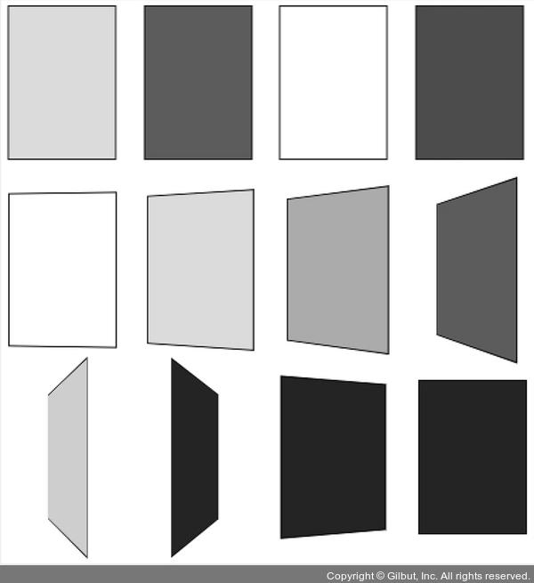

# 11장 이벤트 루프 이해하기_카드 짝 맞추기 게임

이 장에서는 카드 짝 맞추기 게임을 만들며 비동기 코드를 더 깊게 들여보는 시간을 가진다. 짝 맞추기 게임은 다음과 같다. 12장의 카드가 있고, 두 장씩 서로 색이 같다. 모든 카드의 색을 보여 주며 잦ㅁ깐 동안 카드 짝을 외울 수 있는 시간을 주고 나서, 카드를 다시 전부 뒤지은 뒤 짝을 맞추게 한다. 많은 카드를 실시간으로 뒤집어야 하는 만큼, 자바스크립트 코드가 돌아가는 순서를 정확하게 알아야 한다.



## 11.1 순서도 그리기

카드 짝 맞추기 게임의 순서도는 다음과 같다.


2장씩 카드를 뒤집어 2장의 카드 색이 같으면 완료 목록에 넣고, 다르면 다시 뒤집는다. 12장의 카드를 모두 맞추면 성공이다.

처음에 끝말잇기나 계산기, 숫자야구 게임을 만들 때는 철저하게 하나의 작업을 하나의 절차로 만들어서 나열했지만 이제는 서로 관련 있는 절차는 가능한 하나의 절차로 묶고, 복잡한 비동기 절차나 조건문 절차에서만 순서도를 분리한다.

서로 관련 있는 절차를 하나의 절차로 묶는 것을 일일이 각각의 작업을 절차로 그리기 귀찮아서 그랬다고 해석할 수도 있지만, 반대로 프로그래밍 사고력이 늘었다고 해석할 수도 있다. 관련 있는 절차라면 몇 줄이 됐든 하나의 함수로 만들면 되니까 굳이 여러 개의 원을 그릴 필요가 없다.

심지어 간단한 비동기 함수는 굳이 순서도에 표시하지 않고 하나의 원으로 표현할 수 있는 경지에 다다랐을 수도 있다. 이렇게 조금씩 순서도에 익숙해지다 보면 직접 그린 순서도는 점점 더 짧아지고, 머릿속에서 채우는 부분은 점점 더 늘어나게 된다. 그러다가 결국에는 생각만으로 순서도를 그리는 경지에 오르게 된다. 이 경지에 오를 때까지 조금 더 순서도 그리기를 해보자.

다음과 같이 HTML 코드를 작성하자.

```html
<!DOCTYPE html>
<html lang="ko">
<head>
  <meta charset="UTF-8">
  <meta http-equiv="X-UA-Compatible" content="IE=edge">
  <meta name="viewport" content="width=device-width, initial-scale=1.0">
  <title>짝 맞추기</title>
  <style>
    .card {
      display: inline-block;
      margin-right: 20px;
      margin-bottom: 20px;
      width: 70px;
      height: 100px;
      perspective: 140px;
    }

    .card-inner {
      position: relative;
      width: 100%;
      height: 100%;
      text-align: center;
      transition: transform 0.8s;
      transform-style: preserve-3d;
    }

    .card.flipped .card-inner {
      transform: rotateY(180deg);
    }

    .card-front {
      background: navy;
    }

    .card-front, .card-back {
      position: absolute;
      width: 100%;
      height: 100%;
      border: 1px solid black;
      backface-visibility: hidden;
    }

    .card-back {
      transform: rotateY(180deg);
    }
  </style>
</head>

<body>
  <div id="wrapper"></div>
  <script>
    const $wrapper = document.querySelector('#wrapper');
  </script>
</body>

</html>
```

카드 뒤집기 효과는 CSS를 사용하면 쉽게 표현할 수 있다. 카드에 flipped 클래스를 추가하면 카드가 앞면으로 뒤집히고, flipped 클래스를 제거하면 카드가 뒷면으로 뒤집힌다.

물론 자바스크립트로도 카드 뒤집기 효과를 구현할 수 있지만, 원래 CSS가 디자인을 담당하므로 CSS로 표현 가능한 디자인 영역은 최대한 CSS만 사용해서 구현하는 것이 편하다.

## 11.2 카드 생성하기

12장의 카드를 생성하고, 2장씩 색이 같으므로 6가지 색이 필요하다. 여기서는 빨강(red), 주황(orange), 노랑(yellow), 초록(green), 하양(white), 분홍(pink)을 사용하겠다. 6가지 색은 앞면의 색이 되고, 뒷면은 남색(navy) 한가지이다.

6가지 색을 두 번 복사해서 이어 붙이면 12장이 된다. 다만, 카드의 순서를 매번 다르게 무작위로 섞어야 하니, 6장에서 사용했던 피셔-예이츠 셔플 알고리즘을 사용한다.

```html
<script>
  const $wrapper = document.querySelector('#wrapper');

  const total = 12;
  const colors = ['red', 'orange', 'yellow', 'green', 'white', 'pink'];
  let colorCopy = colors.concat(colors);
  let shuffled = [];

  function shuffle() { // 피셔-예이츠 셔플
    for (let i = 0; colorCopy.length > 0; i += 1) {
      const randomIndex = Math.floor(Math.random() * colorCopy.length);
      shuffled = shuffled.concat(colorCopy.splice(randomIndex, 1));
    }
  }

  function createCard(i) {
    const card = document.createElement('div');
    card.className = 'card'; // .card 태그 생성
    const cardInner = document.createElement('div');
    cardInner.className = 'card-inner'; // .card-inner 태그 생성
    const cardFront = document.createElement('div');
    cardFront.className = 'card-front'; // .card-front 태그 생성
    const cardBack = document.createElement('div');
    cardBack.className = 'card-back'; // .card-back 태그 생성
    cardBack.style.backgroundColor = shuffled[i];
    cardInner.appendChild(cardFront);
    cardInner.appendChild(cardBack);
    card.appendChild(cardInner);
    return card;
  }

  function startGame() {
    shuffle();
    for (let i = 0; i < total; i += 1) {
      const card = createCard(i);
      $wrapper.appendChild(card);
    }
  }
  startGame();
</script>
```