# 12장 재귀 함수 사용하기_지뢰 찾기 게임

마지막 세 개 장에서는 지금까지 배운 개념을 모두 활용해 지뢰 찾기 게임, 2048 게임, 두더지 잡기 게임을 만드는 시간을 가진다. 새로운 개념도 나온다. 하지만 지금까지 배운 개념을 확실히 익히지 않았다면 앞으로 게임을 만들 때 엄청나게 고생할 것이다. 또한, 앞으로는 코드를 그냥 따라서 작성하지 말고 직접 구현해 보면서 책에 나온 코드와 얼마나 일치하는지, 어떤 점이 다른지 비교해 보면 더욱 좋다.

이 장에서 만드는 게임은 지뢰 찾기이다. 표 모양의 칸을 만들고 폭탄을 무작위로 배치해야 한다. 그리고 칸을 클릭하면 주변에 있는 지뢰 개수를 표시하고, 주변 칸이 빈칸이면 한 번에 모든 칸을 여는 작업도 필요하다. 또한, 칸을 우클릭하면 물음표나 깃발도 표시되게 해 보자. 기능이 많아 코드가 길어질 텐데, 코드가 아무리 길더라도 호출 스택과 이벤트 루프의 원리를 이용해 실행 순서를 파악할 수 있어야 한다.

- [12.1 순서도 그리기](#121-순서도-그리기)
  - [소스코드](#소스코드)
- [12.3 우클릭으로 깃발 꼽기](#123-우클릭으로-깃발-꼽기)
- [12.4 주변 지뢰 개수 세기](#124-주변-지뢰-개수-세기)
  - [12.5 주변 칸 한 번에 열기](#125-주변-칸-한-번에-열기)
- [12.6 승리 확인하기](#126-승리-확인하기)
- [12.7 줄, 칸, 지뢰 개수 조절하기](#127-줄-칸-지뢰-개수-조절하기)
- [마무리 요약](#마무리-요약)
  - [contextmenu 이벤트](#contextmenu-이벤트)
  - [옵셔널 체이닝](#옵셔널-체이닝)
  - [재귀 함수](#재귀-함수)
- [Self Check 첫 번째로 클릭한 칸은 지뢰가 없게 만들기](#self-check-첫-번째로-클릭한-칸은-지뢰가-없게-만들기)
  - [소스코드](#소스코드-1)
  - [결과](#결과)


## 12.1 순서도 그리기

처음에 표를 생성하는 절차와 칸을 좌클릭하는 절차, 우클릭하는 절차로 나뉜다.

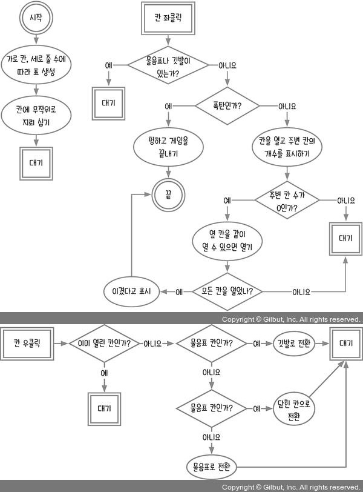

순서도에 칸 우클릭 이벤트에 물음표 칸인가에 대한 조건문이 잘못되어 있는 것 같다. 같은 조건이 두 번 반복된다. 두 번째 조건문에서 물음표 칸일 때의 경우에서 닫힌 칸으로 전환으로는 갈 수가 없다. `닫힌 칸인가?`, `물음표 칸인가?`, `깃발 칸인가?`를 조합해서 다시 조건을 설정해야 한다. 물음표 -> 깃발 -> 닫힌 -> 물음표로 정하든가 깃발 -> 닫힘 -> 물음표 -> 깃발로 정하든 순서와 변화를 정해야 한다. 결국 칸 우클릭은 전환 기능이라는 본질은 변하지 않는다.

### 소스코드

```html
<!DOCTYPE html>
<html lang="ko">
<head>
  <meta charset="UTF-8">
  <meta http-equiv="X-UA-Compatible" content="IE=edge">
  <meta name="viewport" content="width=device-width, initial-scale=1.0">
  <title>지뢰 찾기</title>
  <style>
    table { border-collapse: collapse; }
    td {
      border: 1px solid #bbb;
      text-align: center;
      line-height: 25px;
      width: 25px;
      height: 25px;
      background: #888;
    }
    td.opened { background: white; }
    td.flag { background: red; }
    td.question { background: orange; }
  </style>
</head>

<body>
  <table id="table">
    <tbody></tbody>
  </table>
  <div id="result"></div>
  <script>
    const $tbody = document.querySelector('#table tbody');
    const $result = document.querySelector('#result');
  </script>
</body>

</html>
```

앞으로는 글을 읽기 전에 어떻게 게임을 구성할지 스스로 먼저 생각해보자. 책에 나온 코드도 정답이 아니라 그저 하나의 예일 뿐이다. 책에 나온 코드만 따라 작성해서는 실력이 늘지 않는다.

그래서 읽기 전에 구성을 생각해본 것들을 아래에 정리하였다.

1. 가로 칸, 세로 줄에 대응되는 이차원 배열을 선언한다.
2. 가로, 세로, 지뢰 개수를 설정한다.
3. 피셔-예이츠 셔플을 이용하여 무작위로 이차원 배열에 지뢰를 심는다.
4. 좌클릭, 우클릭 상태를 저장할 변수를 선언하고 false로 초기화한다.
5. 데이터 시각화를 위해 HTML을 구성한다. (table)
6. 칸 좌클릭으로 물음표나 깃발이 있으면 대기한다.
7. 칸 좌클릭으로 지뢰인 경우 실패로 게임을 끝낸다.
8. 칸 좌클릭으로 폭탄이 아닌 경우 칸을 열고 주변 칸의 개수를 표시한다. 주변 칸의 수가 0이면 클릭한 칸을 열고 옆 칸을 같이 열 수 있으면 열어준다. 옆 칸의 기준을 파악하고 적용해야 한다. 그리고 모든 칸을 열었으면 승리를 표시하고 게임을 끝낸다. 아니라면 대기한다.
9. 칸 우클릭하면 웹에서 열리는 도구상자를 표시하지 않고 이벤트가 작동하도록 해야한다.
10. 칸 우클릭으로 이미 열린 칸이라면 대기한다.
11. 칸 우클릭으로 이미 열린 칸이 아니고 닫힌 칸이라면 깃발로 전환한다.
12. 칸 우클릭으로 이미 열린 칸이 아니고 물음표 칸이 아니라면
13. 칸 우클릭으로 이미 열린 칸이 아니고 물음표 칸이 아니라면 물음표로 전환한다.

이 이외에도 깃발, 물음표, 열린 칸, 닫힌 칸 등의 각각의 역할을 파악하거나 정의하여 구분을 잘 지어 기능을 만들어야 한다.

가로 10칸, 세로 10줄, 지뢰 10개로 시작하겠다. 항상 데이터와 화면은 구분하는 것이 좋다. 데이터로 먼저 표현하고, 데이터를 화면에 반영하는 순서로 진행하면 된다. 데이터를 올바르게 표현하지 못하면 당연히 화면도 잘못 나오게 된다.

데이터를 어떻게 표현하면 좋을까? 데이터에 어떤 정보가 들어가야 할지를 생각해야 한다. 단순히 닫힌 칸, 열린 칸, 물음표 칸, 깃발 칸, 지뢰 정도라고 생각하면 곤란하다.

물음표는 이 칸에 지뢰가 있는지 없는지 확신하지 못할 때 표시하는 기호이고, 깃발은 확실히 여기에 지뢰가 있다고 생각할 때 표시하는 기호이다. 일반 칸에서 마우스로 우클릭을 한 번 하면 물음표 칸이 되고, 다시 한 번 우클릭을 하면 깃발 칸이 된다. 여기서 다시 우클릭을 하면 일반 칸으로 되돌아온다.

열린 칸은 주변 지뢰 개수를 표시한다. 주변 지뢰 개수는 0부터 8까지 존재한다. 닫힌 칸에는 지뢰가 있으면서 닫힌 칸과 지뢰가 없으면서 닫힌 칸이 있다. 물음표 칸과 깃발 칸도 마찬가지로 지뢰가 있는 칸과 없는 칸으로 구분된다. 왜 물음표 칸과 깃발 칸에서도 지뢰 존재 여부를 구분해야 할까?

구분하지 않는 경우를 살펴보자. 지뢰가 있는 닫힌 칸이 있다고 하자. 한 번 우클릭을 해서 물음표 칸이 됐고, 다시 한 번 우클릭을 해서 깃발 칸이 됐다. 이제 한 번 더 우클릭을 하면 닫힌 지뢰 칸으로 되돌아와야 하는데, 데이터에는 단순히 깃발 칸으로 표시되어 이 칸에 지뢰가 있는지 없는지 기억하고 있지 않는다. 따라서 물음표 지뢰 칸과 깃발 지뢰 칸을 따로 만들어야 나중에 닫힌 지뢰 칸으로 되돌아올 수 있다.

지금까지 내용을 바탕으로 데이터 코드를 정리해보자.

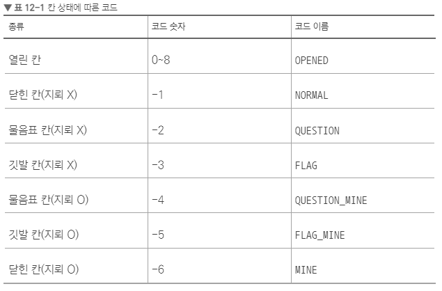

이 표를 코드로 구현하면 된다.

```js
const $tbody = document.querySelector('#table tbody');
const $result = document.querySelector('#result');
const row = 10; // 줄
const cell = 10; // 칸
const mine = 10; // 지뢰
const CODE = {
  NORMAL: -1,
  QUESTION: -2,
  FLAG: -3,
  QUESTION_MINE: -4,
  FLAG_MINE: -5,
  MINE: -6,
  OPENED: 0, // 0 이상이면 모두 열린 칸
}
let data;
function plantMine() {
  const candidate = Array(row * cell).fill().map((arr, i) => {
    return i;
  });
  const shuffle = [];
  while (candidate.length > row * cell - mine) {
    const chosen = candidate.splice(Math.floor(Math.random() * candidate.length), 1)[0];
    shuffle.push(chosen);
  }
  const data = [];
  for (let i = 0; i < row; i++) {
    const rowData = [];
    data.push(rowData);
    for (let j = 0; j < cell; j++) {
      rowData.push(CODE.NORMAL);
    }
  }

  for (let k = 0; k < shuffle.length; k++) {
    const ver = Math.floor(shuffle[k] / cell);
    const hor = shuffle[k] % cell;
    data[ver][hor] = CODE.MINE;
  }
  return data;
}
function drawTable() {
  data = plantMine();
  data.forEach((row) => {
    const $tr = document.createElement('tr');
    row.forEach((cell) => {
      const $td = document.createElement('td');
      if (cell === CODE.MINE) {
        $td.textContent = 'X'; // 개발 편의를 위해
      }
      $tr.append($td);
    });
    $tbody.append($tr);
  })
}
drawTable();
```

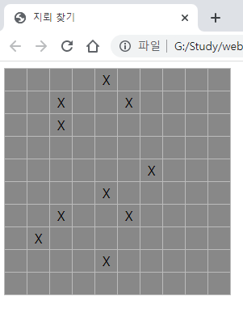

우선은 개발하기 쉽게 지뢰 위치를 X로 표시한다. 게임을 완성하기 전에 X를 지우면 된다.

## 12.3 우클릭으로 깃발 꼽기

깃발 이미지가 없어 깃발은 느낌표로 표시한다. 우클릭 이벤트는  `contextmenu` 이벤트가 따로 존재한다. 단, 브라우저 화면에서는 우클릭하면 기본으로 메뉴가 뜬다. 이 기본 동작을 없애야(preventDefault) 우클릭이 원하는 대로 작동한다.

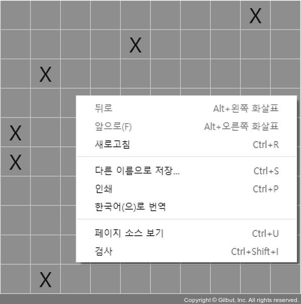

```js
function onRightClick(event) {
  event.preventDefault();
  const target = event.target;
  const rowIndex = target.parentNode.rowIndex;
  const cellIndex = target.cellIndex;
  const cellData = data[rowIndex][cellIndex];
  if (cellData === CODE.MINE) { // 지뢰면
    data[rowIndex][cellIndex] = CODE.QUESTION_MINE; // 물음표 지뢰로
    target.className = 'question';
    target.textContent = '?';
  } else if (cellData === CODE.QUESTION_MINE) { // 물음표 지뢰면
    data[rowIndex][cellIndex] = CODE.FLAG_MINE; // 깃발 지뢰로
    target.className = 'flag';
    target.textContent = '!';
  } else if (cellData === CODE.FLAG_MINE) { // 깃발 지뢰면
    data[rowIndex][cellIndex] = CODE.MINE; // 지뢰로
    target.className = '';
    target.textContent = 'X';
  } else if (cellData === CODE.NORMAL) { // 닫힌 칸이면
    data[rowIndex][cellIndex] = CODE.QUESTION; // 물음표로
    target.className = 'question';
    target.textContent = '?';
  } else if (cellData === CODE.QUESTION) { // 물음표면
    data[rowIndex][cellIndex] = CODE.FLAG; // 깃발으로
    target.className = 'flag';
    target.textContent = '!';
  } else if (cellData === CODE.FLAG) { // 깃발이면
    data[rowIndex][cellIndex] = CODE.NORMAL; // 닫힌 칸으로
    target.className = '';
    target.textContent = '';
  }
}

function drawTable() {
  data = plantMine();
  data.forEach((row) => {
    const $tr = document.createElement('tr');
    row.forEach((cell) => {
      const $td = document.createElement('td');
       if (cell === CODE.MINE) {
         $td.textContent = 'X'; // 개발 편의를 위해
      }
      $tr.append($td);
    });
    $tbody.append($tr);
    $tbody.addEventListener('contextmenu', onRightClick); // 우측 클릭 이벤트
  })
}
```

9장에서 배웠던 `rowIndex`, `cellIndex` 속성과 이벤트 버블링을 모두 활용했다. 코드에 중복되는 부분이 조금 보이긴 하지만, 중복을 제거하려다 보면 오히려 코드가 더 길어질 수 있다. 이럴 때는 그냥 놔두는 게 좋다.

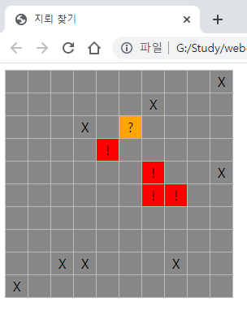

## 12.4 주변 지뢰 개수 세기

이번에는 좌클릭을 구현해보자. 마우스 왼쪽 버튼을 클릭할 때 해당 칸에 지뢰가 있는지 없는지로 코드가 분기한다. 지뢰가 없는 칸부터 구현한다. 지뢰가 없는 칸이라면 주변 지뢰 개수를 화면에 표시해야 한다.

특정 칸을 기준으로 주변 지뢰 개수를 구하는 코드이다. 다음 코드를 보기전에 스스로 구현해보자.

저자가 작성한 소스코드를 보기 전에 직접 구현해보았다.

```js
function onLeftClick(event) {
  const target = event.target;
  const rowIndex = target.parentNode.rowIndex;
  const cellIndex = target.cellIndex;
  const cellData = data[rowIndex][cellIndex];
  if (!cellData) return;
  if (cellData === CODE.MINE) { // 지뢰 칸이라면
    // 게임 오버
  } else if (cellData === CODE.NORMAL) { // 닫힌 칸이라면
    // 주변 지뢰 개수 구하기
    const mineCodes = [CODE.MINE, CODE.FLAG_MINE, CODE.QUESTION_MINE];
    let count = 0;
    // 클릭한 칸을 기준으로 주위 8칸을 확인해야 한다.
    // 왼쪽 위 칸인 11시 방향부터 시계방향으로 확인한다.
    if (mineCodes.includes(data[rowIndex - 1] ?? [] [cellIndex - 1])) count++;
    if (mineCodes.includes(data[rowIndex - 1] ?? [] [cellIndex])) count++;
    if (mineCodes.includes(data[rowIndex - 1] ?? [] [cellIndex + 1])) count++;
    if (mineCodes.includes(data[rowIndex][cellIndex + 1])) count++;
    if (mineCodes.includes(data[rowIndex + 1] ?? [] [cellIndex + 1])) count++;
    if (mineCodes.includes(data[rowIndex + 1] ?? [] [cellIndex])) count++;
    if (mineCodes.includes(data[rowIndex + 1] ?? [] [cellIndex - 1])) count++;
    if (mineCodes.includes(data[rowIndex][cellIndex - 1])) count++;
    target.className = 'opened';
    target.textContent = count || ''; // 0개라면 빈 문자열
    data[rowIndex][cellIndex] = count;
  }
}
```

맨 윗줄과 맨 아랫줄을 클릭하게 되면 잘못된 배열 인덱스 접근 에러가 발생하는데, 어떻게 해결할까 고민하다가 **널 벙합 연산자**(??)를 사용했다. 널 병합 연산자는 왼쪽 피연산자가 `null` 또는 `undefined`일 때 오른쪽 피연산자를 반환하는 논리 연산자이다.

> 널 병합 연산자에 대한 자세한 내용은 아래 링크 참고
> <https://developer.mozilla.org/ko/docs/Web/JavaScript/Reference/Operators/Nullish_coalescing>

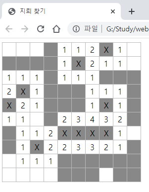

잘 작동하는 것을 확인했다. 그렇다면 이제 책의 소스코드를 보도록 하자.

```js
function countMine(rowIndex, cellIndex) {
  const mines = [CODE.MINE, CODE.QUESTION_MINE, CODE.FLAG_MINE];
  let i = 0;
  mines.includes(data[rowIndex - 1]?.[cellIndex - 1]) && i++;
  mines.includes(data[rowIndex - 1]?.[cellIndex]) && i++;
  mines.includes(data[rowIndex - 1]?.[cellIndex + 1]) && i++;
  mines.includes(data[rowIndex][cellIndex - 1]) && i++;
  mines.includes(data[rowIndex][cellIndex + 1]) && i++;
  mines.includes(data[rowIndex + 1]?.[cellIndex - 1]) && i++;
  mines.includes(data[rowIndex + 1]?.[cellIndex]) && i++;
  mines.includes(data[rowIndex + 1]?.[cellIndex + 1]) && i++;
  return i;
}

function onLeftClick(event) {
  const target = event.target; // td 태그겠죠?
  const rowIndex = target.parentNode.rowIndex;
  const cellIndex = target.cellIndex;
  const cellData = data[rowIndex][cellIndex];
  if (cellData === CODE.NORMAL) { // 닫힌 칸이면
    const count = countMine(rowIndex, cellIndex);
    target.textContent = count || '';
    target.className = 'opened';
    data[rowIndex][cellIndex] = count;
  } else if (cellData ===   CODE.MINE) { // 지뢰 칸이면
  } // 나머지는 무시
}

function drawTable() {
  data = plantMine();
  data.forEach((row) => {
    const $tr = document.createElement('tr');
    row.forEach((cell) => {
      const $td = document.createElement('td');
      if (cell === CODE.MINE) {
        $td.textContent = 'X'; // 개발 편의를 위해
      }
      $tr.append($td);
    });
    $tbody.append($tr);
    $tbody.addEventListener('contextmenu', onRightClick);
    $tbody.addEventListener('click', onLeftClick);
  });
}
```

내가 작성한 소스코드와 다른점은 지뢰 개수를 구하는 기능을 함수로 분류했고, 잘못된 배열의 인덱스 접근을 방지하기위해 옵셔널 체이닝을 사용했다는 점이다. 그리고 논리 연산자 AND를 사용해서 왼쪽피연산자의 값이 참이면 우측 피연산자를 리턴하도록 반환한 것이다. 변수 뿐만 아니라 함수도 리턴 값을 가지므로 함수 호출도 가능하다.

`?.`와 `&&` 기호를 사용한 코드가 8개 있다. `data[rowIndex - 1]`과 `data[rowIndex + 1]` 뒤에만 `?.` 기호가 붙어 있고, `data[rowIndex]` 뒤에는 없다. `?.`는 **옵셔널 체이닝**(optional chaining)이라는 연산자이다. 앞에 있는 것이 참(truthy)인 값이면 뒤 코드를 실행하고, 거짓(falsy)인 값이면 통째로 `undefined`로 만들어 버린다.

잘못된 인덱스 접근이라는 것은 `data[-1]`이나 `data[10]`에 접근하려는 상황을 말한다. 그래서 옵셔널 체이닝을 이용해 `undefined?.[cellIndex]`를 하면 undefined를 반환한다.
이러한 예외처리를 하지 않으면, 맨 윗줄과 맨 아랫줄을 클릭하면 에러가 발생한다.

&&는 **AND 논리 연산자**로 && 연산자를 넣은 것은 if 문을 줄이기 위한 장치이다. && 연산자는 앞의 식이 참이면 뒤의 식을 실행하고, 앞의 식이 거짓이면 뒤의 식을 실행하지 않는다.

> 옵셔널 체이닝, AND 논리 연산자에 대한 자세한 내용은 아래 링크를 참고
> <https://developer.mozilla.org/ko/docs/Web/JavaScript/Reference/Operators/Optional_chaining>
> <https://developer.mozilla.org/ko/docs/Web/JavaScript/Reference/Operators/Logical_AND>

즉, 다음 두 코드는 같다. 이 코드처럼 한 줄밖에 없는 if 문은 &&을 사용해 간단히 줄일 수 있다.

```js
mines.includes(data[rowIndex - 1]?.[cellIndex - 1]) && i++;
// 또는
if (mines.includes(data[rowIndex - 1]?.[cellIndex - 1])) {
  i++;
}
```

반대로, 지뢰 칸을 클릭한 경우도 구현해 보자.

```js
function onLeftClick(event) {
  const target = event.target; // td 태그겠죠?
  const rowIndex = target.parentNode.rowIndex;
  const cellIndex = target.cellIndex;
  const cellData = data[rowIndex][cellIndex];
  if (cellData === CODE.NORMAL) { // 닫힌 칸이면
    const count = countMine(rowIndex, cellIndex);
    target.textContent = count || '';
    target.className = 'opened';
    data[rowIndex][cellIndex] = count;
  } else if (cellData === CODE.MINE) { // 지뢰 칸이면
    target.textContent = '펑';
    target.className = 'opened';
    $tbody.removeEventListener('contextmenu', onRightClick);
    $tbody.removeEventListener('click', onLeftClick);
  } // 나머지는 무시
}
```

지뢰 칸을 클릭하면 칸이 열리면서 ‘펑’이라는 글자가 나타난다. 지뢰가 터진 후에는 더 이상 칸을 클릭할 수 없도록 좌클릭과 우클릭 이벤트 리스너를 해제한다.

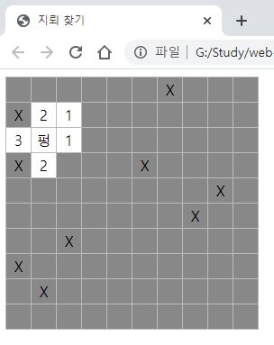

### 12.5 주변 칸 한 번에 열기

지뢰 게임은 지뢰를 제외한 나머지 칸을 모두 열면 승리한다. 100개의 칸이 있는데 지뢰는 10개 밖에 없으므로 90번이나 칸을 클릭해야 한다. 그래서 실제 지뢰 찾기 게임은 주변 지뢰 개수가 0개인 칸을 클릭하면 자동으로 주변 칸도 모두 열어준다. 이것을 구현해 보자.

```js
function open(rowIndex, cellIndex) {
  const target = $tbody.children[rowIndex]?.children[cellIndex];
  if (!target) {
    return;
  }
  const count = countMine(rowIndex, cellIndex);
  target.textContent = count || '';
  target.className = 'opened';
  data[rowIndex][cellIndex] = count;
  return count;
}

function openAround(rI, cI) {
  const count = open(rI, cI);
  if (count === 0) {
    open(rI - 1, cI - 1);
    open(rI - 1, cI);
    open(rI - 1, cI + 1);
    open(rI, cI - 1);
    open(rI, cI + 1);
    open(rI + 1, cI - 1);
    open(rI + 1, cI);
    open(rI + 1, cI + 1);
  }
}

function onLeftClick(event) {
  const target = event.target; // td 태그겠죠?
  const rowIndex = target.parentNode.rowIndex;
  const cellIndex = target.cellIndex;
  const cellData = data[rowIndex][cellIndex];
  if (cellData === CODE.NORMAL) { // 닫힌 칸이면
    openAround(rowIndex, cellIndex); // 주변 칸도 연다
  } else if (cellData === CODE.MINE) { // 지뢰 칸이면
  } // 나머지는 무시
}
```

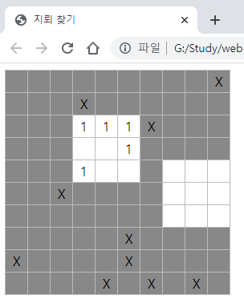

`openAround`함수는 먼저 현재 칸을 열고(open) 현재 칸의 주변 지뢰 개수가 0개면 주변 칸을 연다. open 함수에서는 target이 존재하는지 확인해서 존재하는 경우에만 해당 칸을 연다.

주변 지뢰 개수가 0인 칸을 클릭해서 주변 칸이 열렸는데 주변 칸의 주변 칸도 지뢰 개수가 0이라면 어떻게 할까? 주변 칸의 주변 칸도 열어야한다. 이미 주변 칸을 여는 함수를 만들었으니 조금만 응용하면 주변 칸의 주변 칸도 열 수 있다.

```js
function openAround(rI, cI) {
  const count = open(rI, cI);
  if (count === 0) {
    openAround(rI - 1, cI - 1);
    openAround(rI - 1, cI);
    openAround(rI - 1, cI + 1);
    openAround(rI, cI - 1);
    openAround(rI, cI + 1);
    openAround(rI + 1, cI - 1);
    openAround(rI + 1, cI);
    openAround(rI + 1, cI + 1);
  }
}
```

주변 지뢰 개수가 0개일 때 호출하는 `open`함수를 `openAround`함수로 바꿨다. 이렇게 자기 자신을 다시 호출하는 함수를 **재귀 함수**(recursive function)라고 한다.

이렇게 하면 주변 칸뿐만 아니라 주변 칸의 주변 칸도 열릴 것 같지만, 실제로 해 보면 오류가 발생한다. 다만, 논리적인 오류라기보다 언어적 특성 때문에 발생하는 오류이다.

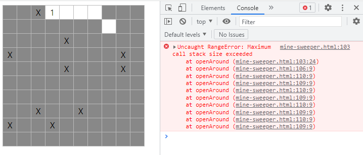

`Maximum call stack size exceeded` 오류는 재귀 함수를 사용하다 보면 자주 볼 수 있다. 호출 스택의 최대 크기를 초과하면 발생하는 오류인데, 왜 이런 오류가 발생하는지 살펴보자.

`onLeftClick`함수가 제일 먼저 호출되고, 그 안에서 `openAround`함수가 호출된다. 따라서 호출 스택에서는 `onLeftClick`함수 위에 `openAround`함수가 올라가 있다. 그다음에 `open`함수가 호출 스택으로 들어간다.

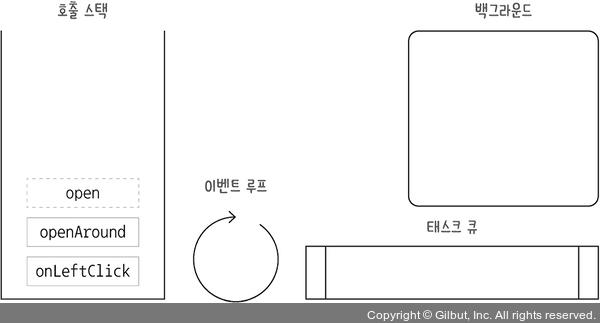

`open`함수는 `openAround`함수보다 먼저 종료되므로 호출 스택에서 빠져나오지만, `openAround`함수는 종료되기 전에 `openAround`함수를 호출하므로 빠져나오지 못한다. `openAround`안의 `openAround`함수는 또다른 `openAround`함수를 호출하게 되고, 이렇게 끊임없이 위로 쌓이다가 호출 스택 최대 크기를 초과하게 된다.

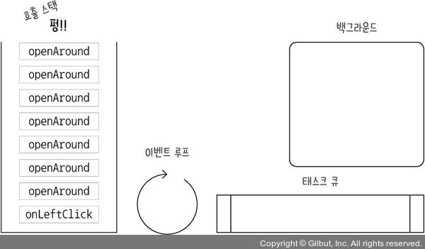

브라우저별로 호출 스택의 최대 크기가 다르다. 다음 코드를 복사해 콘솔에 붙여 넣으면 브라우저의 최대 호출 스택 크기를 알 수 있다.

```js
let i = 0;
function recurse() {
  i++;
  recurse();
}
try {
  recurse();
} catch (ex) {
  alert('최대 크기는 ' + i + '\nerror: ' + ex);
}
```

이 문제를 해결하는 방법은 많지만, 가장 간단한 방법은 비동기 함수를 사용하는 것이다. 재귀 함수의 내부를 대표적인 비동기 함수인 `setTimeout`으로 감싸면 된다. 시간은 0초로 해서 즉시 호출되게 한다.

```js
function openAround(rI, cI) {
  setTimeout(() => {
    const count = open(rI, cI);
    if (count === 0) {
      openAround(rI - 1, cI - 1);
      openAround(rI - 1, cI);
      openAround(rI - 1, cI + 1);
      openAround(rI, cI - 1);
      openAround(rI, cI + 1);
      openAround(rI + 1, cI - 1);
      openAround(rI + 1, cI);
      openAround(rI + 1, cI + 1);
    }
  }, 0);
}
```

`openAround`안에 `setTimeout`을 사용하면 백그라운드로 콜백 함수를 보낼 수 있다. 호출 스택에 `openAround`가 두 개 이상 쌓이지 않으니 호출 스택의 최대 크기를 초과할 일도 없다.

이제 칸들이 순차적으로 열리기 시작한다. 그런데 열어야 할 칸이 많으면 브라우저가 느려지는 모습을 볼 수 있다. 심한 경우에는 브라우저가 멈춰 버릴 수도 있다. 재귀 함수를 잘못 사용하면 연산량이 매우 많아진다.

문제는 다음과 같은 경우에 발생한다. 기준이 되는 어떤 칸을 열면 그 칸은 주변 8칸을 검사한다. 기준 칸의 오른쪽 칸을 열면, 오른쪽 칸은 다시 주변 8칸을 검사하고, 주변 8칸 중에는 기준 칸도 있어서 기준 칸을 다시 열게 된다. 다시 기준 칸은 주변 칸을 검사하고, 주변 칸 중에 오른쪽 칸을 열게 된다. 이렇게 주변 칸 검사와 열기가 무한 반복되어 끝이 나지 않게 된다.

현재 `openAround`함수가 몇 칸을 열고 있는지 확인해 보자.

```js
const $tbody = document.querySelector('#table tbody');
const $result = document.querySelector('#result');
const row = 10; // 줄
const cell = 10; // 칸
const mine = 10;
const CODE = {...};
let data;
let openCount = 0;

...
function open(rowIndex, cellIndex) {
  const target = $tbody.children[rowIndex]?.children[cellIndex];
  if (!target) {
    return;
  }
  const count = countMine(rowIndex, cellIndex);
  target.textContent = count || '';
  target.className = 'opened';
  data[rowIndex][cellIndex] = count;
  openCount++;
  console.log(openCount);
  return count;
}
```

다시 실행해 칸을 열어 보면 실제로 열어야 하는 칸보다 훨씬 더 많은 칸을 열고 있는 것이 콘솔에 보인다. 숫자가 보이지 않는다면 open 함수가 너무 많이 호출되어 브라우저가 멈춘 상태일 것이다.

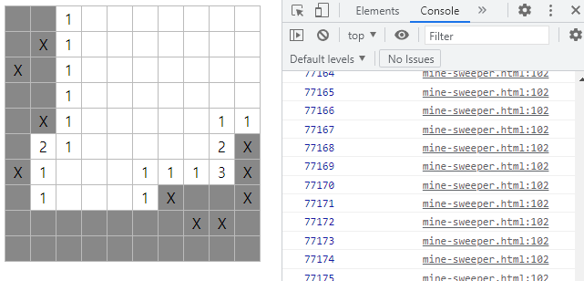

따라서 한 번 열었던 칸을 다시 열지 않게 수정해보자.

```js
function open(rowIndex, cellIndex) {
  if (data[rowIndex]?.[cellIndex] >= CODE.OPENED) return;
  const target = $tbody.children[rowIndex]?.children[cellIndex];
  if (!target) {
    return;
  }
  const count = countMine(rowIndex, cellIndex);
  target.textContent = count || '';
  target.className = 'opened';
  data[rowIndex][cellIndex] =   count;
  openCount++;
  console.log(openCount);
  return count;
}
```

다시 실행해 보면 콘솔의 숫자가 열린 칸의 개수와 일치하는 것을 확인할 수 있다.

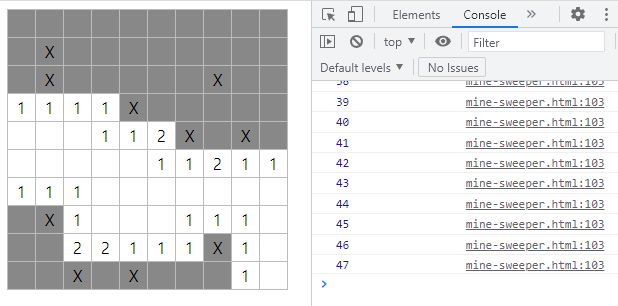

## 12.6 승리 확인하기

모든 칸을 열었을 때 승리했다고 사용자에게 알려 주자. 실제 지뢰 찾기 게임처럼 몇 초가 걸렸는지도 보여 주면 좋아 보인다.

```html
<body>
<div id="timer">0초</div>
<table id="table">
  <tbody></tbody>
</table>
<div id="result"></div>
<script>
  const $timer = document.querySelector('#timer');
  const $tbody = document.querySelector('#table tbody');
  const $result = document.querySelector('#result');
  const row = 10; // 줄
  const cell = 10; // 칸
  const mine = 10;
  const CODE = {...};
  let data;
  let openCount = 0;
  let startTime = new Date();
  const interval = setInterval(() => {
    const time = Math.floor((new Date() - startTime) / 1000);
    $timer.textContent = `${time}초`;
  }, 1000);

  function plantMine() {...}

  function oRightClick(event) {...}

  function countMine(rowIndex, cellIndex) {...}
  function open(rowIndex, cellIndex) {
    if (data[rowIndex]?.[cellIndex] >= CODE.OPENED) return;
    const target = $tbody.children[rowIndex]?.children[cellIndex];
    if (!target) {
      return;
    }
    const count = countMine(rowIndex, cellIndex);
    target.textContent = count || '';
    target.className = 'opened';
    data[rowIndex][cellIndex] = count;
    openCount++;
    console.log(openCount);
    if (openCount === row * cell - mine) {
      const time = (new Date() - startTime) / 1000;
      clearInterval(interval);
      $tbody.removeEventListener('contextmenu', onRightClick);
      $tbody.removeEventListener('click', onLeftClick);
      setTimeout(() => {
        alert(`승리했습니다! ${time}초가 걸렸습니다.`);
      }, 0);
    }
    return count;
  }

  function openAround(rI, cI) {...}

  function onLeftClick(event) {
    const target = event.target; // td 태그겠죠?
    const rowIndex = target.parentNode.rowIndex;
    const cellIndex = target.cellIndex;
    const cellData = data[rowIndex][cellIndex];
    if (cellData === CODE.NORMAL) { // 닫힌 칸이면
      openAround(rowIndex, cellIndex);
    } else if (cellData === CODE.MINE) { // 지뢰 칸이면
      target.textContent = '펑';
      target.className = 'opened';
      clearInterval(interval);
      $tbody.removeEventListener('contextmenu', onRightClick);
      $tbody.removeEventListener('click', onLeftClick);
    } // 나머지는 무시
  }

  function drawTable() {...}
  drawTable();
</script>
</body>
```

`#timer`태그를 만들고 `setInterval`함수로 초 단위로 경과한 시간을 표시한다. 폭탄을 클릭하거나 승리했을 때 타이머를 멈추는 것을 잊지 말자!

`openCount`(칸을 연 횟수)가 빈칸의 개수(row * cell - mine)와 일치하면 승리이다. `alert`함수를 `setTimeout`으로 감싸지 않으면 마지막 칸이 열리기 전에 알림창이 뜨므로 `setTimeout`으로 감싸야 한다.

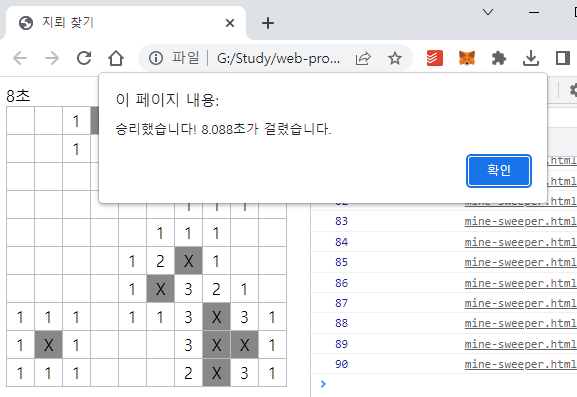

## 12.7 줄, 칸, 지뢰 개수 조절하기

지금까지는 표의 가로와 세로 줄 수, 지뢰 개수를 코드에 고정으로 넣어 사용했지만, 난이도 조절을 위해 사용자가 직접 입력할 수 있게 바꿔 보자. 또한, 완성 직전이므로 지뢰의 X 표시는 숨긴다.

```html
<body>
<form id="form">
  <input placeholder="가로 줄" id="row" size="5" />
  <input placeholder="세로 줄" id="cell" size="5" />
  <input placeholder="지뢰" id="mine" size="5" />
  <button>생성</button>
</form>
<div id="timer">0초</div>
<table id="table">
  <tbody></tbody>
</table>
<div id="result"></div>
<script>
  const $form = document.querySelector('#form');
  const $timer = document.querySelector('#timer');
  const $tbody = document.querySelector('#table tbody');
  const $result = document.querySelector('#result');
  let row; // 줄
  let cell; // 칸
  let mine;
  const CODE = {...};
  let data;
  let openCount = 0;
  let startTime;
  let interval;

  function onSubmit(event) {
    event.preventDefault();
    row = parseInt(event.target.row.value);
    cell = parseInt(event.target.cell.value);
    mine = parseInt(event.target.mine.value);
    drawTable();
    startTime = new Date();
    interval = setInterval(() => {
      const time = Math.floor((new Date() - startTime) / 1000);
      $timer.textContent = `${time}초`;
    }, 1000);
  }
  $form.addEventListener('submit', onSubmit);

  function plantMine() {...}

  function onRightClick(event) {
    ...
    } else if (cellData === CODE.FLAG_MINE) { // 깃발 지뢰면
      data[rowIndex][cellIndex] = CODE.MINE; // 지뢰로
      target.className = '';
      target.textContent = ''; // X 표시 없앰
    } else if (cellData === CODE.NORMAL) { // 닫힌 칸이면
      ...
    } else if (cellData === CODE.QUESTION) { // 물음표면
      ...
    } else if (cellData === CODE.FLAG) { // 깃발이면
      ...
    }
  }
  function countMine(rowIndex, cellIndex) {...}
  function open(rowIndex, cellIndex) {...}
  function openAround(rI, cI) {...}
  function onLeftClick(event) {...}
  function drawTable() {
    data = plantMine();
    data.forEach((row) => {
      const $tr = document.createElement('tr');
      row.forEach((cell) => {
        const $td = document.createElement('td');
        if (cell === CODE.MINE) {
          $td.textContent = ''; // X 표시 없앰
        }
        $tr.append($td);
      });
      $tbody.append($tr);
      $tbody.addEventListener('contextmenu', onRightClick);
      $tbody.addEventListener('click', onLeftClick);
    });
  }
</script>
</body>
```

`#form`태그를 만들어 `submit`이벤트를 추가한다. 단순히 태그와 이벤트 리스너만 추가하는 것이 아니라 표를 만들고, 지뢰를 심고, 초를 재는 등의 초기 설정에 관련된 코드를 모두 `submit`이벤트 내부로 옮겨야 한다.

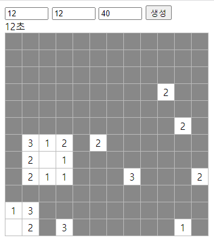

## 마무리 요약

### contextmenu 이벤트

지금까지 마우스 클릭 이벤트는 모두 좌클릭이었습니다. 마우스 우클릭 이벤트는 따로 있습니다. 좌클릭 이벤트는 click이고, 우클릭 이벤트는 contextmenu입니다. contextmenu 이벤트는 기본적으로 브라우저 메뉴를 띄우므로 이를 막으려면 event.preventDefault 메서드를 호출해야 합니다.

### 옵셔널 체이닝

?.는 **옵셔널 체이닝**(optional chaining)이라는 문법입니다. 앞에 있는 것이 참(truthy)인 값이면 뒤 코드를 실행하고, 거짓(falsy)인 값이면 코드를 모두 undefined로 만들어 버립니다.

```js
const obj = undefined;
const arr = undefined;
const func = undefined;
obj?.b; // undefined
arr?.[0]; // undefined
func?.(); // undefined
```

객체나 배열뿐만 아니라 함수에도 옵셔널 체이닝을 적용할 수 있습니다. 속성에 접근하거나 호출하려는 것이 거짓인 값인지 아닌지 의심될 때 옵셔널 체이닝을 적용합시다.

### 재귀 함수

어떤 함수의 내부에서 자기 자신을 다시 호출하는 함수를 **재귀 함수**(recursive function)라고 합니다.

let i = 0;
function recurse() {
  i++;
  recurse();
}
재귀 함수를 사용할 때 호출 스택의 최대 크기를 초과하는 경우가 빈번하게 발생합니다. 이때 Maximum call stack size exceeded 오류가 발생하는데, setTimeout과 같은 비동기 함수를 사용해 해결할 수 있습니다.

재귀 함수를 사용할 때는 연산량이 많으면 브라우저가 느려지는 현상이 발생하므로 연산량을 최소화할 수 있게 코드를 작성합시다.

## Self Check 첫 번째로 클릭한 칸은 지뢰가 없게 만들기

지뢰 찾기 게임을 할 때 하나의 숨겨진 규칙이 있습니다. 바로 첫 번째로 클릭한 칸은 절대 지뢰 칸이 아니라는 것입니다. 우리가 만든 게임은 첫 번째 클릭에서 지뢰를 클릭할 가능성이 있습니다. 다음 그림처럼 첫 클릭에서 지뢰를 밟게 되면 엄청 짜증나겠죠?

첫 번째로 클릭한 칸은 지뢰가 안 되게 바꿔 보세요. 또한, 게임을 하다가 지뢰를 클릭하면 실제 지뢰 찾기 게임처럼 모든 지뢰 위치를 사용자에게 보여 주세요.

힌트: 첫 번째 클릭한 위치에 지뢰가 있다면 이것을 어떻게 해야 할까요?

이번 미션을 정리하자면 아래와 같다.

1. 첫 번째 클릭한 칸은 지뢰가 아니어야 한다.
2. 지뢰를 클릭하면 모든 지뢰 위치를 사용자에게 보여준다.

개인 도전은 아래와 같다.

1. 지뢰의 개수가 가로 * 세로의 크기보다 큰 경우에 대한 예외 처리
2. 생성 버튼 누르면 계속 생성되는 문제 예외 처리
3. 아름다움을 위해 물음표, 깃발, 지뢰, 폭발한 지뢰를 이모지로 변경
4. 폭탄 클릭시 타이머가 멈추고 폭탄이 터졌다는 alert 표시

나의 풀이가 책에 있는 방식과 많이 다르니 궁금하다면 책을 찾아보면 좋다. 달라진 부분만 첨부한다.

### 소스코드

```js
...

// 개인 도전 3. 물음표, 깃발, 지뢰, 폭발한 지뢰를 이모지로 변경
const CODE_TEXT = {
  FLAG: '🚩',
  MINE: '💣',
  QUESTION: '❔',
}
let data;
let openCount = 0;
let startTime;
let interval;
let firstClick;
let mines; // 지뢰를 담을 배열

function onSubmit(event) {
  event.preventDefault();
  row = parseInt(event.target.row.value);
  cell = parseInt(event.target.cell.value);
  mine = parseInt(event.target.mine.value);

  // 개인 도전 1. 지뢰 개수에 대한 예외처리
  if (row * cell <= mine) {
    alert("지뢰의 개수는 '가로 * 세로'의 크기보다 클 수 없습니다.")
    return;
  }

  // 개인 도전 2. 생성 문제 예외 처리
  data = [];
  mines = [];
  $tbody.innerHTML = '';

  drawTable();
  openCount = 0;
  firstClick = true;
  startTime = new Date();
  interval = setInterval(() => {
    const time = Math.floor((new Date() - startTime) / 1000);
    $timer.textContent = `${time}초`;
  }, 1000);
}

function plantMine() {
  const candidate = Array(row * cell).fill().map((arr, i) => {
    return i;
  });
  const shuffle = [];
  while (candidate.length > row * cell - mine) {
    const chosen = candidate.splice(Math.floor(Math.random() * candidate.length), 1)[0];
    shuffle.push(chosen);
  }
  const data = [];
  for (let i = 0; i < row; i++) {
    const rowData = [];
    data.push(rowData);
    for (let j = 0; j < cell; j++) {
      rowData.push(CODE.NORMAL);
    }
  }

  for (let k = 0; k < shuffle.length; k++) {
    const ver = Math.floor(shuffle[k] / cell);
    const hor = shuffle[k] % cell;
    data[ver][hor] = CODE.MINE;
    mines.push({ rowIndex: ver, cellIndex: hor }); // 지뢰 배열에 추가
  }
  return data;
}

function onLeftClick(event) {
  const target = event.target; // td 태그겠죠?
  const rowIndex = target.parentNode.rowIndex;
  const cellIndex = target.cellIndex;
  let cellData = data[rowIndex][cellIndex];
  // Self Check 첫 번째로 클릭한 칸은 지뢰가 없게 만든다.
  if (firstClick) {
    firstClick = false;

    // 지뢰를 클릭했는지 확인한다.
    let isMine = false;
    let targetMine = null;
    for (const mine of mines) {
      if (mine.rowIndex === rowIndex && mine.cellIndex === cellIndex) {
        isMine = true;
        targetMine = mine;
        break;
      }
    }

    // 지뢰를 클릭했다면 지뢰를 옮긴다.
    if (isMine) {
      const max = row * cell;
      const normalData = [];
      data.forEach((row, rowIndex) => {
        row.forEach((cell, cellIndex) => {
          if (cell === CODE.NORMAL) {
            normalData.push({ rowIndex, cellIndex });
          }
        })
      })
      const randomIndex = Math.floor(Math.random() * normalData.length);
      const normalRowIndex = normalData[randomIndex].rowIndex;
      const normalCellIndex = normalData[randomIndex].cellIndex;
      data[normalRowIndex][normalCellIndex] = CODE.MINE;
      data[rowIndex][cellIndex] = CODE.NORMAL;
      cellData = CODE.NORMAL;
      targetMine.rowIndex = normalRowIndex;
      targetMine.cellIndex = normalCellIndex;
    }
  }

  if (cellData === CODE.NORMAL) { // 닫힌 칸이면
    openAround(rowIndex, cellIndex); // 주변 칸도 연다
  } else if (cellData === CODE.MINE) { // 지뢰 칸이면
    // Self Check 지뢰 칸을 클릭하면 모든 지뢰 위치를 사용자에게 보여준다.
    mines.forEach((mine) => {
      $tbody.children[mine.rowIndex].children[mine.cellIndex].textContent = CODE_TEXT.MINE;
    })

    target.textContent = '💥';
    target.className = 'opened';
    $tbody.removeEventListener('contextmenu', onRightClick);
    $tbody.removeEventListener('click', onLeftClick);
    // 개인 도전 4. 폭탄 클릭시 타이머가 멈추고 폭탄이 터졌다는 alert 표시
    clearInterval(interval);
    setTimeout(() => {
      alert(`폭탄이 터졌습니다!`);
    }, 5);
  } // 나머지는 무시
}

function onRightClick(event) {
  event.preventDefault();
  const target = event.target;
  const rowIndex = target.parentNode.rowIndex;
  const cellIndex = target.cellIndex;
  const cellData = data[rowIndex][cellIndex];

  if (cellData === CODE.MINE) { // 지뢰면
    data[rowIndex][cellIndex] = CODE.QUESTION_MINE; // 물음표 지뢰로
    target.className = 'question';
    target.textContent = CODE_TEXT.QUESTION;
  } else if (cellData === CODE.QUESTION_MINE) { // 물음표 지뢰면
    data[rowIndex][cellIndex] = CODE.FLAG_MINE; // 깃발 지뢰로
    target.className = 'flag';
    target.textContent = CODE_TEXT.FLAG;
  } else if (cellData === CODE.FLAG_MINE) { // 깃발 지뢰면
    data[rowIndex][cellIndex] = CODE.MINE; // 지뢰로
    target.className = '';
    target.textContent = '';
  } else if (cellData === CODE.NORMAL) { // 닫힌 칸이면
    data[rowIndex][cellIndex] = CODE.QUESTION; // 물음표로
    target.className = 'question';
    target.textContent = CODE_TEXT.QUESTION;
  } else if (cellData === CODE.QUESTION) { // 물음표면
    data[rowIndex][cellIndex] = CODE.FLAG; // 깃발으로
    target.className = 'flag';
    target.textContent = CODE_TEXT.FLAG;
  } else if (cellData === CODE.FLAG) { // 깃발이면
    data[rowIndex][cellIndex] = CODE.NORMAL; // 닫힌 칸으로
    target.className = '';
    target.textContent = '';
  }
}

...
```

### 결과

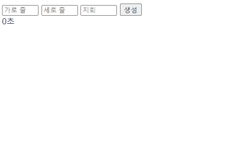