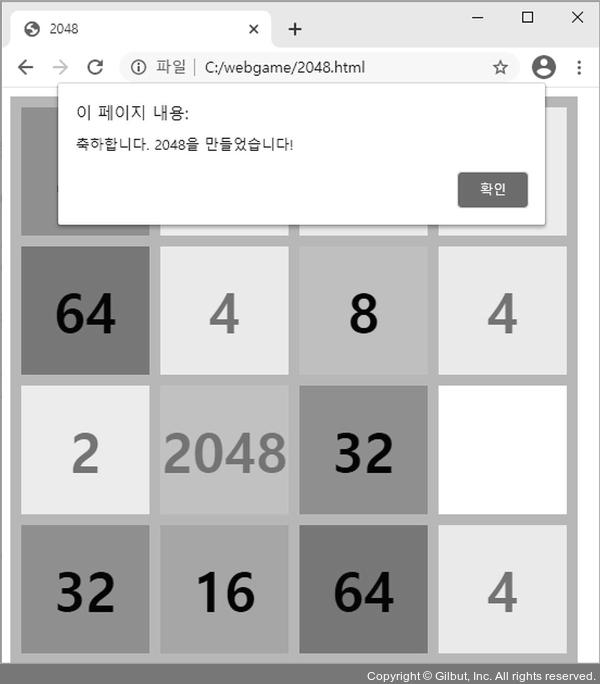
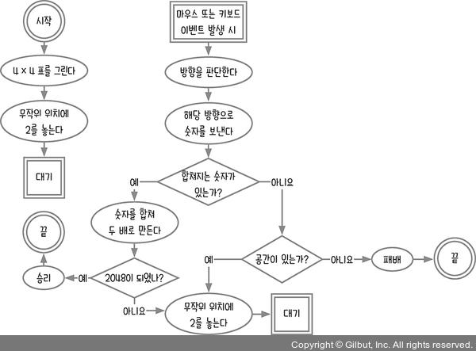
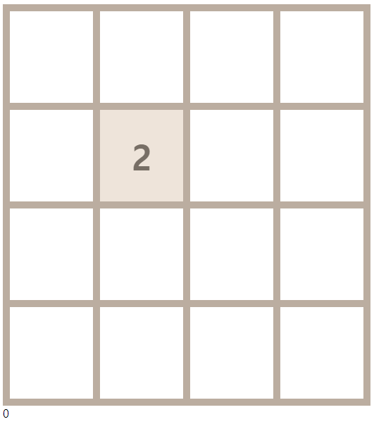
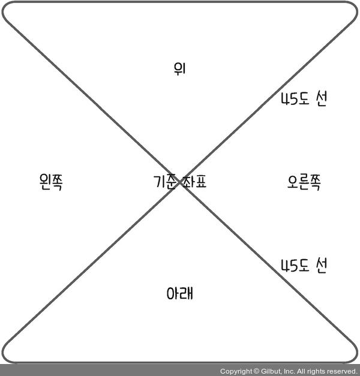
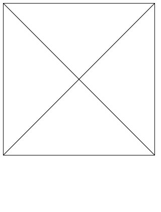
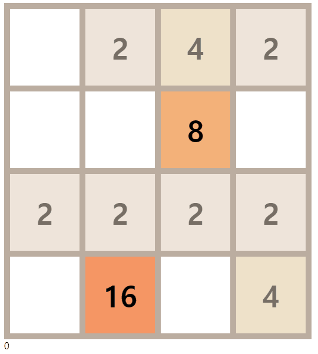
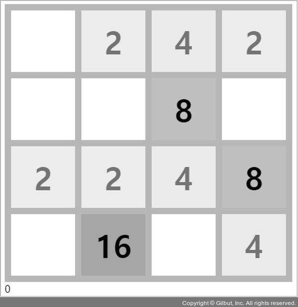
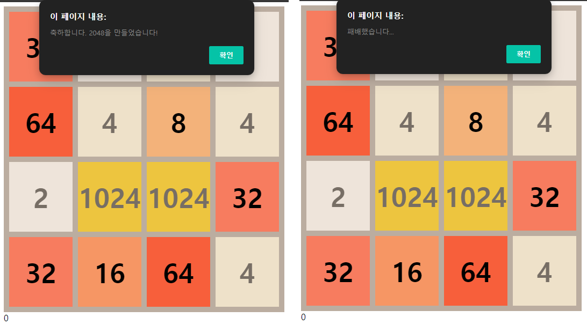
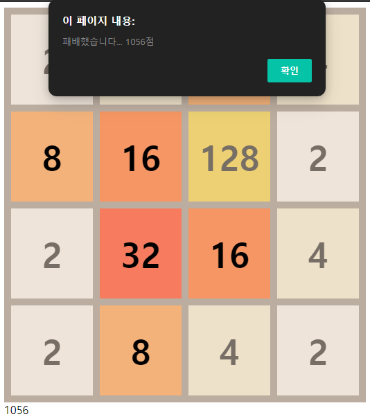
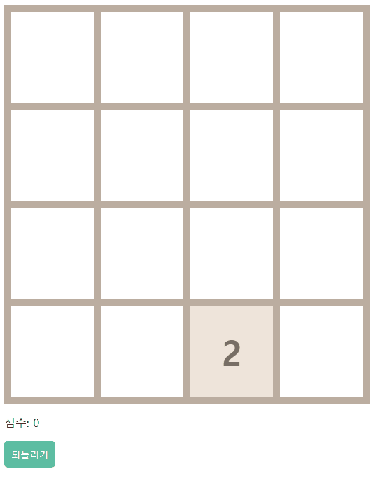

# 13장 키보드 및 마우스 이벤트 사용하기_2048 게임

이번에는 2048 게임을 만들어본다. 게임은 4 × 4 표에서 진행된다. 매 턴마다 무작위 위치에 숫자 2가 생성된다. 사용자는 턴마다 한 번씩 표를 상하좌우 네 방향 중 한 방향으로 기울일 수 있는데, 기울인 방향으로 숫자들이 쏠려서 이동하게 된다. 이때 같은 두 숫자가 연이어 있으면 하나로 합쳐지면서 두 배의 숫자가 된다. 이렇게 표를 상하좌우로 기울이면서 숫자들을 합쳐서 2048을 만드는 게임이다.

컴퓨터 모니터를 상하좌우로 기울일 수는 없으니 마우스 드래그 방향이나 키보드의 화살표 키를 입력하는 것으로 대체한다.



- [13.1 순서도 그리기](#131-순서도-그리기)
- [13.2 이동 방향 판단하기](#132-이동-방향-판단하기)
- [13.3 숫자 합쳐 두 배로 만들기](#133-숫자-합쳐-두-배로-만들기)
  - [제로초의 조언](#제로초의-조언)
- [13.4 승리와 패배 구현하기](#134-승리와-패배-구현하기)
- [마무리 요약](#마무리-요약)
  - [documentFragment](#documentfragment)
  - [키보드 이벤트](#키보드-이벤트)
  - [마우스 이벤트](#마우스-이벤트)
- [Self Check 되돌리기 기능 추가하기](#self-check-되돌리기-기능-추가하기)
  - [소스코드](#소스코드)
  - [결과](#결과)

## 13.1 순서도 그리기

2048 게임의 순서도를 먼저 그려 보자. 처음에 4 × 4 표를 그리고 무작위 위치에 숫자 2를 둔 상태로 시작한다. 마우스 또는 키보드 이벤트가 발생하면 어느 방향으로 움직일지를 판단해서 해당 방향으로 숫자를 몰고, 몰았을 때 연이어 같은 숫자 두 개 있으면 하나로 합치면서 숫자를 두 배로 만든다.

이렇게 해서 2048이 되면 승리하고, 16칸이 모두 꽉 찼는데 합칠 숫자가 없다면 패배하게 된다.



```html
<!DOCTYPE html>
<html lang="ko">
<head>
  <meta charset="UTF-8">
  <meta http-equiv="X-UA-Compatible" content="IE=edge">
  <meta name="viewport" content="width=device-width, initial-scale=1.0">
  <title>2048</title>
  <style>
    #table { border-collapse: collapse; user-select: none; }
    #table td {
      border: 10px solid #bbada0; width: 116px; height: 128px;
      font-size: 50px; font-weight: bold; text-align: center;
    }
    #score { user-select: none; }
    .color-2 { background-color: #eee4da; color: #776e65;}
    .color-4 { background-color: #eee1c9; color: #776e65;}
    .color-8 { background-color: #f3b27a; color: 'white';}
    .color-16 { background-color: #f69664; color: 'white';}
    .color-32 { background-color: #f77c5f; color: 'white';}
    .color-64 { background-color: #f75f3b; color: 'white';}
    .color-128 { background-color: #edd073; color: #776e65;}
    .color-256 { background-color: #edcc62; color: #776e65;}
    .color-512 { background-color: #edc950; color: #776e65;}
    .color-1024 { background-color: #edc53f; color: #776e65;}
    .color-2048 { background-color: #edc22e; color: #776e65;}
  </style>
</head>

<body>
  <table id="table"></table>
  <div id="score">0</div>
  <script>
    const $table = document.getElementById('table');
    const $score = document.getElementById('score');
    let data = [];

    function startGame() {
      const $fragment = document.createDocumentFragment();
      [1, 2, 3, 4].forEach(function () {
        const rowData = [];
        data.push(rowData);
        const $tr = document.createElement('tr');
        [1, 2, 3, 4].forEach(() => {
          rowData.push(0);
          const $td = document.createElement('td');
          $tr.appendChild($td);
        });
        $fragment.appendChild($tr);
      });
      $table.appendChild($fragment);
      put2ToRandomCell();
      draw();
    }

    function put2ToRandomCell() {
      const emptyCells = [];
      data.forEach(function (rowData, i) {
        rowData.forEach(function (cellData, j) {
          if (!cellData) {
            emptyCells.push([i, j]);
          }
        });
      });
      const randomCell = emptyCells[Math.floor(Math.random() * emptyCells.length)];
      data[randomCell[0]][randomCell[1]] = 2;
    }

    function draw() {
      data.forEach((rowData, i) => {
        rowData.forEach((cellData, j) => {
          const $target = $table.children[i].children[j];
          if (cellData > 0) {
            $target.textContent = cellData;
            $target.className = 'color-' + cellData;
          } else {
            $target.textContent = '';
            $target.className = '';
          }
        });
      });
    }

    startGame();
  </script>
</body>
</html>
```

코드는 크게 `startGame`, `put2ToRandomCell`, `draw` 세 가지 함수로 구성되어 있다. `startGame`함수는 게임 시작 시 호출되는 함수로, 4 x 4 표를 그린다. 함수에서 처음 `document.createDocumentFragment`메서드가 나온다. 지금까지는 표를 그릴 때 모든 칸을 `createElement`로 만들어서 실제 태그에 바로 추가(append)했었다. 하지만 추가해야 할 태그가 많다면 실무에서는 이러한 방식을 쓰지 않는 것이 좋다. 실제 태그에 추가하는 횟수가 많아질수록 성능 문제가 생길 가능성이 높아진다.

그래서 메모리 안에만 존재하는 `documentFragment`를 만든다. 가상의 태그라고 봐도 된다. 그리고 `documentFragment` 안에 필요한 태그를 추가(append)한 뒤 마지막으로 `$table`로 한 번에 `documentFragment`를 추가하는 방식을 사용한다. `documentFragment`에 추가하는 것은 성능에 문제가 없지만, 실제 화면에 보이는 태그에 추가하는 것은 문제가 될 수 있다고 기억하면 된다.

> document.createDocumentFragment()
> <https://developer.mozilla.org/ko/docs/Web/API/Document/createDocumentFragment>

`put2ToRandomCell`함수에서는 먼저 빈칸을 모두 찾고 무작위로 빈칸 중에 칸 하나를 선택해 숫자 2를 넣는다. `draw`함수에서는 반복문으로 16칸을 화면에 그린다. 그리고 각 칸에 텍스트와 클래스를 부여한다.

작성한 HTML 파일을 실행하면 다음과 같이 게임 시작 화면이 보일 것이다(번호 위치는 무작위이므로 책과 다를 수 있다).



## 13.2 이동 방향 판단하기

게임에 마우스 이벤트와 키보드 이벤트를 추가하고 마우스가 어느 방향으로 움직였는지 또는 키보드의 어떤 화살표를 눌렀는지 프로그램이 판단하게 해야 한다.

먼저 키보드와 마우스 이벤트의 종류를 알아보자. 키보드 이벤트에는 키보드 키를 눌렀을 때 발생하는 keydown, 키보드 키를 눌렀다 놓았을 때 발생하는 keyup이 있다. 마우스 이벤트에는 클릭할 때 발생하는 mousedown, 클릭했다 뗄 때 발생하는 mouseup이 있다. 그리고 마우스를 움직일 때 발생하는 mousemove 이벤트도 존재한다.

이런 이벤트를 다음과 같이 `window`객체에 추가한다.

```js
...
startGame();

window.addEventListener('keydown', (event) => {
  console.log('keydown', event);
});
window.addEventListener('keyup', (event) => {
  console.log('keyup', event);
});

window.addEventListener('mousedown', (event) => {
  console.log('mousedown', event);
});
window.addEventListener('mousemove', (event) => {
  console.log('mousemove', event);
});
window.addEventListener('mouseup', (event) => {
  console.log('mouseup', event);
});
```

이외에도 자주 쓰이는 이벤트로 주로 모바일 기기의 화면을 터치할 때 발생하는 touchstart(터치 시작), touchmove(터치 이동), touchend(터치 끝) 이벤트가 있다.

`event.key`속성에 어떤 키를 눌렀는지 나온다. 왼쪽은 ArrowLeft, 오른쪽은 ArrowRight, 위쪽은 ArrowUp, 아래쪽은 ArrowDown이다. 이를 통해 방향을 확인할 수 있다.

키보드나 마우스를 누르고 있으면 `down`이벤트가 계속 호출된다. 따라서 키보드나 마우스에서 손을 뗄 때 발생하는 `up`이벤트를 기준으로 코드를 작성하는 것이 낫다. `keydown`이벤트를 제거하고 `keyup`이벤트만 사용하도록 다음과 같이 수정한다.

```js
...
startGame();

function moveCells(direction) {}
window.addEventListener('keyup', (event) => {
  if (event.key === 'ArrowUp') {
    moveCells('up');
  } else if (event.key === 'ArrowDown') {
    moveCells('down');
  } else if (event.key === 'ArrowLeft') {
    moveCells('left');
  } else if (event.key === 'ArrowRight') {
    moveCells('right');
  }
});
```

마우스 이벤트는 조금 더 복잡하다. 마우스는 화면에서 자유롭게 움직일 수 있어서 특정한 기준을 잡아야만 방향을 판단할 수 있다. 클릭한 순간(mousedown)의 좌표를 기준으로 삼고 이를 클릭했다가 뗐을 때(mouseup)의 좌표와 비교해서 방향을 판단한다. 90도 각도로 마우스를 이동하면 판단하기 쉬우나 45도처럼 애매한 각도로 마우스를 움직일 수 있다. 따라서 기준을 명확하게 세워야 한다.



그림에서 가운뎃점을 마우스를 클릭한 시작점으로 하고, 마우스 버튼을 놓은 지점을 끝점으로 한다. 시작점가 끝점이 이루는 각도로 방향을 판단한다. 각도가 ±45도보다 작으면 각각 왼쪽과 오른쪽이 되고, ±45도보다 크면 각각 위쪽과 아래쪽이 된다.

마우스 이벤트의 속성을 보면 x, y 좌표를 얻을 수 있는데, 좌표에는 여러 종류가 있다. x좌표로는 `clientX`, `offsetX`, `pageX`, `screenX`, `movementX`가 있고 y좌표에도 동일한 종류가 있다. 각 좌표가 의미하는 바를 알아야 정확하게 마우스의 위치 변화를 잡아낼 수 있다.

`clientX`, `clientY`는 현재 브라우저 페이지 내에서의 x, y좌표를 가리킨다(픽셀 단위). `pageX`와 `pageY`도 브라우저 페이지 내에서의 x, y좌표를 가리키지만, 스크롤이 있으면 스크롤 한 픽셀 값까지 포함한다는 점이 `clientX`, `clientY`와 다르다.

`offsetX`와 `offsetY`는 이벤트를 연결한 대상을 기준으로 마우스의 x, y좌표를 가져온다. 지금은 `window`에 이벤트를 걸어서 `clientX`, `clientY`와 동일하지만, 페이지 내의 다른 태그에 마우스 이벤트를 걸면 해당 태그의 왼쪽 모서리 좌표가 0이 된다. `screenX`와 `screenY`는 모니터를 기준으로 잡아서 모니터의 왼쪽 모서리가 0이 된다.

`movementX`와 `movementY`는 지난 `mousemove`이벤트와 비교해 얼마나 마우스를 움직였는지 표시한다. 따라서 `mousemove`이벤트인 경우에만 실제 값이 잡힌다.

마우스 방향을 판단할 때는 `mousedown`과 `mouseup`이벤트만 필요하다. `mousemove`이벤트는 제거하고 다음과 같이 코드를 수정한다.

```js
window.addEventListener('keyup', (event) => {...});

let startCoord;
window.addEventListener('mousedown', (event) => {
  startCoord = [event.clientX, event.clientY];
});
window.addEventListener('mouseup', (event) => {
  const endCoord = [event.clientX, event.clientY];
  const diffX = endCoord[0] - startCoord[0];
  const diffY = endCoord[1] - startCoord[1];
  if (diffX < 0 && Math.abs(diffX) > Math.abs(diffY)) {
    moveCells('left');
  } else if (diffX > 0 && Math.abs(diffX) > Math.abs(diffY)) {
    moveCells('right');
  } else if (diffY > 0 && Math.abs(diffX) <= Math.abs(diffY)) {
    moveCells('down');
  } else if (diffY < 0 && Math.abs(diffX) <= Math.abs(diffY)) {
    moveCells('up');
  }
});
```

시작 좌표는 `startCoord`에 저장했고, 끝 좌표는 `endCoord`에 저장했다. x좌표가 바뀐 양은 `diffX`로, y좌표가 바뀐 양은 `diffY`에 저장했다. 왼쪽과 오른쪽 영역은 `diffX`의 절댓값이 `diffY`의 절댓값보다 작다. 실제로 그런지 임의의 시작점과 끝점을 넣어서 계산해 보자. 절댓값은 `Math.abs` 메서드로 구한다. 예를 들어, -5를 인수로 넣으면 5가 나온다.

여기서 왼쪽 영역은 `diffX`가 0보다 작고, 오른쪽 영역은 `diffX`가 0보다 크므로 왼쪽과 오른쪽도 구분할 수 있다. `diffX`의 절댓값이 `diffY`의 절댓값보다 크거나 같으면 위쪽과 아래쪽 영역이 된다. 여기서 위쪽은 `diffY`가 0보다 작고, 아래쪽은 `diffY`가 0보다 크므로 위쪽과 아래쪽도 구분할 수 있다.

정말 제대로 잘 나오는지 궁금하기 때문에 테스트하기 위한 HTML 파일을 하나 만들었다.

```html
<!DOCTYPE html>
<html lang="ko">
<head>
  <meta charset="UTF-8">
  <meta http-equiv="X-UA-Compatible" content="IE=edge">
  <meta name="viewport" content="width=device-width, initial-scale=1.0">
  <title>X</title>
  <style>
    canvas {
      position: relative;
      border: 1px solid black;
    }
    #result {
      font-size: 20px;
      font-weight: bold;
    }
    #log {
      white-space: pre;
    }
  </style>
</head>
<body>
  <canvas width="300" height="300"></canvas>
  <div id="result"></div>
  <div id="log"></div>
  <script>
    const $result = document.querySelector('#result');
    const $log = document.querySelector('#log');
    const $canvas = document.querySelector('canvas');
    const context = $canvas.getContext('2d');

    (function drawX() {
      context.beginPath();
      context.moveTo(0, 0);
      context.lineTo($canvas.width, $canvas.height);
      context.moveTo(0, $canvas.height);
      context.lineTo($canvas.width, 0);
      context.stroke();
    })();

    const colors = ['brown', 'green', 'violet,', 'pink', 'orange', 'purple', 'coral', 'skyblue'];
    function draw({ startX, startY, endX, endY }) {
      context.beginPath();
      context.moveTo(startX, startY);
      context.strokeStyle = colors[Math.floor(Math.random() * colors.length)];
      context.lineTo(endX, endY);
      context.stroke();
    }

    // clinetX, clientY가 아닌
    // offsetX, offsetY 캔버스 내부 크기에 상대적인 좌표 값으로 확인한다.
    let startCoord;
    let log;
    $canvas.addEventListener('mousedown', (event) => {
      startCoord = [event.offsetX, event.offsetY];
    });
    $canvas.addEventListener('mouseup', (event) => {
      const endCoord = [event.offsetX, event.offsetY];
      const diffX = endCoord[0] - startCoord[0];
      const diffY = endCoord[1] - startCoord[1];

      // diffX와 diffY의 절대값 비교로 대각선 영역에 대해
      // 상하좌우 판단이 잘 되는 것을 확인할 수 있다.
      if (diffX < 0 && Math.abs(diffX) > Math.abs(diffY)) {
        $result.textContent = 'left';
      } else if (diffX > 0 && Math.abs(diffX) > Math.abs(diffY)) {
        $result.textContent = 'right';
      } else if (diffY > 0 && Math.abs(diffX) <= Math.abs(diffY)) {
        $result.textContent = 'down';
      } else if (diffY < 0 && Math.abs(diffX) <= Math.abs(diffY)) {
        $result.textContent = 'up';
      }

      draw({
        startX:startCoord[0], startY:startCoord[1],
        endX: endCoord[0], endY:endCoord[1],
      })

      log = '';
      log += `startX: ${startCoord[0]}, startY: ${startCoord[1]}\n`;
      log += `endX: ${endCoord[0]}, endY: ${endCoord[1]}\n`;
      log += `diffX: ${diffX}, diffY: ${diffY}\n`;
      $log.textContent = log;
    });
  </script>
</body>
</html>
```

기본적으로 캔버스에 X로 대각선을 그리고, `mousedown`지점에서 시작해서 `mouseup`지점까지 랜덤 한 색의 선을 그려주는 프로그램이다. 상하좌우 판단 결과도 화면에 표시하고, 각 좌표들에 대한 로그도 화면에 표시한다.

선을 그려주므로 내가 어느 지점에서 클릭을 시작해서 어느 지점에 클릭을 놓았는지 확인할 수 있다.



중앙을 기준으로 테스트했지만, 시작 지점은 `mousedown`이벤트가 발생할 때를 기준으로 하기 때문에 헷갈리면 안 된다.

## 13.3 숫자 합쳐 두 배로 만들기

방향을 알았으니 `moveCells`함수를 구현해 보자. 먼저 각 칸을 해당 방향으로 정렬하고, 숫자가 겹치는 칸이 있는지 파악해서 있다면 합쳐야 한다. 상당히 복잡하므로 차분히 생각해야 구현할 수 있다.

왼쪽 정렬부터 구현해 보자. 왼쪽 정렬을 구현하면 나머지 정렬은 방향만 바꾸면 된다. 숫자를 합치는 것은 아직 구현하지 말고 숫자를 왼쪽으로 정렬하는 것만 해 보자.

```js
data = [
  [0, 2, 4, 2],
  [0, 0, 8, 0],
  [2, 2, 2, 2],
  [0, 16, 0, 4],
];
draw();

function moveCells(direction) {
  switch (direction) {
    case 'left':
      const newData = [[], [], [], []];
      data.forEach((rowData, i) => {
        rowData.forEach((cellData, j) => {
          if (cellData) {
            newData[i].push(cellData);
          }
        });
      });
      console.log(newData);
      [1, 2, 3, 4].forEach((rowData, i) => {
        [1, 2, 3, 4].forEach((cellData, j) => {
          data[i][j] = newData[i][j] || 0;
        });
      });
      break;
    case 'right':
      break;
    case 'up':
      break;
    case 'down':
      break;
  }
  draw();
}
```

칸에 있는 숫자들을 왼쪽으로 정렬하는 코드이다. 임시로 데이터를 저장할 `newData`변수를 하나 선언했다. 다양한 에제를 테스트해야 하므로 `moveCells` 함수 위에 더미 데이터를 넣었다. 여러분은 더미 데이터를 원하는 대로 바꾸면서 모든 경우에도 잘 작동하는지 테스트하면 된다.

반복문을 돌면서 각 줄에 있는 숫자를 `newData`배열의 각 줄 안에 차례대로 넣는다. 첫 번째 줄에 있는 2, 4, 2를 `newData`배열의 첫 번째 줄에 넣고, 두 번째 줄에 있는 8을 `newData`배열의 두 번째 줄에 넣는 식이다. 단순히 `data`배열에 있던 값을 `newData`배열에 옮겼을 뿐인데 왼쪽으로 정렬된다. 왜 그럴까?



데이터를 `newData`로 옮길 때 `cellData`가 0이 아닌 것들만 옮겨서 그렇다. 0을 제외한 나머지 값들을 `newData`로 옮겼으므로 값들을 왼쪽 정렬한 것과 같은 효과가 나타난다.

그렇다면 연속된 두 값을 합치는 것은 어떻게 하면 될까? 줄마다 왼쪽부터 검사해서 다음 칸의 숫자와 같은 숫자 있으면 합치면 될 것 같다. 다만, 여기에는 한 가지 함정이 있다.



그림과 같은 더미 데이터가 있을 때 표의 세 번째 줄을 살펴보자. 2, 2, 4, 8이라는 숫자가 있고, 이를 왼쪽으로 몰면 두 개의 2가 합쳐져서 4, 4, 8이 되어야 한다. 그런데 앞에서 생각한 코드를 잘못 적용하면 16하나만 남을 수도 있다. 왼쪽부터 차례대로 검사하면 처음에 2,2가 만나서 4가 된다. 그러면 4, 4, 8이 남는다. 다시 4와 다음 4가 만나서 8이 되고, 8과 8이 남는다. 마지막에 8과 8이 만나서 16이 된다.

직접 테스트해 보기 전까지는 이러한 상황을 찾기 어렵다. 따라서 프로그램을 만들고 나서 반드시 테스트해 보는 것이 좋다. 이런 상황을 방지하려면 두 값을 합친 후에 합친 결괏값을 다시 다음 칸과 비교하지 않게 해야 한다. 어떻게 하면 좋을까?

여기서는 두 값이 합쳐진 값에 -1을 곱했다. 좀 전과 같이 2, 2, 4, 8이 있다면 2, 2를 합친 값에 -1을 곱해서 -4로 만든다. 그러면 -4, 4, 8이 남아서 더 이상 합쳐질 게 없다. 나중에 `newData`에서 `data`로 값을 옮길 때 음수인 값만 양수로 바꾸면 된다.

```js
function moveCells(direction) {
  switch (direction) {
    case 'left': {
      const newData = [[], [], [], []];
      data.forEach((rowData, i) => {
        rowData.forEach((cellData, j) => {
          if (cellData) {
            const currentRow = newData[i];
            const prevData = currentRow[currentRow.length - 1];
            if (prevData === cellData) { // 이전 값과 지금 값이 같으면
              currentRow[currentRow.length - 1] *= -2;
            } else {
              newData[i].push(cellData);
            }
          }
        });
      });
      console.log(newData);
      [1, 2, 3, 4].forEach((rowData, i) => {
        [1, 2, 3, 4].forEach((cellData, j) => {
          data[i][j] = Math.abs(newData[i][j]) || 0;
        });
      });
      break;
    }
    ...
  }
  ...
}
```

코드에서 -2를 2로 바꾸고 왼쪽으로 몰아 보면 앞에서 언급한 문제가 발생한다.

### 제로초의 조언

```js
case 'left': {
}
```

코드에서 `case`부분을 보면 중괄호(블록)가 생겼다. `case`를 작성할 때 중괄호가 꼭 필요한 것은 아니다. 다만, `case`내부에서 `let`이나 `const`를 사용할 때 중괄호를 넣어서 사용하는 것이 좋다. `const`나 `let`은 블록 스코프라서 블록 안에서만 접근할 수 있던 것을 기억하라.

오른쪽 정렬은 왼쪽 정렬과 반대로 하면 된다. 왼쪽으로 정렬할 때 왼쪽에서부터 칸의 값을 검사했다면, 오른쪽으로 정렬할 때는 오른쪽부터 검사하면 된다.

```js
case 'right': {
  const newData = [[], [], [], []];
  data.forEach((rowData, i) => {
    rowData.forEach((cellData, j) => {
      if (rowData[3 - j]) {
        const currentRow = newData[i];
        const prevData = currentRow[currentRow.length - 1];
        if (prevData === rowData[3 - j]) {
          currentRow[currentRow.length - 1] *= -2;
        } else {
          newData[i].push(rowData[3 - j]);
        }
      }
    });
  });
  console.log(newData);
  [1, 2, 3, 4].forEach((rowData, i) => {
    [1, 2, 3, 4].forEach((cellData, j) => {
      data[i][3 - j] = Math.abs(newData[i][j]) || 0;
    });
  });
  break;
}
```

`cellData`를 `rowData[3 - j]`로 바꿨다. 따라서 오른쪽부터 3, 2, 1, 0번째 칸을 검사하게 된다.

위로 정렬하는 것은 왼쪽 정렬과 비교하면 행과 열이 바뀐다. 즉 i와 j가 반대이다.

```js
case 'up': {
  const newData = [[], [], [], []];
  data.forEach((rowData, i) => {
    rowData.forEach((cellData, j) => {
      if (cellData) {
        const currentRow = newData[j];
        const prevData = currentRow[currentRow.length - 1];
        if (prevData === cellData) {
          currentRow[currentRow.length - 1] *= -2;
        } else {
          newData[j].push(cellData);
        }
      }
    });
  });
  console.log(newData);
  [1, 2, 3, 4].forEach((cellData, i) => {
    [1, 2, 3, 4].forEach((rowData, j) => {
      data[j][i] = Math.abs(newData[i][j]) || 0;
    });
  });
  break;
}
```

아래로 정렬하는 것은 위로 정렬하는 것과 반대이다.

```js
case 'down': {
  const newData = [[], [], [], []];
  data.forEach((rowData, i) => {
    rowData.forEach((cellData, j) => {
      if (data[3 - i][j]) {
        const currentRow = newData[j];
        const prevData = currentRow[currentRow.length - 1];
        if (prevData === data[3 - i][j]) {
          currentRow[currentRow.length - 1] *= -2;
        } else {
          newData[j].push(data[3 - i][j]);
        }
      }
    });
  });
  console.log(newData);
  [1, 2, 3, 4].forEach((cellData, i) => {
    [1, 2, 3, 4].forEach((rowData, j) => {
      data[3 - j][i] = Math.abs(newData[i][j]) || 0;
    });
  });
  break;
}
```

네 방향 정렬과 숫자 합치기를 모두 구현했다. i와 j 때문에 많이 헷갈린다. 머릿속으로 생각하기 어렵다면 노트를 꺼내서 배열을 그리고 순서대로 숫자를 대입해 보는 것도 좋은 방법이다.

다음으로 `moveCells`함수의 마지막 부분에 `put2ToRandomCell`함수를 넣어 정렬 후 무작위 위치에 2를 생성하자. `draw`함수보다는 위에 있어야 화면에 새로 생성한 2가 그려진다.

```js
function moveCells(direction) {
  ...
  put2ToRandomCell();
  draw();
}
```

## 13.4 승리와 패배 구현하기

순서도대로 2048을 만들면 승리하고, 16칸 모두에 숫자가 찼는데 합쳐질 숫자가 없어 새로운 2를 생성할 수 없다면 패배이다. 64까지 만들고 패배하는 것과 1024까지 만들고  패배하는 것을 똑같이 취급할 수는 없으므로 점수를 부여한다. 2를 두 개 합치면 4점, 16을 두 개 합치면 32점을 얻는 식이다. 패배할 때 지금까지 얻은 점수를 함께 표시한다.

점수를 표시하기 전에 승패부터 가려보자.

```js
data = [
  [32, 2, 4, 2],
  [64, 4, 8, 4],
  [2, 1024, 1024, 32],
  [32, 16, 64, 4],
];
draw();

function moveCells(direction) {
  ... // switch 문
  if (data.flat().includes(2048)) { // 승리
    draw();
    setTimeout(() => {
      alert('축하합니다. 2048을 만들었습니다!');
    }, 0);
  } else if (!data.flat().includes(0)) { // 빈칸이 없으면 패배
    alert('패배했습니다...');
  } else {
    put2ToRandomCell();
    draw();
  }
}
```

실제로 2048을 만들기는 매우 어려우므로 항상 `data`에 더미 데이터를 넣어 테스트해 보는 것이 좋다. 왼쪽이나 오른쪽으로 이동하면 승리하고, 위나 아래로 이동하면 패배한다.



점수는 정렬할 때 계산하면 된다.

```js
function moveCells(direction) {
  switch (direction) {
    case 'left': {
      const newData = [[], [], [], []];
      data.forEach((rowData, i) => {
        rowData.forEach((cellData, j) => {
          if (cellData) {
            const currentRow = newData[i];
            const prevData = currentRow[currentRow.length - 1];
            if (prevData === cellData) { // 이전 값과 지금 값이 같으면
              // 점수 추가
              const score = parseInt($score.textContent); 
              $score.textContent = score + currentRow[currentRow.length - 1] * 2;
              currentRow[currentRow.length - 1] *= -2;
            } else {
              newData[i].push(cellData);
            }
          }
        });
      });
      console.log(newData);
      [1, 2, 3, 4].forEach((rowData, i) => {
        [1, 2, 3, 4].forEach((cellData, j) => {
          data[i][j] = Math.abs(newData[i][j]) || 0;
        });
      });
      break;
    }
    // 나머지도 위와 같이 점수 추가하는 코드를 넣으면 된다.
    case 'right': { ... }
    case 'up': { ... }
    case 'down': { ...}
  }

  if (data.flat().includes(2048)) { // 승리
    draw();
    setTimeout(() => {
      alert('축하합니다. 2048을 만들었습니다!');
    }, 0);
  } else if (!data.flat().includes(0)) { // 빈칸이 없으면 패배
    alert(`패배했습니다... ${$score.textContent}점`); // 점수 표시
  } else {
    put2ToRandomCell();
    draw();
  }
}
```

패배했을 때도 점수가 표시된다. 게임을 완성하기 전에 더미 데이터를 없애는 것을 잊지 말자.



## 마무리 요약

### documentFragment

실무에서는 화면에 태그를 추가할 때 createElement로 만들어서 태그에 바로 추가(append)하는 방식을 잘 사용하지 않습니다. 그 대신 document.createDocumentFragment 메서드로 메모리 안에서만 존재하는 documentFragment를 만들고, documentFragment 안에 필요한 태그를 추가(append)한 뒤 마지막으로 $table에 한 번에 documentFragment를 추가하는 방식을 사용합니다.

### 키보드 이벤트

대표적인 키보드 이벤트에는 keydown과 keyup이 있습니다. 키보드를 누를 때와 눌렀다 뗄 때 각각 호출됩니다. 어떤 키를 눌렀는지는 event.key 속성에 나옵니다. 왼쪽은 ArrowLeft, 오른쪽은 ArrowRight, 위쪽은 ArrowUp, 아래쪽은 ArrowDown입니다. 이를 통해 방향을 확인할 수 있습니다. event.ctrlKey(Ctrl 키), event.altKey(Alt 키), event.shiftKey(Shift 키), event.metaKey(윈도우 키) 속성도 제공해 다른 키와 동시에 누르는 것도 알아낼 수 있습니다.

### 마우스 이벤트

대표적인 마우스 이벤트에는 mousedown, mouseup, mousemove가 있습니다. 각각 마우스를 클릭할 때 때와 클릭했다가 뗄 때, 마우스를 이동할 때 호출됩니다.

마우스 이벤트의 속성에서 x, y 좌표를 얻을 수 있으며 이를 이용해 마우스 위치의 변화를 잡아낼 수 있습니다. 좌표에는 다음과 같은 종류가 있습니다.

- clientX, clientY는 현재 브라우저 페이지 내에서의 x, y 좌표를 가리킵니다(픽셀 단위).
- pageX와 pageY도 브라우저 페이지 내에서의 x, y 좌표를 가리키지만, 스크롤이 있는 경우 스크롤한 픽셀 값까지 포함합니다.
- offsetX와 offsetY는 이벤트를 연결한 대상을 기준으로 마우스의 x, y 좌표를 가져옵니다.
- screenX와 screenY는 모니터를 기준으로 모니터의 왼쪽 모서리가 0이 됩니다.
- movementX와 movementY는 지난 mousemove 이벤트와 비교해 얼마나 마우스를 움직였는지 표시하므로 mousemove 이벤트인 경우에만 실제 값이 잡힙니다.

## Self Check 되돌리기 기능 추가하기

2048 게임은 움직이는 방향을 선택하는 것이 매우 중요합니다. 잘못 선택하면 패배로 이어집니다. 따라서 선택을 잘못했을 때 되돌릴 기회를 주고 싶습니다. 이 기능을 구현해 보세요.

힌트: 과거 데이터를 저장해 두었다가 되돌리기를 누를 때 저장된 데이터로 복구하면 됩니다. 참고로 점수도 되돌려야 합니다.

크게 추가할 것이 많이 없다.

### 소스코드

```html
<!DOCTYPE html>
<html lang="ko">
<head>
  <meta charset="UTF-8">
  <meta http-equiv="X-UA-Compatible" content="IE=edge">
  <meta name="viewport" content="width=device-width, initial-scale=1.0">
  <title>2048</title>
  <style>
    ...
    .btn-return {
      padding: 10px;
      border: none;
      cursor: pointer;
      border-radius: 5px;
      color: white;
      background-color: #5dbea3;
    }
    .btn-return:hover {
      background-color: #9be9d3;
    }
  </style>
</head>

<body>
  <table id="table"></table>
  <p>
    <span>점수: </span>
    <span id="score">0</span>
  </p>
  <button class="btn-return">되돌리기</button>
  <script>
    const $table = document.getElementById('table');
    const $score = document.getElementById('score');

    let data = [];
    let historyData = [];

    function startGame() {
      ...
    }

    function put2ToRandomCell() {
      ...
    }

    function draw() {
      ...
    }

    startGame();
    draw();

    function moveCells(direction) {
      addHistory(data); // 이전 데이터 기록
      switch (direction) {
        case 'left': {
          ...
          break;
        }
        case 'right': {
          ...
          break;
        }
        case 'up': {
          ...
          break;
        }
        case 'down': {
          ...
          break;
        }
      }
      ...
    }

    function updateScore(addScore) {
      const score = parseInt($score.textContent);
      const newScore = score + addScore;
      $score.textContent = newScore;
    }

    function addHistory(data) {
      if (!data || data.length < 1) return;
      const newData = [];
      data.forEach(rowData => {
        newData.push([...rowData]);
      })
      const newStackData = {
        score: parseInt($score.textContent),
        data: newData,
      }
      historyData.push(newStackData);
    }

    window.addEventListener('keyup', (event) => {
      ...
    });
    let startCoord;
    window.addEventListener('mousedown', (event) => {
      ...
    });
    window.addEventListener('mouseup', (event) => {
      ...
    });

    // Self Check 되돌리기 기능 추가
    document.querySelector('.btn-return').addEventListener('click', event => {
      if (!historyData || historyData.length < 1) return;
      // const prev = historyData.pop();
      const prev = historyData.splice(historyData.length - 1, 1)[0];
      data = prev.data;
      $score.textContent = prev.score;
      draw();
    })
  </script>
</body>
</html>
```

기존에서 버튼 관련 CSS 스타일이 추가되었고 점수를 표시하는 코드가 중복되어서 `updateScore`함수로 묶었다. 그리고 `addHistory`함수에서 데이터를 기록한다. 여기서 중요한 점은 깊은 복사이다. 저번에 배운 대로 `JSON.parse`함수와 `JSON.stringify`함수를 이용하면 더 간편하게 할 수 있다. 하지만 나는 조금 다른 방식의 깊은 복사로 해결하였다. 정해진 답은 없으니 본인에게 편하거나 효율적인 방식으로 도전해 보면 좋을 것 같다.

기록하는 시점이 중요한데 `moveCells`함수에 진입하는 시점에서 데이터를 기록한다면 행동하기 이전 데이터를 기록하게 된다.

그리고 버튼 클릭 이벤트 리스너 되돌리기 함수에서 배열의 `pop`또는 `splice`메서드를 이용해서 배열의 가장 마지막 데이터를 빼와서 데이터를 적용시켜주면 된다.

### 결과



