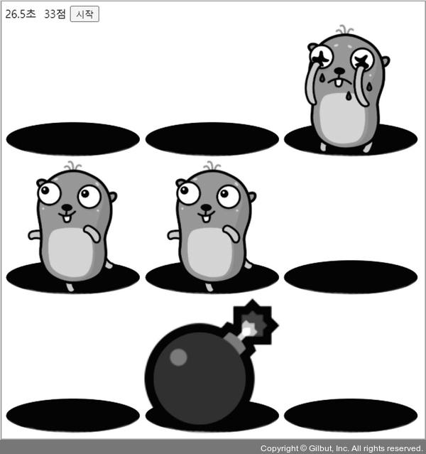
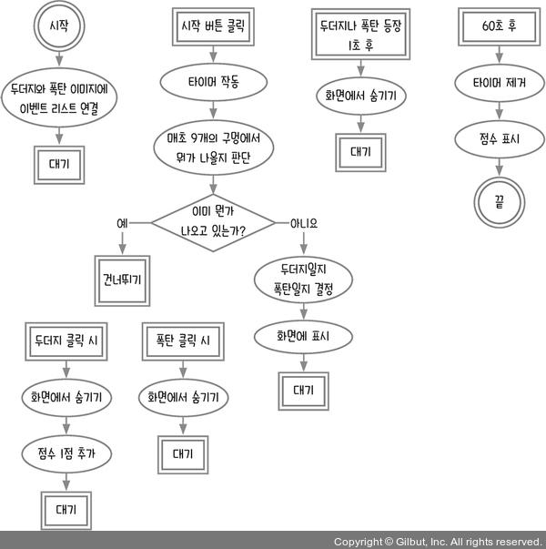

# 14장 복습_두더지 잡기 게임

이 책에서 만드는 마지막 게임은 두더지 잡기 게임이다. 두더지들이 실시간으로 무작위로 튀어나오고, 사용자는 정해진 시간 안에 두더지를 클릭해야 한다. 가끔 두더지 대신 폭탄이 튀어나오는데, 폭탄을 클릭하면 목숨이 하나 줄어든다.
목숨은 3개가 주어지고 목숨이 0개가 되면 게임이 끝난다. 60초 안에 얼마나 많은 두더지를 잡는지 경쟁하는 게임이다.

## 14.1 순서도 그리기

이벤트 리스너와 타이머 등의 비동기 코드가 많이 나오므로 순서를 정확히 지키도록 호출 스택과 이벤트 루프를 생각하며 코딩해야 한다.

HTML 파일을 만들어 다음 코드를 작성한다.