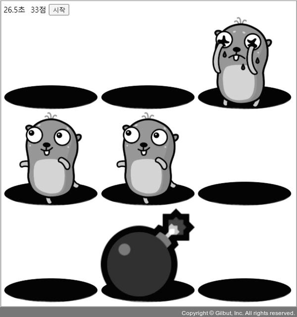
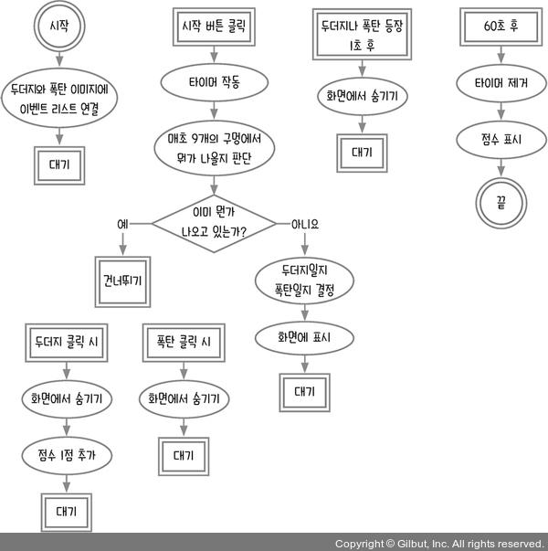
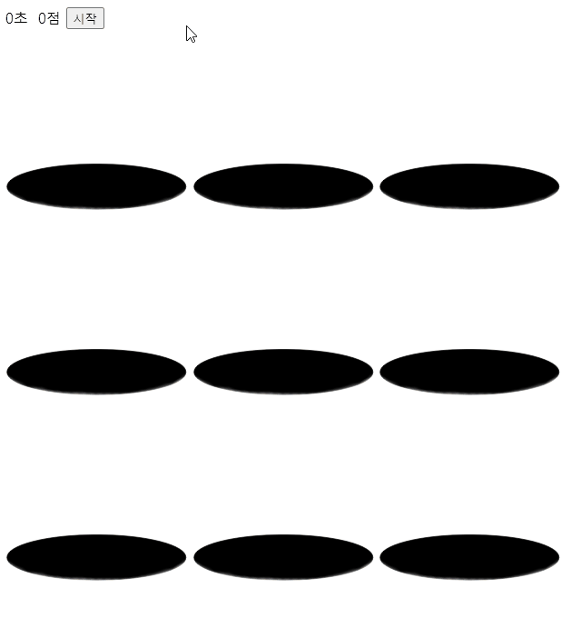
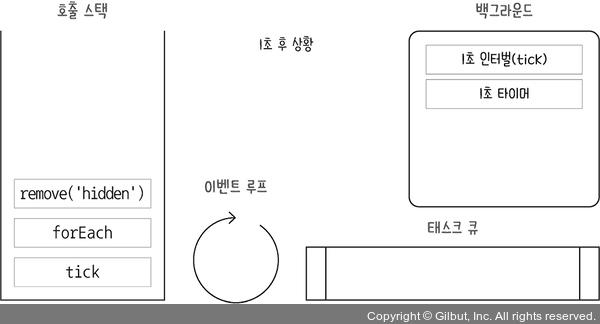
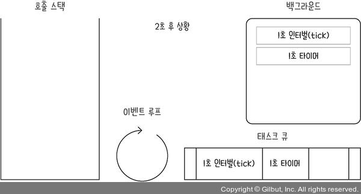

# 14장 복습_두더지 잡기 게임

이 책에서 만드는 마지막 게임은 두더지 잡기 게임이다. 두더지들이 실시간으로 무작위로 튀어나오고, 사용자는 정해진 시간 안에 두더지를 클릭해야 한다. 가끔 두더지 대신 폭탄이 튀어나오는데, 폭탄을 클릭하면 목숨이 하나 줄어든다.
목숨은 3개가 주어지고 목숨이 0개가 되면 게임이 끝난다. 60초 안에 얼마나 많은 두더지를 잡는지 경쟁하는 게임이다.



- [14.1 순서도 그리기](#141-순서도-그리기)
- [14.2 이미지 움직이기](#142-이미지-움직이기)
- [14.3 두더지와 폭탄 결정하기](#143-두더지와-폭탄-결정하기)
- [14.4 두더지 클릭해 잡기](#144-두더지-클릭해-잡기)
- [마무리 요약](#마무리-요약)
  - [HTML과 CSS 활용](#html과-css-활용)
  - [이벤트 루프 분석할 때](#이벤트-루프-분석할-때)
  - [alert 함수 사용 시 주의점](#alert-함수-사용-시-주의점)
- [Self Check 목숨 구현하기](#self-check-목숨-구현하기)
  - [소스코드](#소스코드)
  - [결과](#결과)
- [느낀점](#느낀점)

## 14.1 순서도 그리기



이벤트 리스너와 타이머 등의 비동기 코드가 많이 나오므로 순서를 정확히 지키도록 호출 스택과 이벤트 루프를 생각하며 코딩해야 한다.

HTML 파일을 만들어 다음 코드를 작성한다.

```html
<html>
<head>
<meta charset="UTF-8">
<title>두더지 잡기</title>
<style>
  .cell {
    display: inline-block; position: relative;
    width: 200px; height: 200px;
    background: 'yellow'; overflow: hidden;
  }
  .gopher, .bomb {
    width: 200px; height: 200px; bottom: 0;
    position: absolute; transition: bottom 1s;
  }
  .gopher {
    background: url('./gopher.png') center center no-repeat;
    background-size: 200px 200px;
  }
  .dead {
    background: url('./dead_gopher.png') center center no-repeat;
    background-size: 200px 200px;
  }
  .bomb {
    background: url('./bomb.png') center center no-repeat;
    background-size: 200px 200px;
  }
  .boom {
    background: url('./explode.png') center center no-repeat;
    background-size: 200px 200px;
  }
  .hidden {
    bottom: -200px;
  }
  .hole {
    width: 200px; height: 150px; position: absolute; bottom: 0;
    background: url('./mole-hole.png') center center no-repeat;
    background-size: 200px 150px;
  }
  .hole-front {
    width: 200px; height: 30px; position: absolute; bottom: 0;
    background: url('./mole-hole-front.png') center center no-repeat;
    background-size: 200px 30px;
  }
</style>
</head>
<body>
<div>
  <span id="timer">0</span>초&nbsp;
  <span id="score">0</span>점
  <button id="start">시작</button>
</div>
<div id="game">
  <div class="row">
    <div class="cell">
      <div class="hole"></div>
      <div class="gopher hidden"></div>
      <div class="bomb hidden"></div>
      <div class="hole-front"></div>
    </div>
    <div class="cell">
      <div class="hole"></div>
      <div class="gopher hidden"></div>
      <div class="bomb hidden"></div>
      <div class="hole-front"></div>
    </div>
    <div class="cell">
      <div class="hole"></div>
      <div class="gopher hidden"></div>
      <div class="bomb hidden"></div>
      <div class="hole-front"></div>
    </div>
    </div>
      <div class="row">
      <div class="cell">
      <div class="hole"></div>
      <div class="gopher hidden"></div>
      <div class="bomb hidden"></div>
      <div class="hole-front"></div>
    </div>
    <div class="cell">
      <div class="hole"></div>
      <div class="gopher hidden"></div>
      <div class="bomb hidden"></div>
      <div class="hole-front"></div>
    </div>
    <div class="cell">
      <div class="hole"></div>
      <div class="gopher hidden"></div>
      <div class="bomb hidden"></div>
      <div class="hole-front"></div>
    </div>
  </div>
  <div class="row">
    <div class="cell">
      <div class="hole"></div>
      <div class="gopher hidden"></div>
      <div class="bomb hidden"></div>
      <div class="hole-front"></div>
    </div>
    <div class="cell">
      <div class="hole"></div>
      <div class="gopher hidden"></div>
      <div class="bomb hidden"></div>
      <div class="hole-front"></div>
    </div>
    <div class="cell">
      <div class="hole"></div>
      <div class="gopher hidden"></div>
      <div class="bomb hidden"></div>
      <div class="hole-front"></div>
    </div>
  </div>
</div>
<script>
  const $timer = document.querySelector('#timer');
  const $score = document.querySelector('#score');
  const $game = document.querySelector('#game');
  const $start = document.querySelector('#start');
  const $$cells = document.querySelectorAll('.cell');
</script>
</body>
</html>
```

두더지 잡기도 언뜻 보면 3 X 3 표의 구조를 띄고 있다. `table`태그 대신해서 `div`태그를 사용했는데, `table` 태그는 원래 용도가 표를 나타내는 것이므로 다양한 화면을 표시하기에는 제약이 있다. 그래서 화면이 복잡해질수록 `div`태그로 구성하는 것이 좋다.

두더지 잡기에서 애니메이션을 자바스크립트로 처리하면 복잡할 뿐만 아니라 성능도 좋지 않다. 코드가 조금 길어지겠지만, HTML과 CSS로 처리하는 것이 좋다. CSS 부분에서 `transition`이 애니메이션 역할을 한다.

또한, 두더지 구멍을 CSS로 표현하려고 `cell`클래스 태그 안에 여러 겹의 `div`를 사용했다. HTML에서는 코드에서 아래에 위치한 태그가 화면상으로는 앞에 오게 된다. 따라서 코드에서는 `.hole`태그(구멍이미지, mole-hole.png)가 맨 앞에 있고, `.hole-front`태그(구멍 바깥쪽 이미지, mole-hole-front.png)가 맨 뒤에 위치한다.

HTML과 CSS를 적절하게 사용하는 것이 좋다. 특히 화면의 배치와 애니메이션은 CSS를 적극적으로 사용하자.

gopher.png, dead_gopher.png, bomb.png, explode.png, mole-hole.png, mole-hole-front.png
6개의 이미지를 내려 받아야 한다. 주소는 <https://raw.githubusercontent.com/ZeroCho/es2021-webgame/master/파일명> 형태이다.

예를 들어 gopher.png를 내려받으려면 <https://raw.githubusercontent.com/ZeroCho/es2021-webgame/master/gopher.png>로 접속하며 된다. 이미지를 마우스 우클릭한 후 이미지를 다른 이름으로 저장하면 된다. 이때 모든 이미지를 작성한 HTML 파일과 동일한 폴더에 저장해야 이미지가 제대로 보인다. 이미지가 안보인다면, 파일 경로를 잘 확인해야 한다.

나 같은 경우 HTML 파일이 있는 폴더 하위에 `images`폴더를 생성하고 이미지 파일들을 넣어두고 HTML 파일에서 경로를 수정하였다.

## 14.2 이미지 움직이기

애니메이션을 CSS로 처리했다. 예를 들어, 폭탄이나 두더지 `div`에 `hidden`클래스를 주면 구멍 아래로 내려가고, `hidden`클래스를 빼면 구멍 위로 올라온다. 따라서 자바스크립트로 태그에 클래스를 넣을지 뺄지만 조작하면 애니메이션은 자동으로 처리된다.

시작 버튼을 누를 때 모든 칸에서 두더지가 나타나게 해 보자. 두더지가 올라오는 애니메이션은 1초 동안 지속한다. 그리고 1초 후에 두더지가 다시 구멍으로 들어가게 한다. 내려가는 애니메이션도 1초 동안 지속한다. 따라서 기본적으로 두더지는 올라왔다 내려가는 데 총 2초가 걸린다.

```js
const $timer = document.querySelector('#timer');
const $score = document.querySelector('#score');
const $game = document.querySelector('#game');
const $start = document.querySelector('#start');
const $$cells = document.querySelectorAll('.cell');

const holes = [0, 0, 0, 0, 0, 0, 0, 0, 0];
let started = false;
let score = 0;
$start.addEventListener('click', () => {
  if (started) return; // 이미 시작했으면 무시
  started = true;
  console.log('시작');
  tick();
});
function tick() {
  holes.forEach((hole, index) => {
    const $gopher = $$cells[index].querySelector('.gopher');
    holes[index] = setTimeout(() => { // 1초 뒤에 사라짐
      $gopher.classList.add('hidden');
      holes[index] = 0;
    }, 1000);
    $gopher.classList.remove('hidden');
  });
}
```

먼저 9개 구멍에 대한 정보를 담당할 `holes`배열을 선언한다. 그리고 `#start`버튼을 누를 때 작동할 이벤트 리스너를 연결한다. 이벤트 리스너가 한 번만 작동하도록 `started`변수를 만들어서 관리한다.

버튼을 클릭하면 `tick`함수가 호출된다. `tick`함수는 비어 있는 칸에 두더지나 폭탄을 보여 준다. `tick`함수에서는 `holes`배열로 반복문을 돌며 각 칸의 두더지 이미지 태그에 `hidden`클래스를 제거하여 구멍에서 올라오게 하고 1초 뒤에 `hidden`클래스를 다시 추가해 두더지가 구멍으로 들어가게 한다.

`holes`배열에는 각 타이머의 아이디를 저장해 나중에 타이머를 취소할 때 사용한다. 타이머가 등록되어 있으면 0이 아닌 값이 배열에 기록되고, 타이머가 없으면 0이 들어 있으므로 각 칸에 두더지가 있는지 없는지를 구분할 수 있다.

이번에는 반복적으로 두더지가 올라왔다가 내려가게 해보자.

```js
$start.addEventListener('click', () => {
  if (started) return; // 이미 시작했으면 무시
  started = true;
  console.log('시작');
  const tickId = setInterval(tick, 1000);
  tick();
});
```

1초마다 `tick`함수를 반복 호출하게 수정하였다. 매초 `tick`함수는 비어 있는 칸을 찾아 두더지를 보여 준다.



두더지가 한번 올라왔다 내려간 뒤로는 다시 올라오지 않는다. `tick`함수에서 동시에 여러 개의 타이머가 실행되어 문제가 발생한다.

이벤트 루프로 한번 분석해 보자. 9개 구멍에서 발생하는 이벤트를 모두 분석하면 복잡하니 하나의 구멍만 분석한다. 각각의 이벤트가 서로 영향을 미치지 않는다면 굳이 전부 분석할 필요는 없다.

다음 그림은 1초가 지나서 첫 번째 `tick`함수가 실행되는 상황이다. `tick`함수 내부에서 `forEach`메서드가 실행되고 그 안에서 다시 `hidden`클래스를 제거하는 `remove`메서드가 실행된다. `hidden`클래스가 제거됐으므로 두더지가 구멍에서 올라온다.



백그라운드에는 매초 `tick`을 호출하는 `setInterval`과 첫 번째 `tick`에서 등록한 타이머가 들어 있다.

여기서 다시 1초가 지나면(전체적으로 2초가 지난 상황) 백그라운드에 있던 타이머들이 태스크 큐로 넘어간다. 인터벌이 1초 타이머보다 더 먼저 등록됐으므로 인터벌의 콜백 함수인 `tick`이 태스크 큐에 먼저 들어간다.



`tick`함수에서는 이전과 마찬가지로 `hidden`클래스를 제거하는데, 그 후에 실행되는 1초 타이머의 콜백 함수에서 다시 `hidden`클래스를 추가한다. 그래서 `hidden`클래스가 사라지지 않고 계속 남아 있게 된다.

이 상황이 매초 반복된다. `tick`함수와 1초 타이머가 연이어 실행되는데, `tick`함수에서 `hidden`클래스를 없애자마자 1초 타이머에서 `hidden`클래스를 추가해 버린다. 그래서 한번 구멍 속으로 들어간 두더지는 다시 구멍 위로 올라오지 않게 되는 것이다.

`hidden`클래스가 자꾸 추가되어 두더지가 올라오지 않으므로 `hidden`클래스를 추가하는 1초 타이머를 실행하지 않으면 된다. 따라서 코드를 다음과 같이 수정하면 두더지가 다시 올라온다.

```js
function tick() {
  holes.forEach((hole, index) => {
    if (hole) return; // 무언가 일어나고 있으면 return
    const $gopher = $$cells[index].querySelector('.gopher');
    holes[index] = setTimeout(() => { // 1초 뒤에 사라짐
      $gopher.classList.add('hidden');
      holes[index] = 0;
    }, 1000);
    $gopher.classList.remove('hidden');
  });
}
```

`holes`배열 안에 값이 있으면 두더지가 보이는 상황이므로 이때는 타이머를 추가하지 않는다.

이번에는 반대로 두더지 대신 폭탄이 나오게 해보자.

```js
function tick() {
  holes.forEach((hole, index) => {
    if (hole) return; // 무언가 일어나고 있으면 return
    const $bomb = $$cells[index].querySelector('.bomb');
    holes[index] = setTimeout(() => { // 1초 뒤에 사라짐
      $bomb.classList.add('hidden');
      holes[index] = 0;
    }, 1000);
    $bomb.classList.remove('hidden');
  });
}
```

`$gopher`를 `$bomb`로 바꾸기만 했다. 이렇게 하면 모든 칸에 폭탄이 올라간다.

## 14.3 두더지와 폭탄 결정하기

이제 두더지나 폭탄만 나오게 하지 말고 둘 다 나오게 해보자. 또한, 아무것도 안 나오는 칸도 있으면 좋다. 두더지와 폭탄, 빈칸의 비율은 `tick`함수에서 설정한다. 여기서는 두더지의 비율 30%, 폭탄의 비율 20%, 빈 칸의 비율 50%로 설정했다.

```js
let gopherPercent = 0.3;
let bombPercent = 0.5;
function tick() {
  holes.forEach((hole, index) => {
    if (hole) return; // 무언가 일어나고 있으면 return
    const randomValue = Math.random();
    if (Math.random() < gopherPercent) {
      const $gopher = $$cells[index].querySelector('.gopher');
      holes[index] = setTimeout(() => { // 1초 뒤에 사라짐
        $gopher.classList.add('hidden');
        holes[index] = 0;
      }, 1000);
      $gopher.classList.remove('hidden');
    } else if (Math.random() < bombPercent) {
      const $bomb = $$cells[index].querySelector('.bomb');
      holes[index] = setTimeout(() => { // 1초 뒤에 사라짐
        $bomb.classList.add('hidden');
        holes[index] = 0;
      }, 1000);
      $bomb.classList.remove('hidden');
    }
  });
}
```

`Math.random` 메서드로 무작위 값을 얻을 수 있습니다. 두더지 비율은 30%라서 0.3으로 설정했는데, 폭탄 비율(20%)이 0.2가 아닌 0.5이다. 그리고 빈칸 비율은 아예 설정하지 않았다. 이유는 `if`문을 보면 알 수 있다. `Math.random`의 결과가 0부터 0.3까지는 두더지를 표시하고, 0.3부터 0.5까지는 폭탄을 표시한다. 그 이후는 무시한다.

이렇게 `tick`마다 무엇을 표시할지 결정하게 된다. 시간이 흐름에 따라 두더지, 폭탄, 빈칸의 비율을 조절해서 게임의 난이도를 조절해도 된다.

## 14.4 두더지 클릭해 잡기

현재는 두더지가 나타난 뒤 1초 뒤에 자동으로 내려가지만, 실제 게임에서는 두더지를 클릭하면 바로 내려가야 한다. 두더지를 클릭하면 바로 내려가도록 이벤트 리스너를 연결한다.

```js
function tick() {...}

$$cells.forEach(($cell, index) => {
  $cell.querySelector('.gopher').addEventListener('click', (event) => {
    event.target.classList.add('dead');
    event.target.classList.add('hidden');
    clearTimeout(holes[index]); // 기존 내려가는 타이머 제거
    setTimeout(() => {
      holes[index] = 0;
      event.target.classList.remove('dead');
    }, 1000);
  });
});
```

두더지를 클릭하는 부분에 `dead`와 `hidden`클래스를 추가한다. `dead`클래스가 추가되면 두더지 이미지가 울고 있는 두더지 이미지로 바뀌고, `hidden`클래스가 추가되면 구멍 속으로 내려간다.

폭탄도 클릭하면 바로 내려가게 이벤트 리스너를 연결해 보자.

```js
$$cells.forEach(($cell, index) => {
  $cell.querySelector('.gopher').addEventListener('click', (event) => {...});
  $cell.querySelector('.bomb').addEventListener('click', (event) => {
    event.target.classList.add('boom');
    event.target.classList.add('hidden');
    clearTimeout(holes[index]); // 기존 내려가는 타이머 제거
    setTimeout(() => {
      holes[index] = 0;
      event.target.classList.remove('boom');
    }, 1000);
  });
});
```

폭탄을 클릭하는 부분에도 두더지와 마찬가지로 `boom`과 `hidden`클래스를 추가해서 폭탄 이미지가 폭발하는 이미지로 바뀌고, 구멍속으로 내려가게 한다.

두더지를 클릭하면 점수를 1점씩 부여해 보자. 같은 두더지를 여러 번 클릭할 때 점수를 1점보다 더 많이 부여하지 않게 조심해야 한다.

```js
$$cells.forEach(($cell, index) => {
  $cell.querySelector('.gopher').addEventListener('click', (event) => {
    if (!event.target.classList.contains('dead')) {
      score += 1;
      $score.textContent = score;
    }
    event.target.classList.add('dead');
    event.target.classList.add('hidden');
    clearTimeout(holes[index]); // 기존 내려가는 타이머 제거
    setTimeout(() => {
      holes[index] = 0;
      event.target.classList.remove('dead');
    }, 1000);
  });
  $cell.querySelector('.bomb').addEventListener('click', (event) => {...});
});
```

마지막으로 게임에 제한 시간을 설정하고 제한 시간이 다 되면 타이머를 멈춘 뒤 몇 점을 얻었는지를 표시해 보자. 여기서는 60초로 설정한다. 타이머는 0.1초마다 작동하게 해서 화면에 표시되는 시간을 0.1초씩 줄어들게 한다.

```js
const holes = [0, 0, 0, 0, 0, 0, 0, 0, 0];
let started = false;
let score = 0;
let time = 60;
$start.addEventListener('click', () => {
  if (started) return; // 이미 시작했으면 무시
  started = true;
  console.log('시작');
  const timerId = setInterval(() => {
    time = (time * 10 - 1) / 10; // 소수점 계산 시 문제 있음
    $timer.textContent = time;
    if (time === 0) {
      clearInterval(timerId);
      clearInterval(tickId);
      setTimeout(() => {
        alert(`게임 오버! 점수는${score}점`);
      }, 50);
    }
  }, 100);
  const tickId = setInterval(tick, 1000);
});
```

소숫점 계산시 문제가 있어서 0.1초를 빼는 코드를 계산할 때 10을 곱한 뒤 1을 빼고 다시 10으로 나누는 것으로 작성하였다.

`time`이 0이 되면(시간 초과) `setTimeout`을 호출하는데, `alert` 함수는 화면이 움직이는 것을 즉시 멈추고 알림창을 띄우므로, 화면 변경 사항이나 애니메이션이 있다면 그것도 멈춰 버린다. 따라서 `alert`함수를 사용할 때 `setTimeout`과 함께 사용하는 것이 좋다.

실제로 타이머가 0.1초에서 0초로 바뀌면서 게임 오버됐다는 알림창이 떠야 하는데 `alert`함수가 0초로 화면을 바꾸는 것을 막아 버려 0.1초에서 게임 오버가 표시된다.

끝!

> 지금껏 고생 많았습니다! 12개의 게임을 만들면서 자바스크립트와 조금 더 친해졌길 바랍니다. 코드를 작성하면서 프로그램은 정말 여러분이 입력한 그대로 움직인다는 것을 느꼈을 겁니다. 정말 사소한 오타 때문에 프로그램이 돌아가지 않는 경험도 했을 거고요.
>
> 이 책에서는 어떤 게임을 만들든지 순서도를 먼저 그렸고(숙련되면 머릿속으로 그릴 수 있다고 했죠?) 그 후 순서도를 코드로 구현했습니다. 코드로 구현할 때는 자바스크립트의 언어적 특성(기본 문법과 변수의 스코프, 이벤트 루프 등)을 잘 알아야 하겠죠. 이 책에서는 자바스크립트의 핵심적인 특성을 설명하려 노력했지만, 지면상 모든 것을 설명하지는 못했습니다. 부족한 부분은 1.1.1 자바스크립트를 배울 때 도움 되는 자료에서 소개한 사이트를 참고해서 스스로 보충해 보세요.
>
> 여기서 책을 덮지 말고, 이 책에서 만든 게임에 기능을 추가해 여러분만의 게임을 만들어 보세요. 이 책에 없는 새로운 게임을 만들어 봐도 좋습니다(바둑이나 체스, 테트리스 등). 또는 웹 게임 대신 웹 사이트를 만들어 볼 수도 있겠죠.
>
> 프로그래밍 실력은 책을 읽는다고 해서 늘지 않습니다. 끝없이 새로운 개념을 배우고, 직접 코딩을 하면서 온갖 고생을 해봐야만 늡니다. 앞으로도 많은 난관에 부딪히겠지만, 하나씩 해결하면서 얻는 성취감은 고생만큼 클 것입니다.
>
> 자바스크립트 프로그래밍에 입문한 것을 축하합니다!
>
> \- 제로초(조현영) -

## 마무리 요약

### HTML과 CSS 활용

웹 게임은 HTML과 CSS, 자바스크립트가 어우러져 제작됩니다. 웹 게임뿐만 아니라 웹 사이트나 웹 애플리케이션도 모두 그렇습니다. 이 책에서는 자바스크립트 위주로 프로그래밍했지만, 자바스크립트만 사용해야 하는 것은 아닙니다. HTML이나 CSS가 자바스크립트의 역할을 분담할 수 있으면 좋습니다. 특히 애니메이션이나 화면 요소들의 배치는 자바스크립트보다는 HTML과 CSS에 맡기는 게 더 좋은 경우가 많습니다.

### 이벤트 루프 분석할 때

이벤트가 많이 발생하는 경우에 프로그램 전체에서 발생하는 이벤트를 모두 분석하면 매우 복잡합니다. 이럴 때는 관련 있는 이벤트만 분석해도 됩니다. 어떠한 이벤트를 분석하는 데 영향을 미치지 않는 다른 이벤트가 있다면 해당 이벤트는 이벤트 루프 분석에서 제외해도 됩니다.

### alert 함수 사용 시 주의점

alert 함수는 현재 진행되는 화면 변경 사항이나 애니메이션을 즉시 멈추고 알림창을 띄우므로 알림창이 뜰 때 마지막 화면 변경 사항이나 애니메이션이 적용되지 않는 경우가 많습니다. 이럴 때는 setTimeout과 함께 호출해서 마지막 화면 변경 사항이나 애니메이션이 적용될 시간을 주는 것이 좋습니다.

## Self Check 목숨 구현하기

현재 폭탄을 클릭해도 아무런 벌칙이 없습니다. 따라서 사용자가 화면을 마구 클릭할 수 있으므로 목숨이라는 개념을 부여해 목숨이 0이 되면 게임 오버가 되게 만들고 싶습니다. 목숨은 3개로 제한하겠습니다.

힌트: 폭탄을 클릭할 때 목숨을 하나씩 깎으면 됩니다. 목숨이 0이 되면 기존처럼 게임 오버를 표시합니다.

간단한 미션이다. 아래 소스코드에 바뀌는 부분만 표시했다. 그리고 시작 후에 처음 두더지를 클릭할 때 지연되어 끊기는 렉이 발생한다. 두더지 이미지 사이즈가 크기 때문에 발생한 문제로 보인다. 그래서 이미지 사이즈를 5000x5000에서 1024x1024로 조절하고 다시 테스트해보니 렉이 사라졌다. css를 이용해서 이미지 사이즈를 줄이더라도 원본 이미지의 픽셀의 계산을 무시하지 못하는 것 같다.

### 소스코드

```html
<body>
  <div>
    <span id="timer">0</span>초&nbsp;
    <span id="score">0</span>점&nbsp;
    남은 목숨 <span id="life"></span>개
    <button id="start">시작</button>
  </div>
  ...
  <script>
    ...
    const $$cells = document.querySelectorAll('.cell');
    const $life = document.querySelector('#life');

    const holes = [0, 0, 0, 0, 0, 0, 0, 0, 0];
    let started = false;
    let score = 0;
    let time = 60;
    let life = 3; // 목숨
    let timerId, tickId;

    $start.addEventListener('click', () => {
      if (started) return; // 이미 시작했으면 무시
      started = true;
      $life.textContent = life; // 남은 목숨 표시
      console.log('시작');
      timerId = setInterval(() => {
        time = (time * 10 - 1) / 10; // 소수점 계산 시 문제 있음
        $timer.textContent = time;
        if (time === 0) {
          gameOver(); // 게임 오버
        }
      }, 100);
      tickId = setInterval(tick, 1000);
    });

    let gopherPercent = 0.3;
    let bombPercent = 0.5;
    function tick() { ... }

    // 시간 종료, 목숨 0일 때 게임 오버를 위해 함수로 작성
    function gameOver() {
      clearInterval(timerId);
      clearInterval(tickId);
      setTimeout(() => {
        alert(`게임 오버! 점수는${score}점`);
      }, 50);
    }

    $$cells.forEach(($cell, index) => {
      $cell.querySelector('.gopher').addEventListener('click', (event) => {
        ...
      });
      $cell.querySelector('.bomb').addEventListener('click', (event) => {
        // Self Check 폭탄 클릭 시 목숨 -1, 목숨이 0이 되면 게임 오버
        if (!event.target.classList.contains('boom')) {
          if (--life <= 0) {
            gameOver(); // 게임 오버
          }
          $life.textContent = life;
        }
        event.target.classList.add('boom');
        event.target.classList.add('hidden');
        clearTimeout(holes[index]); // 기존 내려가는 타이머 제거
        setTimeout(() => {
          holes[index] = 0;
          event.target.classList.remove('boom');
        }, 1000);
      });
     });
  </script>
</body>
```

### 결과


## 느낀점

기존에 자바스크립트에 대한 지식이 있는 상태라 이 책을 통해서 새로운 기술을 익히는 느낌은 별로 없었다. 다만, 같은 순서도를 보고 코드를 작성하더라도 '이 분은 이렇게 작성하는 구나'라는 관점으로 배웠다. 문제 해결에 대한 방식을 여러 각도로 다양하게 생각할 수 있게된 좋은 경험이었다. 그리고 순서도에 맞게 효율적으로 코드가 작성된 부분들이 많다고 느껴서, 분석하고 이해하면서 사고력 향상에 도움이 되었다.

제로초(조현영)님 감사합니다!