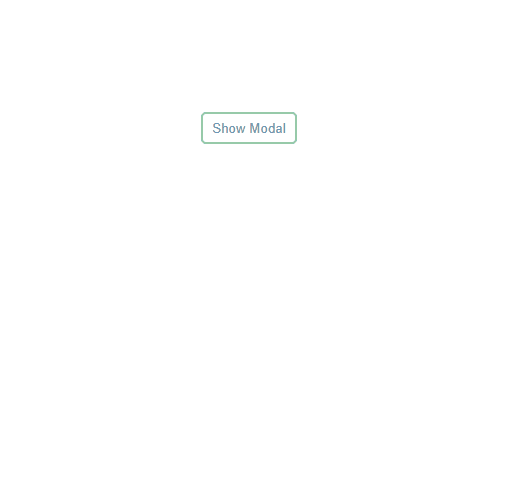
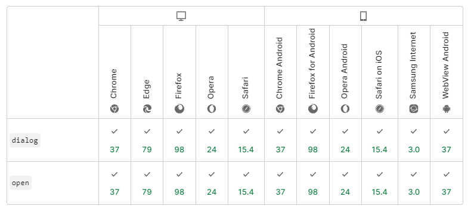

# dialog Element

HTML `<dialog>` 요소는 닫을 수 있는 경고, 검사기, 창 등 대화 상자 및 기타 다른 상호작용 가능한 컴포넌트를 나타낸다.

<https://developer.mozilla.org/ko/docs/Web/HTML/Element/dialog>

모달창을 기본 태그로 쉽게 구현이 가능하다. 블러도 잘 먹는다. 기본적으로 바깥 영역을 클릭해도 닫히지 않는다. 필요시 기능을 구현해야 한다.

버튼을 활용하기 위해서는 form 태그와 button 태그를 자식으로 구성해야 한다. 버튼을 클릭하게 되면 dialog element의 `returnValue` 프로퍼티 값에 버튼의 value 값이 들어간다. 그리고 어떤 버튼이든 간에 클릭하게 되면 dialog가 `비활성화(display none)`상태가 된다. 그리고 dialog element의 `close 이벤트`가 실행된다.

```html
<dialog id="dialog-1">
  <p>구독에 동의하십니까?</p>
  <form method="dialog" class="flex justify-between">
    <button value="cancel" class="modal-btn">취소</button>
    <button value="confirm" class="modal-btn">확인</button>
  </form>
</dialog>

<script>
  const showBtn = document.querySelector('.show-btn');
  const dialogOne = document.querySelector('#dialog-1');

  showBtn.addEventListener('click', () => {
    // 모달을 보여주는 함수를 실행
    dialogOne.showModal();
  })

  dialogOne.addEventListener('close', (event) => {
    /**
     * event.returnValue는 close이벤트에 대한 리턴 값으로 true를 반환한다.
     * 따라서 event가 아닌 dialogOne 요소의 returnValue의 값을 확인한다.
     * dialogOne.returnValue의 값은 form 요소의 자식인 button 요소의 value 값이다.
     * */
    if (dialogOne.returnValue === 'confirm') {
      dialogTwo.showModal();
    }
  })
</script>
```

dialog.html 파일의 실행 결과는 아래와 같다.



## Outside click event

dialog의 바깥 부분인 backdrop 범위를 클릭하면 닫히게 하는 이벤트는 dialog 클릭 이벤트 타겟의 박스 객체를 받아와서 상하좌우의 위치 값이랑 클릭한 값이랑 비교하여 범위를 벗어나면 dialog를 닫히게 해준다.

```js
// 바깥 영역(backdrop) 클릭시 닫히는 이벤트 함수
  dialogTwo.addEventListener('click', function (event) {
    /**
      * target === this 조건으로 close를 한다면 dialog 상자 안에 빈 곳을 클릭해도
      * 닫힌다.(this 바인딩에 주의) 정확하게 dialog 바깥인 backdrop 클릭시에만
      * 이벤트를 호출하려면 클릭 포인트가 상자 내부에 있는지를 체크하기 위해 
      * left right top bottom을 확인해야한다.
    * */
    /** @type {HTMLDialogElement} */
    const target = event.target;
    const rect = target.getBoundingClientRect();
    if (rect.left > event.clientX ||
      rect.right < event.clientX ||
      rect.top > event.clientY ||
      rect.bottom < event.clientY
    ) {
      dialogTwo.close();
    }
  })
```

## 브라우저 호환성

