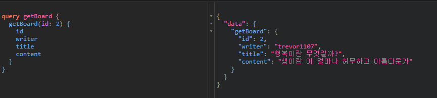

# GraphQL 맛보기

## 패키지 설치

`npm install`

## 실행

`npm start`

## GraphQL 이란?

GraphQL은 API에 대한 쿼리 언어이며, 사용자가 정의한 유형 시스템을 사용하여 쿼리를 실행하기 위한 서버측 런타임이다.
GraphQL은 특정 데이터베이스나 스토리지 엔진에 연결되어 있지 않으며, 대신 기존 코드와 데이터에 의해 지원된다.

REST API는 다양한 Endpoint가 존재하지만, graphQL은 하나의 Endpoint만 존재한다. 또한 gql API에서는 불러오는 데이터의 종류를 쿼리 조합을 통해서 결정한다. REST API에서는 각 Endpoint마다 데이터베이스 SQL 쿼리가 달라지는 반면, gql API는 gql 스키마의 타입마다 데이터베이스 SQL 쿼리가 달라진다.

### 쿼리와 뮤테이션

쿼리 요청과 응답



뮤테이션 요청과 응답


요청하는 쿼리문의 구조와 응답 내용의 구조는 거의 일치 한다. gql에서는 굳이 쿼리와 뮤테이션을 나누는데 내부적으로 들어가면 사실상 이 둘은 별 차이가 없다.
쿼리는 데이터를 읽는데(R) 사용하고, 뮤테이션은 데이터를 변조(CUD) 하는데 사용한다는 개념 적인 규약을 정해 놓은 것 뿐이다.

```graphql
mutation CreateBoard($input: BoardInput!) {
  createBoard(input: $input)
}
```

오퍼레이션 네임 쿼리는 비유하자면 쿼리용 함수이다. 인자 값을 받아서 쿼리를 요청할 수 있다.

클라이언트에서 write API에 요청하고 write API에서 GraphQL API에 요청하는 방식

```js
app.post('/write', async (req, res) => {
  try {
    const { writer, title, content } = req.body;
    /* 
      mutation CreateBoard($input: BoardInput!)
      오퍼레이션 네임 쿼리(쿼리용 함수)를 작성할 때 스키마에 type Mutation에
      정의 된 매개변수와 일치시켜야 한다. 느낌표를 빠트리거나 하면 안된다.
     */
    const query = `mutation CreateBoard($input: BoardInput!) {
      createBoard(input: $input)
    }`;

    const reqBody = JSON.stringify({
      query,
      variables: {
        input: {
          writer,
          title,
          content,
        }
      }
    });

    const response = await axios({
      method: 'POST',
      url: 'http://localhost:4243/board',
      headers: {
        'Content-Type': 'application/json',
      },
      data: reqBody,
    });

    console.log(response.data); // { data: { createBoard: true } }
    res.send(response.data);
  } catch (error) {
    console.error(error);
    res.send(error);
  }
})
```


클라이언트에서 직접 GraphQL API `mutation createBoard`를 호출하는 방식


### 스키마(schema)와 타입(type)

```graphql
type Character {
  name: String!
  appearsIn: [Episode!]!
}
```

- 오브젝트 타입 : Character, Episode
- 필드 : name, appearsIn
- 스칼라 타입 : String, ID, Int 등
- 느낌표(!) : 필수 값을 의미(non-nullable)
- 대괄호([, ]) : 배열을 의미(array)

## Reference

<https://graphql.org/learn/>
<https://graphql.org/graphql-js/>
<https://tech.kakao.com/2019/08/01/graphql-basic/>
