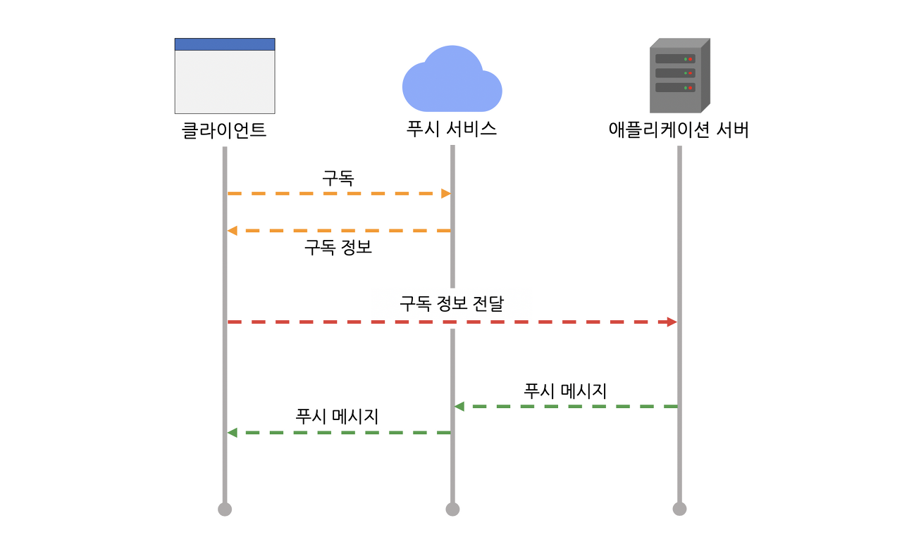

# Javascript Push API 사용 예제

<figure>
  
  <figcaption>ⓒ근둥이의 블로그 웹 푸시 아키텍처</figcaption>
</figure>

Javascript Push API를 사용하여 모바일 및 PC(windows)에 푸시 알람 기능에 대한 예제이다.

자세한 내용은 [W3C - Push API](https://www.w3.org/TR/push-api/) [MDN - Push API](https://developer.mozilla.org/ko/docs/Web/API/Push_API), [web.dev - 푸시 알림 개요](https://web.dev/articles/push-notifications-overview?hl=ko)를 참고하길 바란다.

모바일로 로컬 호스트 접속을 위해 [ngrok](https://www.npmjs.com/package/ngrok) 패키지를 이용한다. https 임시 주소를 발행하여 포트 포워딩을 통해 로컬 호스트에 접속할 수 있도록 도와주는 패키지 이다.

## 패키지 설치

`npm install -g ngrok`

`npm install`

## 실행

nodejs 실행

`npm start`

(필수 아님) 로컬 호스트 주소의 모바일 접속을 위해 아래 명령어를 입력해 준다.
7274는 포트 번호이다. 포트 번호는 `./bin/www` 파일에서 변경이 가능하다.

`ngrok http 7274`
