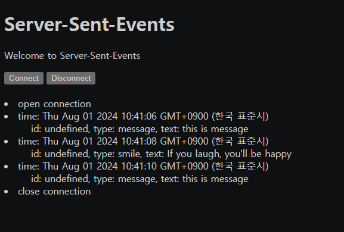
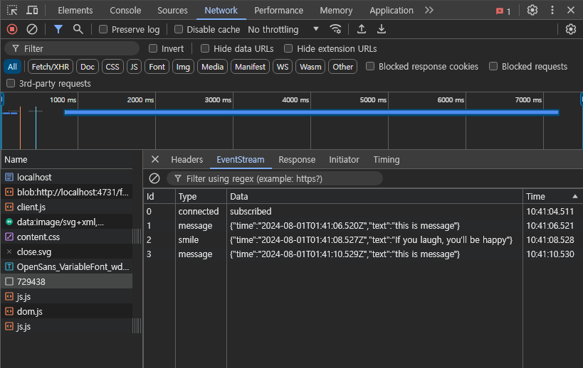

# Server-Sent-Events

<https://developer.mozilla.org/en-US/docs/Web/API/Server-sent_events/Using_server-sent_events>
<https://blog.q-bit.me/how-to-use-nodejs-for-server-sent-events-sse/>
를 참고 하였다.

SSE는 서버의 데이터를 실시간으로, 지속적으로 연결하는 기술이다. 단방향으로 데이터를 전송한다. 즉, 서버에서 전송하는 데이터를 클라이언트에서는 받기만 할 수 있다. 또한 HTTP 통신을 사용하기 때문에 쉽게 개발이 가능하다.
단점으로 최대 동시 접속자 수는 HTTP의 경우 브라우저당 6개, HTTP2에서는 100개까지 제한이 있다.

SSE는 주로 알림 기능에 사용한다. 데이터 구분자로 `\n`을 사용한다. `request query`의 `&`와 같은 의미로 사용 된다. 데이터 전송 시 마지막에 데이터의 마지막을 알리는 `\n\n`을 포함하여야 한다.

## 구성

클라이언트 HTML 파일은 `views/index.ejs`, JS 파일은 `public/javascript/client.js`
서버 JS 파일은 `app.js`

## 패키지 설치

`npm install`

## 실행

- nodejs 실행 `npm start`
- html 접속 <http://localhost:4731>

nodejs를 실행 후 <http://localhost:4731>에 접속하여 화면을 보면 버튼이 보일 것이다.

`Connect` 버튼을 클릭하면 연결을 시도하고, 성공한다면 연결이 유지된다.
설정한 일정 주기마다 데이터를 받는 것을 확인할 수 있다.

`Disconnect` 버튼을 클릭하면 연결을 종료한다.

개발자 도구에서 다음과 같이 확인이 가능하다.

