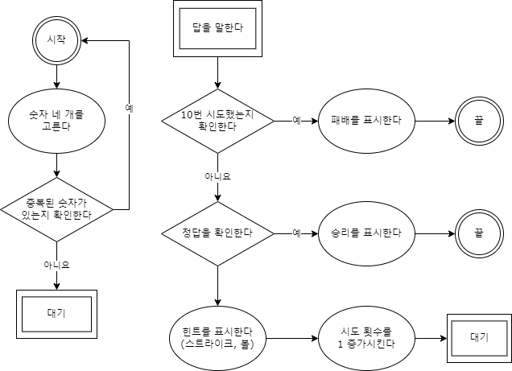
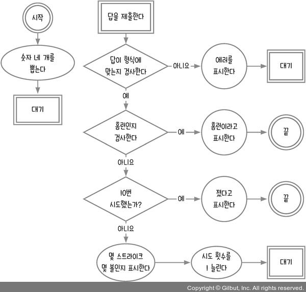
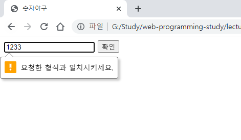
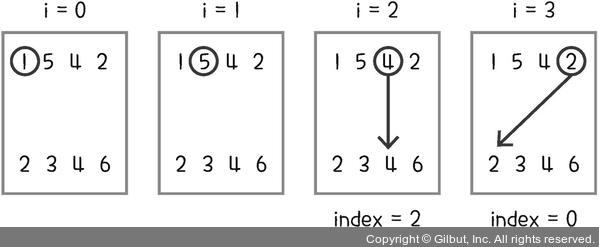
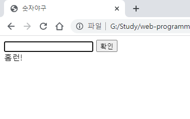
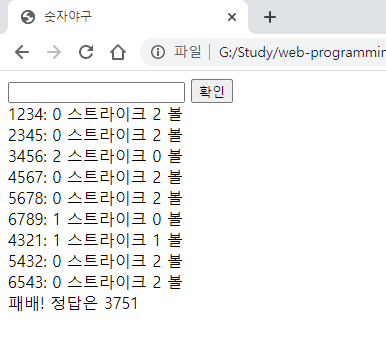
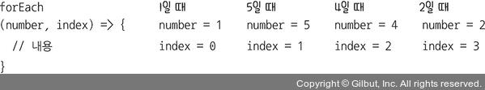
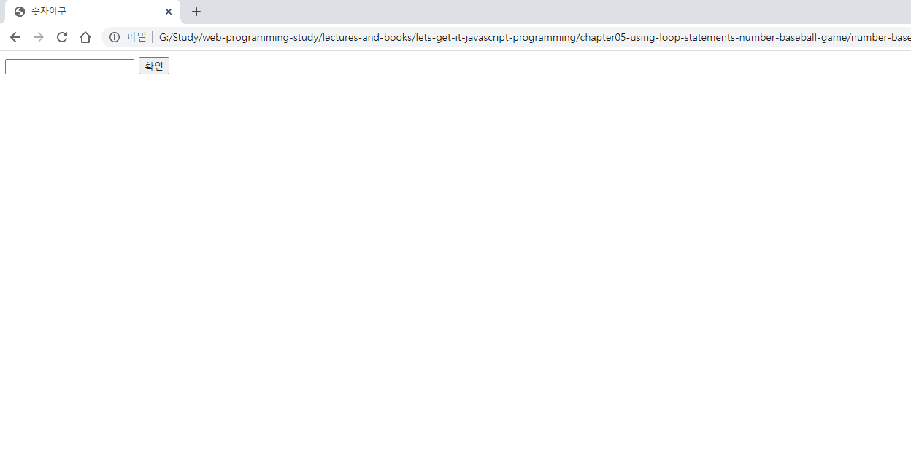

# 5장 반복문 사용하기_숫자야구 게임

숫자야구 게임을 간단히 설명하면 다음과 같다..

1. 먼저 상대편이 숫자 1~9 중에서 중복되지 않게 네 개를 고른다.(더 어렵게 만들려면 0을 포함)
2. 10번의 기회가 주어지고 상대편이 고른 숫자 네 개를 맞히면 된다.
3. 숫자만 맞히는 것이 아니라 숫자의 순서까지 맞혀야 한다.
4. 틀릴 때마다 힌트를 준다.
5. 맞힌 숫자의 개수(볼), 숫자뿐만 아니라 순서까지 맞힌 개수(스트라이크)를 알려준다.

예를 들어, 상대편이 5728을 뽑았다고 가정해 보자. 플레이어가 7129를 말한다면, 상대는 1스트라이크, 1볼이라고 말해준다. 7은 숫자만 맞혀서 볼이고, 2는 숫자에 순서(세 번째)까지 맞혀서 스트라이크이다. 마찬가지로 플레이어가 7528을 말한다면, 2스트라이크 2볼이 되고, 7285를 말한다면 4볼이 된다. 5728을 말한다면 4스트라이크(홈런)가 되어 이기게 된다. 그리고 10번의 기회 안에 맞히지 못한다면 상대편이 승리한다. 이 게임은 스트라이크와 볼이라는 용어가 사용되어서 숫자야구라는 이름이 붙은 것이지 실제로는 야구와 아무 관련이 없다.

숫자야구 게임에서는 반복문을 많이 사용한다. 같이 게임을 만들면서 간단한 반복문부터 복잡한 반복문까지 해보자.

- [5.1 순서도 그리기](#51-순서도-그리기)
- [5.2 무작위로 숫자 뽑기](#52-무작위로-숫자-뽑기)
  - [1분 퀴즈 1번 문제](#1분-퀴즈-1번-문제)
- [5.3 입력값 검증하기](#53-입력값-검증하기)
  - [HTML5의 검증 기능 활용하기](#html5의-검증-기능-활용하기)
- [5.4 입력값과 정답 비교하기](#54-입력값과-정답-비교하기)
  - [제로초의 조언](#제로초의-조언)
  - [1분 퀴즈 2번 문제](#1분-퀴즈-2번-문제)
- [마무리 요약](#마무리-요약)
  - [무작위로 숫자 뽑기](#무작위로-숫자-뽑기)
  - [1부터 원하는 숫자까지 들어 있는 배열 만들기](#1부터-원하는-숫자까지-들어-있는-배열-만들기)
  - [indexOf와 includes](#indexof와-includes)
  - [forEach와 map](#foreach와-map)
  - [document.createElement, document.createTextNode](#documentcreateelement-documentcreatetextnode)
  - [appendChild와 append](#appendchild와-append)
- [Self Check 아웃 만들기](#self-check-아웃-만들기)
  - [소스코드](#소스코드)
  - [결과](#결과)

## 5.1 순서도 그리기

우선 숫자야구 게임의 룰만 가지고 직접 순서도를 그려보았다.



책에서 소개하는 순서도를 보는 순간, 내가 빼먹은 게 무엇인지 알 수 있었다. 말한 답의 형식이 맞는지 검사하는 로직이 빠졌던 것이다. 제출한 답의 형식이 중복되지 않은 네 자리 숫자인지 확인이 필요하다. 그리고 절차의 순서도 다르다.



숫자야구는 두 명이 하는 게임이지만, 컴퓨터를 상대편으로 간주해서 순서도를 작성했다고 한다.

컴퓨터가 무작위로 숫자 네 개를 뽑으면 사용자는 답을 입력창에 입력한다. 답을 입력하는 이벤트가 발생하면 먼저 답의 형식이 맞는지 검사하고(중복되지 않은 네 자리 숫자) 홈런인지 검사한다. 홈런이라면 승리, 아니라면 10번을 초과해서 시도했는지 검사하고, 10번 초과했다면 패배가 된다. 그것도 아니라면 몇 스트라이크에 몇 볼인지 검사해서 화면에 표시한다.

`number-baseball.html`파일을 만들어 아래 코드와 같이 작성한다.

```html
<!DOCTYPE html>
<html lang="ko">
<head>
  <meta charset="UTF-8">
  <meta http-equiv="X-UA-Compatible" content="IE=edge">
  <meta name="viewport" content="width=device-width, initial-scale=1.0">
  <title>숫자야구</title>
</head>
<body>
  <form id="form">
    <input type="text" id="input">
    <button>확인</button>
  </form>
  <div id="logs"></div>
  <script>
    const $input = document.querySelector('#input');
    const $form = document.querySelector('#form');
    const $logs = document.querySelector('#logs');
  </script>
</body>
</html>
```

## 5.2 무작위로 숫자 뽑기

순서도는 단순하지만, 각각의 절차를 구현할 때는 더 고민을 해야 한다. 프로그램이 시작되고 숫자 4개를 뽑을 때 숫자를 저장할 변수가 필요하고, 무작위로 숫자를 하나씩 뽑아 저장하는 절차를 4번 반복해야 한다. 그리고 4개의 숫자는 중복되지 않아야 한다.

`Math.random()` 함수는 0이상 1미만의 실수형 숫자를 무작위로 생성한다. 하지만 숫자야구 게임에서는 1에서 9까지의 숫자가 필요하다. `Math.random()`은 암호학적으로 완전한 무작위가 아니다. 따라서 보안과 관련된 작업(비밀번호 생성 등)을 할 때는 `Math.random()`으로 생성된 수를 사용하면 위험하다.
`Math.ceil()` 함수는 숫자를 가까운 정수로 올림하여 반환한다.
`Math.floor()` 함수는 숫자를 가까운 정수로 내림하여 반환한다.
`Math.round()` 함수는 숫자를 가까운 정수로 반올림하여 반환한다.

4개의 숫자를 뽑을 때 랜덤 한 숫자를 생성하고 정수로 내림하면 된다.
`Math.floor(Math.random() * 9 + 1)`;

랜덤한 숫자를 뽑아도 중복된 숫자가 나올 수 있으므로 1부터 9까지 숫자를 배열에 담아 놓고 뽑아서 나온 숫자와 같은 숫자를 배열에서 빼는 식으로 중복을 제거하는 방법이 효율적이다.

numbers라는 빈 배열을 만들고 그 안에 1부터 9까지의 숫자를 넣는데, 반복문의 범위를 적용하는 방법은 다음 네 가지가 있다.

- 0부터 시작해 9 미만으로 적기
- 0부터 시작해 8 이하로 적기
- 1부터 시작해서 10 미만으로 적기
- 1부터 시작해 9 이하로 적기

```js
const numbers = [];
for (let n = 1; n < 10; n++) {
  numbers.push(n);
}
```

프로그래밍에서는 보통 숫자는 0부터 시작한다. 미만으로 표기할지 이하로 표기할지는 개인의 취향이다. 1부터 9까지의 숫자를 뽑는 것이라 1부터 시작해 9이하(<= 9)가 더 직관적으로 보이지만 10 미만(< 10)의 방식을 사용해야 하는 경우도 있다.

```js
const numbers = [];
for (let n = 1; n < 10; n++) {
  numbers.push(n);
}

const answer = [];
for (let n = 0; n <= 3; n += 1) { // 네 번 반복
  const index = Math.floor(Math.random() * 9); // 0~8 정수
  answer.push(numbers[index]);
  numbers.splice(index, 1);
}
console.log(answer); // undefined가 섞여나올 때가 있다.
```

`splice()` 함수를 이용해서 배열의 요소를 제거하고 있기 때문에 제거된 인덱스를 참조하게 되면서 undefined가 발생할 수 있다. 그래서 `numbers.length`를 이용하면 0~8의 정수가 아닌 배열이 줄어드는 것을 반영할 수 있다.

```js
const answer = [];
for (let n = 0; n <= 3; n += 1) {
  // numbers 길이에 따라 달라짐
  const index = Math.floor(Math.random() * numbers.length);
  answer.push(numbers[index]);
  numbers.splice(index, 1);
}
console.log(answer);
```

### 1분 퀴즈 1번 문제

2에서 5까지의 숫자를 뽑고 싶습니다. 제대로 작동하도록 (가)~(라)를 모두 채우세요. 반복문의 시작 값과 끝 값을 입력하는 스타일에 관련된 문제입니다.

코드 1

```js
const answer = [];
for (let n = 0; n < (가); n++)
{
  answer.push(n + 2);
}
```

코드 2

```js
const answer = [];
for (let n = 0; n <= (나); n++)
{
  answer.push(n + 2);
}
```

코드 3

```js
const answer = [];
for (let n = 1; n < (다); n++)
{
  answer.push(n + 1);
}
```

코드 4

```js
const answer = [];
for (let n = 1; n <= (라); n++)
{
  answer.push(n + 1);
}
```

나의 풀이는 (가) = 4, (나) = 3, (다) = 5, (라) = 4 이다.

## 5.3 입력값 검증하기

이제 입력창으로 숫자야구의 예측값을 받는다. 이번에는 버튼 click 이벤트 대신에 $form 태그에 submit 이벤트를 사용한다. 보통 입력창이 있으면 폼 태그로 감싸서 submit 이벤트를 사용하는 것이 좋은데, 그 이유는 Enter 키를 눌렀을 때도 값을 제출할 수 있기 때문이다.

```js
...
console.log(answer);

const tries = [];
function checkInput(input) {}
$form.addEventListener('submit', (event) => {
  event.preventDefault(); // submit 기본 이벤트 취소
  const value = $input.value;
  $input.value = '';
  const valid = checkInput(value);
});
```

`event.preventDefault()` 함수는 이벤트의 기본 동작을 취소해 주는 함수이다.
폼 태그는 submit 이벤트가 발생할 때 기본으로 브라우저를 새로고침한다. 브라우저가 새로고침되면 모든 데이터가 초기화되므로 새로고침되는 것은 막아야 한다.

입력한 값은 `$input.value`로 가져온다. 이때 숫자가 아니라 문자열로 값이 들어온다. 이 값을 `checkInput`이라는 함수를 통해 검증한다.

```js
function checkInput(input) {
  if (input.length !== 4) { // 길이는 4가 아닌가
    return alert('4자리 숫자를 입력해 주세요.');
  }
  if (new Set(input).size !== 4) { // 중복된 숫자가 있는가
    return alert('중복되지 않게 입력해 주세요.');
  }
  if (tries.includes(input)) { // 이미 시도한 값은 아닌가
    return alert('이미 시도한 값입니다.'); // return undefined
  }
  return true;
}
```

이미 시도한 값인지를 검사하는 이유는 똑같은 결과를 다시 시도할 이유가 없기 때문이다. 기회를 한 번 날릴 수 있으므로 검증 함수에서 걸러낸다.

검사를 통과하면 true를 반환하고 실패하면 undefined를 반환한다.  if에서는 undefined를 false로 처리한다. 언어적인 특성이므로 복잡하다면 alert 한 후에 명시적으로 return false 해도 된다.

`alert()` 함수는 undefined를 반환한다.
`Set`은 중복을 허용하지 않는 특수한 배열이다. `new Set('1231')`을 하면 내부에는 1, 2, 3만 들어간다. 이를 통해 Set의 요소 개수를 세면 중복된 값이 있는지 아닌지를 검사할 수 있다. 중복이 없다면 4가 나오지만, 중복이 있다면 4보다 작은 값이 나올 것이다. Set의 요소 개수를 구할 때는 `size`속성을 사용한다.

### HTML5의 검증 기능 활용하기

여기서는 입력값을 자바스크립트로 검사하지만, HTML 자체에서도 입력값 검사 기능을 제공한다. 브라우저에서 자바스크립트 코드를 실행하지 않는 경우도 있으므로(사용자가 브라우저 환경 설정에서 자바스크립트를 실행하지 않게 설정할 수 있다.) HTML로도 검사해 보는 것이 좋다.

```html
<input
  required
  type="text"
  id="input"
  minlength="4" maxlength="4" pattern="^(?!.*(.).*\1)\d{4}$">
```

`required`속성은 입력값이 필수라는 의미이고, `type="text"`는 입력값이 문자열로 인식된다는 뜻이다. `minlength`와 `maxlength`는 각각 입력값의 최소 길이와 최대 길이를 의미한다. `pattern`은 정규 표현식(regular expression)으로 입력값을 검사하는 기능이다. 현재 작성된 정규 표현식은 중복되지 않은 4자리 숫자를 의미한다.

> 정규 표현식에 대한 참고할 만한 사이트로 참고할 만한 사이트로 <https://github.com/ziishaned/learn-regex>를 추천합니다.

HTML 자체의 검사를 통과하지 못한다면 다음과 같이 에러 메시지가 표시된다.



## 5.4 입력값과 정답 비교하기


홈런인지 검사하는 부분과 시도 횟수가 10번을 넘겼는지 검사하는 부분을 추가해 본다. 변수의 개수를 줄일 수 있다면 최대한 줄이는 게 좋다.

```js
$form.addEventListener('submit', (event) => {
  event.preventDefault();
  const value = $input.value;
  $input.value = '';
  const valid = checkInput(value);
  if (!valid) return;
  if (answer.join('') === value) {
    $logs.textContent = '홈런!';
    return;
  }
  if (tries.length >= 9) {
    const message = document.createTextNode(`패배! 정답은 ${answer.join('')}`);
    $logs.appendChild(message);
    return;
  }

  // 몇 스트라이크 몇 볼인지 검사
  let strike = 0;
  let ball = 0;
  for (let i = 0; i < answer.length; i++) {
    const index = value.indexOf(answer[i]);
    if (index > -1) { // 일치하는 숫자 발견
      if (index === i) { // 자릿수도 같음
        strike += 1;
      } else { // 숫자만 같음
        ball += 1;
      }
    }
  }
  $logs.append(`${value}: ${strike} 스트라이크 ${ball} 볼`, document.createElement('br'));
  tries.push(value);
});
```

`checkInput()` 함수를 통해 입력값 검증을 통과했는지 확인 후 홈런인지 확인한다.
10번의 기회를 다 날리면 패배하는 것은 tries.length가 9 이상인지 검사하면 알 수 있다.

10번 시도했다면 패배했다고 알리고 정답을 공개한다. 기존 $logs 태그의 내용을 유지하면서 추가로 다음 줄에 기록을 남기려면 `document.createTextNode`로 먼저 텍스트를 만들고 `appendChild`로 화면에 추가해야 한다.

몇 스트라이크 몇 볼인지 검사하는 부분이 중요하다.
구현할 때 아이디어가 잘 떠오르지 않는다면 사람이라면 어떻게 할지를 생각해 보면 된다. 사람이라면 몇 스트라이크 몇 볼인지를 구하기 위해 정답 숫자를 하나씩 예측값과 비교해서 같은 숫자가 있는지 찾아보고 자릿수도 일치하는지 확인할 것이다. 프로그램을 구현할 때도 마찬가지로 하면 된다.

예를들어 answer 배열에 든 정답이 [1, 5, 4, 2], 입력값이 든 value는 '2346'이라고 가정해보자.



먼저정답 숫자를 하나씩 선택한다. 반복할 때 `answer.length`는 4인데 숫자로는 0~3을 반복해야 하니까 4 미만(< 4)으로 적는다.

이제 정답 숫자 하나에 대해 `value.indexOf(answer[i])`로 일치하는 숫자가 있는지 찾아낸다. `'2346'.indexOf(1)`이나 `'2346'.indexOf(5)`를 하면 -1이 나온다. `'2346'.indexOf(4)`를 하면 인덱스 2에 4가 있으므로 2가 반환된다. 이때 index와 i가 일치하므로 스트라이크가 된다. `'2346.indexOf(2)`를 하면 0이 반환된다. -1은 아니지만 i와 일치하지 않으므로(i === 3) 볼이 된다. 최종적으로는 1스트라이크 1볼이 된다.

스트라이크와 볼의 개수를 구했으니 화면에 표시한다. `$logs` 태그에 `append` 메서드로 텍스트와 태그를 동시에 추가할 수 있다. `appendChild`메서드는 하나의 텍스트나 태그만 추가할 수 있지만, `append`는 여러 개가 가능하다.

메시지를 표시한 뒤에는 tries 배열에 방금 입력한 값을 저장해서 시도 횟수를 1 늘려준다.

정답을 맞춘 경우 아래와 같이 나온다.



정답을 맞추지 못한 경우 아래와 같이 나온다.



for 문 외에 배열에서도 반복문 역할을 하는 메서드들이 있다. 대표적으로 `forEach()` 메서드가 있다.

`forEach()` 메서드는 배열에 있는 요소들을 순회한다. 인수로 함수를 받고, 배열의 요소 하나하나에 인수로 받은 함수를 각각 적용한다. 이때 요소 순서대로 함수를 적용하므로 반복문의 역할을 한다. 인수로 받는 함수의 매개변수의 첫 번째는 요소의 값이고, 두 번째는 index이다.

```js
answer.forEach((number, aIndex) => {
  const index = value.indexOf(String(number));
  if (index > -1) { // 일치하는 숫자 발견
    if (index === aIndex) { // 자릿수도 같음
      strike += 1;
    } else { // 숫자만 같음
      ball += 1;
    }
  }
});
```



### 제로초의 조언

저는 개인적으로 프로그래밍할 때 for 문을 아예 사용하지 않고, 모든 값을 배열로 만들어서 처리합니다. 그만큼 배열의 메서드가 강력하기 때문입니다.

```js
const numbers = [];
for (let n = 1; n <= 9; n += 1) {
  numbers.push(n);
}
```

앞의 반복문도 다음과 같이 배열의 메서드만으로 같은 결과를 얻을 수 있습니다.

```js
const numbers = Array(9).fill().map((v, i) => i + 1);
```

코드가 많이 짧아졌죠? Array(9)는 길이가 9인 배열을 만듭니다. fill()은 배열의 요소로 undefined를 채워 넣는 메서드이고, map은 요소들을 일대일로 짝지어서 다른 값으로 변환하는 메서드입니다. map도 forEach처럼 함수를 인수로 받지만, return 값에 따라 새로운 요소를 반환한다는 점이 다릅니다.

```js
const array = [1, 3, 5, 7];
const newArray = array.map((number, index) => {
console.log(number, index);
  return number + 1;
});
console.log(array); // [1, 3, 5, 7]
console.log(newArray); // [2, 4, 6, 8]
```

이렇게 배열의 메서드를 익히면 긴 반복문을 짧게 줄일 수 있습니다. 하지만 배열의 메서드가 익숙하지 않은 입문자는 먼저 for 문을 사용하며 반복문에 익숙해지기를 추천합니다.

### 1분 퀴즈 2번 문제

forEach 메서드를 사용한 코드를 for 문으로 바꿔보세요.

```js
const array = [1, 3, 5, 7];
array.forEach((number, index) => {
  console.log(number, index);
});
```

나의 풀이는 아래와 같다.

```js
const array = [1, 3, 5, 7];
for (let i = 0; i < array.length; i++) {
  console.log(array[i], i);
}
```

## 마무리 요약

### 무작위로 숫자 뽑기

무작위로 숫자를 뽑을 때는 Math.random 메서드를 사용합니다. 단, 뽑은 값은 정수가 아니므로 Math.floor나 Math.ceil 같은 메서드를 사용해 정수로 바꿔야 합니다.

- Math.floor 내림
- Math.ceil 올림
- Math.round 반올림

### 1부터 원하는 숫자까지 들어 있는 배열 만들기

반복문을 사용해 배열에 숫자를 push 하면 됩니다.

```js
const numbers = [];
for (let n = 1; n <= 숫자; n += 1) {
  numbers.push(n);
}
```

### indexOf와 includes

indexOf와 includes는 배열이나 문자열에 원하는 값이 들어 있는지 찾는 메서드입니다. 원하는 값이 들어 있다면 해당 인덱스를 알려주고, 들어 있지 않다면 -1을 반환합니다. includes는 조금 더 직관적으로 true/false를 반환합니다.

```js
'2345'.indexOf(3) === 1;
'2345'.indexOf(6) === -1;
['2', '3', '4', '5'].indexOf('5') === 3;
['2', '3', '4', '5'].indexOf(5) === -1; // 요소의 자료형까지 같아야 함
'2345'.includes(3) === true;
['2', '3', '4', '5'].includes(5) === false;
```

### forEach와 map

forEach는 반복문 효과를 내는 배열의 메서드입니다. 인수로 함수를 넣고, 이 함수가 각각의 배열 요소들에 순서대로 적용되는 구조입니다.

```js
const array = [1, 3, 5, 7];
array.forEach((number, index) => {
  console.log(number, index);
});
```

map도 반복문 역할을 하지만, 반환값이 있다는 점에서 forEach와 다릅니다. map은 기존 배열의 요소를 일대일로 다른 값으로 바꿉니다. 단, 기존 배열의 값이 바뀌는 것이 아니라 새로운 배열을 만듭니다.

### document.createElement, document.createTextNode

각각 태그와 텍스트를 만드는 메서드입니다. 단, 다른 태그에 append나 appendChild 하기 전까지는 화면에 보이지 않습니다.

### appendChild와 append

document.createElement, document.createTextNode로 만든 태그나 텍스트를 선택한 태그의 자식 태그로 넣습니다. appendChild로는 하나만 넣을 수 있고, append를 사용하면 여러 개를 동시에 넣을 수 있습니다. 또한, append로 텍스트를 추가할 때는 document.createTextNode 대신 문자열을 바로 넣어도 됩니다.

```js
const array = [1, 3, 5, 7];
const newArray = array.map((number, index) => {
  console.log(number, index);
  return number + 1;
});
console.log(array); // [1, 3, 5, 7]
console.log(newArray); // [2, 4, 6, 8]
```

## Self Check 아웃 만들기

지금까지는 숫자만 맞히면 볼, 숫자와 자릿수까지 모두 맞히면 스트라이크였습니다. 그런데 숫자를 하나도 맞히지 못하면 어떻게 될까요? 정답이 ‘1357’인데 ‘2468’을 입력하는 경우입니다. 현재 상황에서는 ‘0볼 0스트라이크’라고 표시합니다. 이 대신에 아웃으로 표시해 봅시다. 그리고 3아웃이 되면 패배하게 합니다.

힌트: 아웃 횟수도 변수에 저장해야 합니다. 메시지를 화면에 표시하는 부분은 append로 만들어 보세요.

개인 미션을 간단히 버그 수정 정도만 추가로 진행한다.

1. 입력한 값에 대한 형식 검사에서 숫자가 아닌 다른 값을 입력한 경우 에러 처리

### 소스코드

```js
const $input = document.querySelector('#input');
const $form = document.querySelector('#form');
const $logs = document.querySelector('#logs');

const numbers = [];
for (let n = 1; n <= 9; n += 1) {
  numbers.push(n);
}

const answer = [];
for (let n = 0; n <= 3; n += 1) {
  const index = Math.floor(Math.random() * numbers.length); // numbers 길이에 따라
  answer.push(numbers[index]);
  numbers.splice(index, 1);
}
console.log(answer);

const tries = [];
function checkInput(input) {
  // 개인 미션 1. 숫자가 아닌 다른 값을 입력한 경우 에러 처리
  if (isNaN(input)) { // 숫자 형식이 맞는지
    return alert('숫자를 입력해 주세요.')
  }
  if (input.length !== 4) { // 길이는 4가 아닌가
    return alert('4자리 숫자를 입력해 주세요.');
  }
  if (new Set(input).size !== 4) { // 중복된 숫자가 있는가
    return alert('중복되지 않게 입력해 주세요.');
  }
  if (tries.includes(input)) { // 이미 시도한 값은 아닌가
    return alert('이미 시도한 값입니다.'); // return undefined
  }
  return true;
}

// 패배 메시지 추가
function defeat() {
  const message = document.createTextNode(`패배! 정답은 ${answer.join('')}`);
  $logs.appendChild(message);
}

// 아웃 카운트 변수
let outCount = 0;

$form.addEventListener('submit', (event) => {
  event.preventDefault();
  const value = $input.value;
  $input.value = '';
  const valid = checkInput(value);
  if (!valid) return;
  if (answer.join('') === value) {
    $logs.textContent = '홈런!';
    return;
  }
  if (tries.length >= 9) {
    defeat();
    return;
  }

  // 몇 스트라이크 몇 볼인지 검사
  let strike = 0;
  let ball = 0;
  for (let i = 0; i < answer.length; i++) {
    const index = value.indexOf(answer[i]);
    if (index > -1) { // 일치하는 숫자 발견
      if (index === i) { // 자릿수도 같음
        strike += 1;
      } else { // 숫자만 같음
        ball += 1;
      }
    }
  }

  // 0 스트라이크 0 볼 검사
  let message = `${value}: ${strike} 스트라이크 ${ball} 볼`;
  if (strike === 0 && ball === 0) {
    message = `${value}: ${++outCount} 아웃!`;
  }

  // 아웃이 3이상이면 패배
  if (outCount >= 3) {
    defeat();
    return;
  }

  $logs.append(message, document.createElement('br'));
  tries.push(value);
});
```

### 결과


