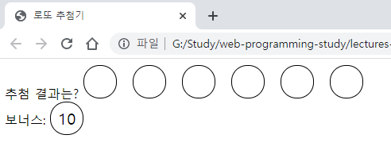

# 6장 타이머 사용하기_로또 추첨기

이 장에서는 비동기를 소개한다. 비동기는 동기의 반대말로, 실제로 코딩한 순서와 다르게 작동하는 코드를 비동기 코드라고 한다.
지금껏 사용했던 이벤트 리스너가 대표적인 비동기 코드이다. 비동기를 이용하여 로또 추첨기를 만들어보자


- [6.1 순서도 그리기](#61-순서도-그리기)
- [6.2 무작위로 공 뽑기](#62-무작위로-공-뽑기)
  - [1분 퀴즈 1번 문제](#1분-퀴즈-1번-문제)
- [6.3 공 정렬하기](#63-공-정렬하기)
  - [1분 퀴즈 2번 문제](#1분-퀴즈-2번-문제)
- [6.4 일정 시간 후에 실행하기](#64-일정-시간-후에-실행하기)
  - [1분 퀴즈 3번 문제](#1분-퀴즈-3번-문제)
- [6.5 타이머와 반복문 같이 사용하기](#65-타이머와-반복문-같이-사용하기)
- [마무리 요약](#마무리-요약)
  - [피셔-예이츠 셔플 알고리즘](#피셔-예이츠-셔플-알고리즘)
  - [sort](#sort)
  - [setTimeout](#settimeout)
  - [스코프](#스코프)
- [Self Check 공 색칠하기](#self-check-공-색칠하기)
  - [소스코드](#소스코드)
  - [결과](#결과)

## 6.1 순서도 그리기

로또 추첨기의 순서도는 간단하다. 1~45까지의 숫자를 중복되지 않게 7개를 뽑으면 된다. 그리고 뽑은 순서와 갯수에 따라 등수가 달라진다.

뽑은 공을 한 번에 보여주는 것이 아니라, 1초에 하나씩 보여주는 방식으로 구성한다.


## 6.2 무작위로 공 뽑기

1에서 45까지 숫자를 추첨하는 코드를 작성한다.

```html
<script>
  // 1~45까지 숫자의 배열을 만든다.
  const candidate = Array(45).fill().map((v, i) => i + 1);

  // 45개의 숫자를 섞는다.
  const shuffle = [];
  while (candidate.length > 0) {
    const random = Math.floor(Math.random() * candidate.length); // 무작위 인덱스 뽑기
    const spliceArray = candidate.splice(random, 1); // 뽑은 값은 배열에 들어 있음
    const value = spliceArray[0]; // 배열에 들어 있는 값을 꺼내어
    shuffle.push(value); // shuffle 배열에 넣기
  }
  console.log(shuffle);
</script>
```

`candidate` 배열에서 무작위로 뽑은 숫자를 `shuffle` 배열로 하나씩 옮긴다. `candidate` 배열의 길이가 0이 될 때까지 이를 반복한다. 이것이 **피셔-예이츠 셔플**(Fisher-Yates Shuffle)이라는 알고리즘이다.

### 1분 퀴즈 1번 문제

피셔-예이츠 셔플을 구현할 때 for 문 대신 while 문을 쓴 이유가 있습니다. while 문 대신 for 문으로 만들어 보고, 어느 때 while 문이 좋고, 어느 때 for 문이 좋은지 느껴보세요. 단, for 문에서 사용하는 변수 i의 시작 값이 candidate.length가 되게 해 보세요.

```js
for (let i = candidate.length; i > 0; i--) {
  const random = Math.floor(Math.random() * i);
  const spliceArray = candidate.splice(random, 1);
  const value = spliceArray[0];
  shuffle.push(value);
}
```

## 6.3 공 정렬하기

공 45개를 뽑았다. 현재 shuffle 안에 들어 있는 순서가 뽑은 순서이다. 이를 오름차순으로 정렬하기 위해 자바스크립트가 제공하는 배열의 정렬 메서드 `sort`를 사용한다.

```js
const candidate = Array(45).fill().map((v, i) => i + 1);
const shuffle = [];
for (let i = candidate.length; i > 0; i--) {
  const random = Math.floor(Math.random() * i);
  const spliceArray = candidate.splice(random, 1);
  const value = spliceArray[0];
  shuffle.push(value);
}
console.log(shuffle);

// 배열에서 0번째 인덱스 요소부터 6개까지(index 0~5)의 요소를 반환하고 정렬한다.
const winBalls = shuffle.slice(0, 6).sort((a, b) => a - b);
const bonus = shuffle[6];
console.log(winBalls, bonus);
```

sort 메서드 안에 함수가 들어 있다. 이 함수에 적힌 규칙에 따라 배열이 정렬된다. 이런 함수를 `비교 함수`라고 한다.

```js
(a, b) => a - b;
```

비교 함수의 매개변수로 a와 b가 주어질 때 반환값에 따라 배열이 다르게 정렬된다. 현재 비교 함수의 반환값은 a - b이다. a - b가 0보다 크면 b, a 순으로 정렬되고, a - b가 0보다 작으면 a, b 순서대로 정렬된다. 0이면 순서가 유지된다.

예를 들어 [1, 3, 16, 27, 44]라는 배열이 있을 때 44와 16을 뽑았다고 치겠다. a - b는 44 - 16는 28로 0보다 크다. 그래서 16, 44로 정렬한다. 배열에서 뽑을 수 있는 모든 쌍에 이를 적용하면 배열의 값들이 오름차순으로 정렬된다.

### 1분 퀴즈 2번 문제

오름차순으로 정렬했던 공을 내림차순으로 다시 정렬해 보세요.

나의 풀이는 아래와 같다.

```js
const winBalls = shuffle.slice(0, 6).sort((a, b) => b - a);
```

a - b가 오름차순이니 반대로 b - a는 내림차순이 된다.

## 6.4 일정 시간 후에 실행하기

이제 1초에 하나씩 뽑아 화면에 표시할 것이다. 자바스크립트에서는 `setTimeout`함수로 지정한 시간 뒤에 코드가 실행되게 할 수 있다.

```js
setTimeout(() => {
  // 내용
}, 밀리초);
```

이때 `setTimeout`안에 넣는 함수는 특정 작업(지정한 시간까지 기다리기) 이후에 추가로 실행되는 함수이므로 **콜백 함수**로 볼 수 있다.

두 번째 인수가 밀리초 단위이므로 원하는 초 단위로 바꾸기 위해서 1000을 곱해야 한다.

```js
...
console.log(winBalls, bonus);
const $result = document.querySelector('#result');
setTimeout(() => {
  const $ball = document.createElement('div');
  $ball.className = 'ball';
  $ball.textContent = winBalls[0];
  $result.appendChild($ball);
}, 1000);
```

HTML을 실행하면 다음과 같은 화면이 뜬다. 무작위로 뽑으므로 브라우저를 새로고침할 때 마다 공의 숫자가 달라진다.


타이머의 시간은 아쉽게도 정확하지 않다. 자바스크립트는 기본적으로 한 번에 한 가지 일만 할 수 있는 단일 스레드이다. 따라서 이미 많은 일을 하고 있다면 설정한 시간이 되어도 setTimeout에 지정된 작업이 수행되지 않는다. 기존에 하고 있던 일이 끝나야 setTimeout에 지정한 작업이 실행된다.

> 타이머와 관련된 자바스크립트 이벤트 루프에 대한 자세한 내용이 궁금하다면 아래 링크를 참고
> <https://developer.mozilla.org/ko/docs/Web/JavaScript/Event_loop>
> <https://ko.javascript.info/event-loop>

### 1분 퀴즈 3번 문제

3.5초 뒤에 다음 func 함수를 실행되게 해 보세요.

```js
function func() {
  console.log('hello');
}
```

나의 풀이는 다음과 같다.

```js
function func() {
  setTimeout(() => {
    console.log('hello');
  }, 3500);
}
```

setTimeout의 두 번째 인자는 밀리초라 3.5초를 위해 1000을 곱해서 3500으로 하면 된다.

## 6.5 타이머와 반복문 같이 사용하기

하나의 공이 화면에 표시되는 것을 확인했으나 7개의 공을 모두 화면에 표시해 보도록하자.
공 6개를 먼저 화면에 표시하고, 그 후에 보너스 공을 표시한다.

```js
...
console.log(winBalls, bonus);
const $result = document.querySelector('#result');
for (let i = 0; i < winBalls.length; i++) {
  setTimeout(() => {
    const $ball = document.createElement('div');
    $ball.className = 'ball';
    $ball.textContent = winBalls[i];
    $result.appendChild($ball);
  }, 1000 * (i + 1));
}

const $bonus = document.querySelector('#bonus');
setTimeout(() => {
  const $ball = document.createElement('div');
  $ball.className = 'ball';
  $ball.textContent = bonus;
  $bonus.appendChild($ball);
}, 7000);
```

일반 공을 뽑는 코드와 보너스 공을 뽑는 코드가 중복된다. 중복되는 것은 함수로 뽑아낸다. 중복되지 않는 것은 매개변수로 만든다.

```js
const $result = document.querySelector('#result');
function drawBall(number, $parent) {
  const $ball = document.createElement('div');
  $ball.className = 'ball';
  $ball.textContent = number;
  $parent.appendChild($ball);
}

for (let i = 0; i < winBalls.length; i++) {
  setTimeout(() => {
    drawBall(winBalls[i], $result);
  }, 1000 * (i + 1));
}

const $bonus = document.querySelector('#bonus');
setTimeout(() => {
  drawBall(bonus, $bonus);
}, 7000);
```

drawBall 함수를 만든 뒤 달라지는 부분인 숫자와 부모 태그를 각각 number, $parent 매개변수로 만들어서 코드가 더욱 깔끔해졌다.

실행하면 1초 마다 공을 뽑아서 화면에 표시한다.


앞서 작성한 반복문 부분을 잠깐 let에서 var로 바꿔보면 결과가 완전히 달라진다.

```js
for (var i = 0; i < winBalls.length; i++) {
  setTimeout(() => {
    console.log(winBalls[i], i);
    drawBall(winBalls[i], $result);
  }, 1000 * (i + 1));
}
```



보너스 공을 빼고 모든 공에 숫자가 뜨지 않는다. `winBalls[i]`와 `i`를 콘솔로 출력하면 모두 undefined 6으로 나온다.

모든 i가 6으로 나오는 차이는 바로 var와 let의 결정적인 차이이다.

변수는 **스코프**(scope, 범위)라는 것을 가진다. var는 함수 스코프, let은 블록 스코프를 가진다.

```js
function b() {
  var a = 1;
}
console.log(a); // Uncaught ReferenceError: a is not defined
```

a를 콘솔로 출력하면 에러가 발생한다. a는 함수 안에 선언된 변수이므로 함수 바깥에서는 접근할 수 없다. 이렇듯 함수를 경계로 접근 여부가 달라지는 것을 **함수 스코프**라고 한다.

이번에는 `if`문 안에 `var`를 넣어보자

```js
if (true) {
  var a = 1;
}
console.log(a); // 1
```

var는 함수 스코프(함수만 신경 씀)라서 if 문 안에 들어 있으면 바깥에서 접근할 수 있다.

```js
if (true) {
  let a = 1;
}
console.log(a); // Uncaught ReferenceError: a is not defined
```

`let`의 경우에는 에러가 발생한다. let은 **블록 스코프**(블록을 신경 씀)라서 그렇다.
블록은 if 문, for 문, while 문, 함수에서 볼 수 있는 `{}`를 의미한다. 블록 바깥에서는 블록 안에 있는 let에 접근할 수 없다. const도 let과 마찬가지로 블록 스코프를 가진다.

> 블록 스코프와 함수 스코프에 대해 자세한 내용이 궁금하다면 아래 링크를 참고
> <https://developer.mozilla.org/ko/docs/Web/JavaScript/Reference/Statements/block>
> <https://www.zerocho.com/category/JavaScript/post/5740531574288ebc5f2ba97e>
> <https://ko.javascript.info/closure>
> <https://poiemaweb.com/js-scope>

그러면 반복문에서 var를 사용한 결과가 다른 이유를 다시 살펴보자.

```js
for (var i = 0; i < winBalls.length; i++) {
  setTimeout(() => {
    console.log(winBalls[i], i);
    drawBall(winBalls[i], $result);
  }, 1000 * (i + 1));
}
```

`setTimeout`의 콜백 함수 안에 든 `i`와 바깥의 `1000 * (i + 1)`는 다른 시점에 실행된다.

`1000 * (i + 1)`는 반복문을 돌 때 실행되고, `setTimeout`의 콜백 함수는 지정한 시간 뒤에 호출된다. 그런데 반복문은 매운 빠른 속도로 돌아서 콜백 함수가 실행될 때는 이미 i가 6이 되어 있는다.

실행 순서는 아래와 같다.

i가 0일 때 setTimeout(콜백0, 1000) 실행
i가 1일 때 setTimeout(콜백1, 2000) 실행
i가 2일 때 setTimeout(콜백2, 3000) 실행
i가 3일 때 setTimeout(콜백3, 4000) 실행
i가 4일 때 setTimeout(콜백4, 5000) 실행
i가 5일 때 setTimeout(콜백5, 6000) 실행
i가 6이 됨
1초 후 콜백0 실행(i는 6)
2초 후 콜백1 실행(i는 6)
3초 후 콜백2 실행(i는 6)
4초 후 콜백3 실행(i는 6)
5초 후 콜백4 실행(i는 6)
6초 후 콜백5 실행(i는 6)

따라서 콜백 함수가 실행될 때 `i`를 콘솔로 출력하면 6이 나오게 된다. 그리고 `winBalls`는 인덱스가 5까지밖에 없으므로 `winBalls[6]`은 `undefined`가 된다.

그렇다면 왜 let을 쓸 때는 이러한 문제가 발생하지 않는지 let 코드를 보면서 분석해 보자

```js
for (let i = 0; i < winBalls.length; i++) {
  setTimeout(() => {
    drawBall(winBalls[i], $result);
  }, 1000 * (i + 1));
}
```

`for`문에서 쓰이는 `let`은 하나의 볼록마다 i가 고정된다. 이것도 블록 스코프의 특성이라고 보면 된다. 따라서 `setTimeout` 콜백 함수 내부의 `i`도 `setTimeout`을 호출할 때의 `i`와 같은 값이 들어간다.

반복문과 var를 쓸 때 항상 스코프 관련 문제가 생기는 것은 아니다. `setTimeout` 같은 비동기 함수와 반복문이 var를 만나면 이런 문제가 발생한다.

## 마무리 요약

### 피셔-예이츠 셔플 알고리즘

숫자를 무작위로 섞는 방법입니다. 먼저 무작위 인덱스를 하나 뽑은 후, 그에 해당되는 요소를 새로운 배열로 옮깁니다. 이를 반복하다 보면 새 배열에 무작위로 섞인 숫자들이 들어갑니다.

```js
// 1~45까지 숫자의 배열을 만든다.
const candidate = Array(45).fill().map((v, i) => i + 1);

// 45개의 숫자를 섞는다.
const shuffle = [];
while (candidate.length > 0) {
  const random = Math.floor(Math.random() * candidate.length); // 무작위 인덱스 뽑기
  const spliceArray = candidate.splice(random, 1); // 뽑은 값은 배열에 들어 있음
  const value = spliceArray[0]; // 배열에 들어 있는 값을 꺼내어
  shuffle.push(value); // shuffle 배열에 넣기
}
```

### sort

비교 함수에 적힌 내용대로 배열을 정렬하는 메서드입니다.

```js
배열.sort(비교 함수);
```

비교 함수는 다음과 같은 형태입니다.

```js
(a, b) => 반환값
```

반환값이 0보다 크면 b, a 순으로 정렬되고, 0보다 작으면 a, b 순으로 정렬됩니다.

### setTimeout

지정한 시간(밀리초) 뒤에 지정한 작업을 수행하는 타이머입니다.

```js
setTimeout(() => {
  // 내용
}, 밀리초);
```

### 스코프

var는 함수 스코프를, let은 블록 스코프를 가집니다. 함수, if 문, for 문에서 접근 범위의 차이를 보입니다. 또한, let을 사용할 때는 for 문 안에서 let 변수의 값이 고정되므로 var와는 실행결과가 달라집니다.

## Self Check 공 색칠하기

현재 모든 공이 흰색이라서 조금 심심해 보입니다. 숫자에 따라 색을 넣어 봅시다. 숫자가 10 미만이면 빨간색, 20 미만이면 주황색, 30 미만이면 노란색, 40 미만이면 파란색, 40부터는 초록색 공으로 만들고 싶습니다. 공이 빨간색, 파란색, 초록색일 때는 글자도 하얗게 만들면 알아보기 쉬울 것 같습니다.

힌트: 태그.style.CSS속성 = 값;을 하면 태그에 CSS 속성이 적용됩니다. CSS 속성으로는 backgroundColor가 배경색을 나타내고 color가 글자색을 나타냅니다.

기존의 코드에서 `drawBall` 함수의 내용만 바꿔주면 된다.

### 소스코드

```js
function drawBall(number, $parent) {
  const $ball = document.createElement('div');
  $ball.className = 'ball';
  $ball.textContent = number;

  // Self Check 공 색칠하기
  let backgroundColor = '#98D8AA'; // 숫자가 40 이상이면 녹색으로 적용
  let fontColor = 'white'; // 빨간색, 파란색, 초록색 공은 글자색 white
  if (number < 10) {
    backgroundColor = '#FF6D60';
  } else if (number < 20) {
    backgroundColor = '#F49D1A';
    fontColor = 'black';
  } else if (number < 30) {
    backgroundColor = '#F7D060';
    fontColor = 'black';
  } else if (number < 40) {
    backgroundColor = '#6DA9E4';
  }

  // 스타일 변경
  $ball.style.backgroundColor = backgroundColor;
  $ball.style.color = fontColor;

  $parent.appendChild($ball);
}
```

### 결과


