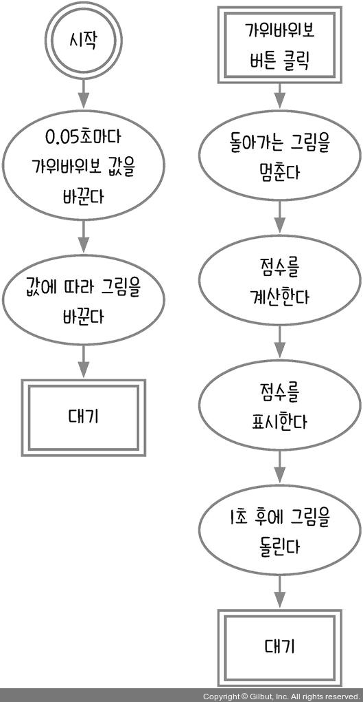
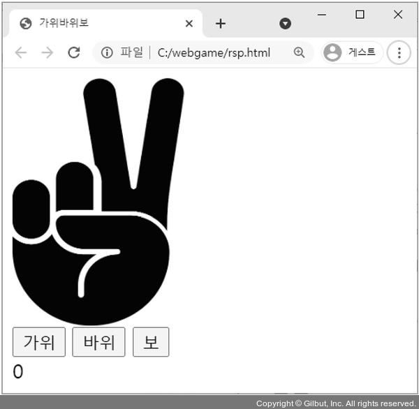
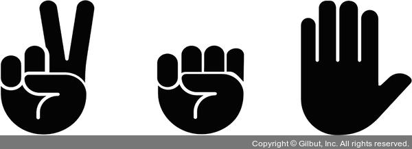

# 7장 객체 다루기_가위바위보 게임

컴퓨터와 가위바위보를 해서 몇 번 이겼는지 점수를 기록한다. 객체의 사용법을 익히고 타이머를 멈췄다가 재개하는 방법을 배운다.

## 7.1 순서도 그리기

가위, 바위, 보 버튼을 누르면 승부를 표시하기 위해 돌아가는 그림을 1초 동안 멈추도록 한다.



### 코드 작성

```html
<html>
<head>
  <meta charset="utf-8" />
  <title>가위바위보</title>
  <style>
    #computer {
      width: 142px;
      height: 200px;
    }
  </style>
</head>

<body>
<div id="computer"></div>
<div>
  <button id="scissors" class="btn">가위</button>
  <button id="rock" class="btn">바위</button>
  <button id="paper" class="btn">보</button>
</div>
<div id="score">0</div>
<script>
  const $computer = document.querySelector('#computer');
  const $score = document.querySelector('#score');
  const $rock = document.querySelector('#rock');
  const $scissors = document.querySelector('#scissors');
  const $paper = document.querySelector('#paper');
  const IMG_URL = './rsp.png';
  $computer.style.background = `url(${IMG_URL}) 0 0`;
  $computer.style.backgroundSize = 'auto 200px';
</script>
</body>
</html>
```

### 실행 결과



## 7.2 객체로 변수 묶기

IMG_URL 변수에 주어진 이미지는 다음과 같다.



이미지가 가위, 바위, 보로 각각 분리된 것이 아니라 하나의 이미지로 합쳐 있다. 서버에 이미지를 요청하는 횟수를 줄이기 위한 기법이다. 이렇게 이미지가 합쳐져 있는 것을 **이미지 스프라이트**(image sprite)라고 한다. 다만, 이미지가 하나로 합쳐져 있으므로 CSS와 Javascript로 적절히 잘라서 화면에 표시해야 한다.

background 속성은 `url(주소) x좌표 y좌표`로 구성되어있다.

```js
const IMG_URL = './rsp.png';
$computer.style.background = `url(${IMG_URL}) 0 0`; // 가위
$computer.style.background = `url(${IMG_URL}) -220px 0`; // 바위
$computer.style.background = `url(${IMG_URL}) -440px 0`; // 보
```

이미지가 매우 커서 이미지 크기를 조절한다. 가로는 auto, 세로는 200px로 설정했다.
`$computer.style.backgroundSize = 'auto 200px';`

가위는 x 좌표가 0(0px은 px 생략 가능), 바위는 -220px, 보는 -440px에 위치한다. y 좌표는 모두 0이다. 따라서 x 좌표를 변수에 저장하면 된다.
그런데 이 변수들은 x 좌표라는 공통점이 있다. 따라서 객체로 묶어서 표현하는 것이 좋다.

```js
...
$computer.style.backgroundSize = 'auto 200px';

const scissorsX = '0'; // 가위
const rockX = '-220px'; // 바위
const paperX = '-440px'; // 보

// 위 변수들을 객체로 묶어서 표현
const rspX = {
  scissors: '0', // 가위
  rock: '-220px', // 바위
  paper: '-440px', // 보
}
```

## 7.3 일정 시간마다 반복하기

이제 0.05초(50밀리초)마다 가위바위보 그림을 바꿔보자.

```js
...
const rspX = {
  scissors: '0', // 가위
  rock: '-220px', // 바위
  paper: '-440px', // 보
};

let computerChoice = 'scissors';
const changeComputerHand = () => {
  if (computerChoice === 'rock') {
    computerChoice = 'scissors';
  } else if (computerChoice === 'scissors') {
    computerChoice = 'paper';
  } else if (computerChoice === 'paper') {
    computerChoice = 'rock';
  }
  $computer.style.background = `url(${IMG_URL}) ${rspX[computerChoice]} 0`;
  $computer.style.backgroundSize = 'auto 200px';
}
```

`changeComputerHand`함수 내부를 보면 데이터를 수정하는 부분과 화면을 수정하는 부분이 나뉘어 있다. 데이터는 다른 곳에서 자주 재사용되므로 이렇게 데이터와 화면을 분리해서 프로그래밍하는 것이 좋다.

이제 `changeComputerHand`함수를 50밀리 초마다 실행해야 한다.

```js
const changeComputerHand = () => {
  ...
  $computer.style.backgroundSize = 'auto 200px';
  setTimeout(changeComputerHand, 50);
}
setTimeout(changeComputerHand, 50);
```

이와 같이 코드를 작성할 수도 있지만, 자바스크립트는 같은 효과를 내는 `setInterval`함수를 제공한다.

```js
setInterval(() => {
  // 내용
}, 밀리초);
```

`setTimeout`을 `setInterval`로 대체하면 아래와 같다.

```js
const changeComputerHand = () => {
  ...
  $computer.style.backgroundSize = 'auto 200px';
}
setInterval(changeComputerHand, 50);
```

이제 50밀리초(1초에 20번)마다 컴퓨터의 손 이미지가 바뀐다.

### 1분 퀴즈 1번 문제

다음 setInterval 함수를 같은 효과를 내는 setTimeout으로 바꿔 보세요.

```js
setInterval(() => {
  console.log('hello');
}, 1000);
```

나의 풀이는 아래와 같다.

```js
function repeatedHello() {
  console.log('hello');
  setTimeout(repeatedHello, 1000);
}
setTimeout(repeatedHello, 1000);
```

## 7.4 타이머 멈췄다 다시 실행하기

컴퓨터의 가위, 바위, 보는 반복하고 있으니 이제 버튼을 클릭해 컴퓨터와 대결하면 된다. 버튼을 클릭하는 순간 승부를 확인할 수 있게 잠깐 멈추는 기능을 추가한다.

`setInterval`함수를 취소할 수 있는 `clearInterval`함수가 있다.

```js
let 아이디 = setInterval(함수, 밀리초);
clearInterval(아이디);
```

`setInterval`함수는 타이머에 대한 아이디(숫자)를 반환한다. 이와 마찬가지로 `setTimeout`함수도 `clearTimeout`함수로 취소할 수 있다. 단, `setTimeout`함수에 인수로 넣은 함수가 실행되기 전에 `clearTimeout`을 호출해야 한다.

버튼을 클릭하면 `setInterval`이 멈췄다가 1초 뒤에 다시 실행하도록 추가한다.

```js
...
const changeComputerHand = () => {...}
let intervalId = setInterval(changeComputerHand, 50);
const clickButton = () => {
  clearInterval(intervalId);
  // 점수 계산 및 화면 표시
  setTimeout(() => {
    intervalId = setInterval(changeComputerHand, 50);
  }, 1000);
};
$rock.addEventListener('click', clickButton);
$scissors.addEventListener('click', clickButton);
$paper.addEventListener('click', clickButton);
```

다시 HTML을 실행해서 버튼을 누르면 그림이 멈췄다가 1초 뒤에 다시 돌아온다. 하지만 여기에 한 가지 버그가 있다. 그림이 멈춘 동안 버튼을 여러 번 클릭하면 1초 뒤에 그림이 평소보다 훨씬 더 빠르게 돌아간다.

그 이유는 버튼을 클릭할 때마다 각각 `setTimeout`타이머가 실행되기 때문이다. 버튼을 클릭할 때 `clearInterval`으로 실행중인 `setInterval`을 멈추지만 `setTimeout`을 멈추고 있지 않다. 따라서 버튼 누른 횟수만큼 `setTimeout`타이머가 실행되고 각각 1초 뒤에 setInterval을 하게 되어 그림이 매우 빠른 속도로 돌아간다.

이 현상을 막기 위해 그림이 멈춰 있는 동안 버튼을 클릭해도 `clickButton`함수가 호출되지 않게 하거나 `clickButton`함수를 호출해도 아무 일도 일어나지 않게 만들면 된다.

첫 번째 방법은 `removeEventListener`메서드를 사용하면 된다.

```js
function 함수() {}
태그.addEventListener('이벤트', 함수);
태그.removeEventListener('이벤트', 함수);
```

여기서 중요한 것은 이벤트를 등록할 때의 함수와 이벤트를 제거할 때의 함수가 같은 함수여야 한다. 두 메서드에 인수로 넣은 함수를 `===`로 비교할 때 true가 나와야 한다.

두 번째 방법으로 이벤트를 제거하는 대신에 함수가 아무 일도 하지 않게 만들어보자

```js
let clickable = true;
const clickButton = () => {
  if (clickable) {
    clearInterval(intervalId);
    clickable = false;
    // 점수 계산 및 화면 표시
    setTimeout(() => {
      clickable = true;
      intervalId = setInterval(changeComputerHand, 50);
    }, 1000);
  }
};
$rock.addEventListener('click', clickButton);
$scissors.addEventListener('click', clickButton);
$paper.addEventListener('click', clickButton);
```

### 1분 퀴즈 2번 문제

다음 이벤트 리스너를 removeEventListener 메서드로 제거해 보세요.

```js
const fun = (값) => () => { 
  console.log('고차 함수입니다', 값); 
}
태그.addEventListener('click', fun(1));
```

나의 풀이는 아래와 같다.

```js
const $body = document.querySelector('body');
const fun = (값) => () => {
  console.log('고차 함수입니다.', 값);
}

const higherOrderFunc = fun(4);
console.log(fun(4) === fun(4)); // false
$body.addEventListener('click', higherOrderFunc);
$body.removeEventListener('click', higherOrderFunc);
```

고차 함수는 새로운 함수를 리턴한다. 그래서 변수에 담아서 같은 함수를 재사용 할 수 있도록 해야한다.

## 7.5 가위바위보 규칙 찾기

이제 버튼을 클릭하면 점수를 계산해서 화면에 점수를 표시하는 부분만 구현하면 된다. 먼저 버튼을 클릭할 때 어떤 선택지를 클릭했는지를 알아야 한다. `event.target.textContent`를 사용하면 글자를 알아낼 수 있다.

```js
const clickButton = () => {
  if (clickable) {
    clearInterval(intervalId);
    clickable = false;
    const myChoice = event.target.textContent === '바위'
      ? 'rock'
      : event.target.textContent === '가위'
        ? 'scissors'
        : 'paper';
    setTimeout(() => {
      clickable = true;
      intervalId = setInterval(changeComputerHand, 50);
    }, 1000);
  }
};
```

다음으로 승부를 어떻게 결정할지 생각해야 한다. 가위바위보에는 무승부도 존재한다. 간단하게 if 문을 사용해서 모든 경우를 직접 코딩해도 된다. 하지만 코드가 너무 길어진다.

| 나\컴퓨터 | 가위 | 바위 | 보 |
|:-:|:-:|:-:|:-:|
| 가위 | 0 | 1 | 2 |
| 바위 | -1 | 0 | 1 |
| 보 | -2 | -1 | 0 |

가위바위보 점수 표를 보면서 규칙을 정리하면 무승부이면 0, 이기면 2 또는 -1, 지면 1또는 -2가 나온다. 승부를 판단하면 다음과 같이 코드를 줄일 수 있다.

```js
const scoreTable = {
  rock: 0,
  scissors: 1,
  paper: -1,
};

let clickable = true;
const clickButton = () => {
  if (clickable) {
    clearInterval(intervalId);
    clickable = false;
    const myChoice = event.target.textContent === '바위'
      ? 'rock'
      : event.target.textContent === '가위'
        ? 'scissors'
        : 'paper';
    const myScore = scoreTable[myChoice];
    const computerScore = scoreTable[computerChoice];
    const diff = myScore - computerScore;
    if ([2, -1].includes(diff)) { // diff === 2 || diff === -1와 같다.
      console.log('승리');
    } else if ([-2, 1].includes(diff)) {
      console.log('패배');
    } else {
      console.log('무승부');
    }
    setTimeout(() => {
      clickable = true;
      intervalId = setInterval(changeComputerHand, 50);
    }, 1000);
  }
};
```

`diff === 2 || diff === -1` 같은 OR 조건문은 `[2, -1].includes(diff)` 방식으로 코드를 더 간결하게 작성할 수 있다.

마지막으로 승리 시 1점, 패배 시 -1점을 주고 #score 태그에 메시지까지 표시하는 절차를 완성한다.