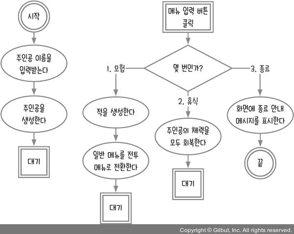
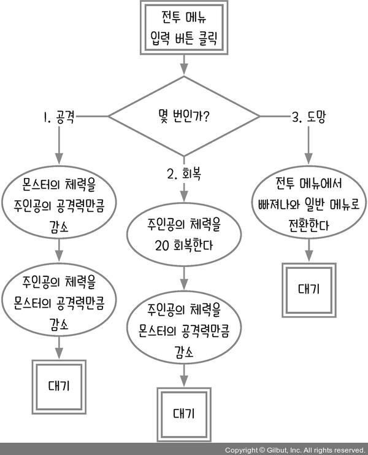
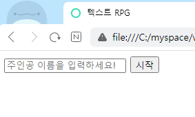
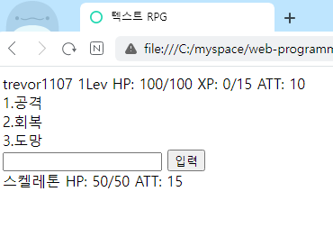

# 10장 클래스 다루기_텍스트 RPG

이 장에서는 텍스트 RPG를 만들면서 클래스 문법을 배운다. 주인공과 몬스터, 보스, 레벨업도 하는 게임이다.

## 10.1 순서도 그리기

게임에는 크게 두 가지 모드가 있다. 모험, 휴식, 종료 중에서 선택하는 일반 모드와 모험을 떠나 적을 만나면 전투를 벌이는 전투 모드이다. 전투 모드에서는 적을 공격하거나 체력을 회복하거나 도망간다.





지금까지 만든 게임 중에 순서도가 가장 복잡하다. 일반 모드와 전투 모드, 두 가지 경우를 순서도로 만들었기 때문이다. 먼저 첫 화면을 만들어 사용자에게 주인공 이름을 입력받아 캐릭터를 만들어보자.

```html
<!DOCTYPE html>
<html lang="ko">
<head>
  <meta charset="UTF-8">
  <meta http-equiv="X-UA-Compatible" content="IE=edge">
  <meta name="viewport" content="width=device-width, initial-scale=1.0">
  <title>텍스트 RPG</title>
</head>
<body>
  <form id="start-screen">
    <input id="name-input" placeholder="주인공 이름을 입력하세요!" />
    <button id="start">시작</button>
  </form>
  <div id="screen">
    <div id="hero-stat">
      <span id="hero-name"></span>
      <span id="hero-level"></span>
      <span id="hero-hp"></span>
      <span id="hero-xp"></span>
      <span id="hero-att"></span>
    </div>
    <form id="game-menu" style="display: none;">
      <div id="menu-1">1.모험</div>
      <div id="menu-2">2.휴식</div>
      <div id="menu-3">3.종료</div>
      <input id="menu-input" />
      <button id="menu-button">입력</button>
    </form>
    <form id="battle-menu" style="display: none;">
      <div id="battle-1">1.공격</div>
      <div id="battle-2">2.회복</div>
      <div id="battle-3">3.도망</div>
      <input id="battle-input" />
      <button id="battle-button">입력</button>
    </form>
    <div id="message"></div>
    <div id="monster-stat">
      <span id="monster-name"></span>
      <span id="monster-hp"></span>
      <span id="monster-att"></span>
    </div>
  </div>
  <script>
  </script>
  </body>
</html>
```



사용자가 주인공 이름을 입력하고 시작 버튼을 클릭하면 초기 화면을 일반 메뉴 화면으로 전환한다.

```html
<script>
  const $startScreen = document.querySelector('#start-screen');
  const $gameMenu = document.querySelector('#game-menu');
  const $battleMenu = document.querySelector('#battle-menu');
  const $heroName = document.querySelector('#hero-name');

  $startScreen.addEventListener('submit', (event) => {
    event.preventDefault();
    const name = event.target['name-input'].value;
    $startScreen.style.display = 'none';
    $gameMenu.style.display = 'block';
    $heroName.textContent = name;
  });
</script>
```

간단히 style 속성을 조작해 화면을 전환한다. 초기 화면을 숨기고(display: none) 일반 메뉴 화면을 보이면(display: block) 된다.

## 10.2 주인공과 몬스터 만들기

주인공의 이름만 입력받았을 뿐, 주인공의 정보는 아직 입력되지 않았다. 주인공의 정보와 몬스터들의 정보를 작성해보자.

```js
const $startScreen = document.querySelector('#start-screen');
const $gameMenu = document.querySelector('#game-menu');
const $battleMenu = document.querySelector('#battle-menu');
const $heroName = document.querySelector('#hero-name');
const $heroLevel = document.querySelector('#hero-level');
const $heroHp = document.querySelector('#hero-hp');
const $heroXp = document.querySelector('#hero-xp');
const $heroAtt = document.querySelector('#hero-att');
const $monsterName = document.querySelector('#monster-name');
const $monsterHp = document.querySelector('#monster-hp');
const $monsterAtt = document.querySelector('#monster-att');
const $message = document.querySelector('#message');
const hero = {
  name: '', // 이름
  lev: 1, // 레벨
  maxHp: 100, // 최대 체력
  hp: 100, // 현재 체력
  xp: 0, // 경험치
  att: 10, // 공격력
};
let monster = null;
const monsterList = [
  { name: '슬라임', hp: 25, att: 10, xp: 10 },
  { name: '스켈레톤', hp: 50, att: 15, xp: 20 },
  { name: '마왕', hp: 150, att: 35, xp: 50 },
];

$startScreen.addEventListener('submit', (event) => {
  event.preventDefault();
  const name = event.target['name-input'].value;
  $startScreen.style.display = 'none';
  $gameMenu.style.display = 'block';
  $heroName.textContent = name;
  $heroLevel.textContent = `${hero.lev}Lev`;
  $heroHp.textContent = `HP: ${hero.hp}/${hero.maxHp}`;
  $heroXp.textContent = `XP: ${hero.xp}/${15 * hero.lev}`;
  $heroAtt.textContent = `ATT: ${hero.att}`;
  hero.name = name;
});
```

객체 리터럴로 간단하게 주인공을 만들었다. hp가 0이 되면 게임 오버가 된다. xp가 일정 수준에 도달하면 레벨업되어 체력과 공격력이 올라간다. 몬스터 정보는 monsterList에 저장했다.

일반 메뉴에서 1번을 눌러 모험을 선택하면 화면이 전투 메뉴로 바뀌고 상대할 몬스터를 무작위로 선택한다. 이때 몬스터는 monsterList에서 가져온다.

```js
$gameMenu.addEventListener('submit', (event) => {
  event.preventDefault();
  const input = event.target['menu-input'].value;
  if (input === '1') {
    $gameMenu.style.display = 'none';
    $battleMenu.style.display = 'block';
    monster = JSON.parse(
      JSON.stringify(monsterList[Math.floor(Math.random() * monsterList.length)])
    );
    monster.maxHp = monster.hp;
    $monsterName.textContent = monster.name;
    $monsterHp.textContent = `HP: ${monster.hp}/${monster.maxHp}`;
    $monsterAtt.textContent = `ATT: ${monster.att}`;
  } else if (input === '2') {
  } else if (input === '3') {
  }
});
```

몬스터를 생성하는 코드를 보면 `JSON.parse`와 `JSON.stringify`라는 메서드를 사용했다. 원래 `parse`메서드는 문자열을 객체로, `stringify`메서드는 객체를 문자열로 만드는 메서드이다. 하지만 두 메서드를 조합해 사용하면 대상 객체를 **깊은 복사**(deep copy)할 수 있다.

여기서 **깊은 복사와 참조의 차이점**을 알아야 한다.

```js
const monster1 = JSON.parse(JSON.stringify(monsterList[0])); // 깊은 복사
const monster2 = monsterList[0]; // 얕은 복사
monster1.name = '새 몬스터';
console.log(monsterList[0].name); // 슬라임
monster2.name = '새 몬스터';
console.log(monsterList[0].name); // 새 몬스터
console.log(monsterList[0] === monster1); // false, 깊은 복사
console.log(monsterList[0] === monster2); // true, 참조 관계
```

참조는 얕은 복사로 인해서 발생하는데, 같은 메모리의 주솟값을 참조하여 서로의 데이터가 연결되어 공유된 상태라고 보면 된다. 복사된 객체나 배열의 내부 구조를 변경하면 원본도 함께 변경된다.

따라서 참조하는 경우와 깊은 복사하는 경우를 구별해서 사용해야 한다. 이 코드에서는 `monsterList`를 계속 재사용하므로 참조가 아니라 깊은 복사를 해야 한다.



### 제로초의 조언

간단한 객체는 JSON.parse(JSON.stringify(객체))를 사용해도 크게 문제는 없습니다. 다만, 성능도 느리고 함수나 Math, Date 같은 객체를 복사할 수 없다는 단점이 있습니다. 따라서 실무에서는 lodash 같은 라이브러리(다른 사람이 미리 만들어 둔 코드)를 사용하곤 합니다.

깊은 복사가 있다면 얕은 복사도 있겠죠? 얕은 복사(shallow copy)는 중첩된 객체가 있을 때 가장 바깥 객체만 복사되고, 내부 객체는 참조 관계를 유지하는 복사를 의미합니다. 말로 설명하면 복잡하니 코드로 살펴봅시다.

```js
const array = [{ j: 'k' }, { l: 'm' }];
const shallowCopy = [...array]; // 얕은 복사
console.log(array === shallowCopy); // false
console.log(array[0] === shallowCopy[0]); // true
```

얕은 복사를 할 때는 ... 연산자를 사용합니다. ... 연산자를 스프레드(spread) 문법이라고 하는데, 스프레드 문법은 기존 객체의 속성을 새 객체에 할당할 때 사용합니다. 배열이라면 [...배열]을 하면 되고, 객체라면 {...객체}를 하면 됩니다.

array와 shallowCopy 변수는 서로 다른데, array[0]과 shallowCopy[0]은 같습니다. 가장 바깥 객체는 복사되어 참조 관계가 끊어지므로 다른 값이 됩니다.

깊은 복사 및 참조와의 차이점도 알아봅시다.

```js
const reference = array; // 참조
const deepCopy = JSON.parse(JSON.stringify(array)); // 깊은 복사
console.log(array === reference); // true
console.log(array[0] === reference[0]); // true
console.log(array === deepCopy); // false
console.log(array[0] === deepCopy[0]); // false
```

얕은 복사는 깊은 복사와 참조의 중간에 위치한 복사 방법임을 알 수 있습니다.

> 깊은 복사와 얕은 복사에 대한 자세한 내용은 아래 링크를 참고
> <https://developer.mozilla.org/en-US/docs/Glossary/Deep_copy>
> <https://developer.mozilla.org/en-US/docs/Glossary/Shallow_copy>

### 1분 퀴즈 1번 문제는

다음 다섯 개의 값을 각각 복사해 보세요. 여기서 복사라고 함은 복사본을 수정할 때 원본이 바뀌지 않는 것을 의미합니다. 객체라면 복사한 객체 내부의 값을 바꿔도 원본 객체의 값이 바뀌지 않아야 합니다.

```js
const a = 'b';
const c = ['d', true, 1];
const e = { g: 'h' };
const i = [{ j: 'k' }, { l: 'm' }];
const n = { o: { p: 'q' }};
```

나의 풀이는 아래와 같다.

```js
const a = 'b';
const c = ['d', true, 1];
const e = { g: 'h' };
const i = [{ j: 'k' }, { l: 'm' }];
const n = { o: { p: 'q' }};

let deepA = a;
deepA = 10;
const deepC = [...c]; // c.slice()도 가능
deepC[0] = 'd->ddd';
const deepE = { ...e };
deepE.g = 'h->hhh';
const deepI = JSON.parse(JSON.stringify(i));
// const deepI = [{ ...i[0] }, { ...i[1] }]; // 이렇게도 가능
deepI[0].j = 'k->kkk';
const deepN = JSON.parse(JSON.stringify(n));
deepN.o.p = 'q->qqq';

console.log(a); // b
console.log(deepA); // 10
console.log(c); // ['d', true, 1]
console.log(deepC); // ['d->ddd', true, 1]
console.log(e); // {g: 'h'}
console.log(deepE); // {g: 'h->hhh'}
console.log(i); // [{j: 'k'}, {l: 'm'}]
console.log(deepI); // {j: 'k->kkk'}, {l: 'm'}
console.log(n); // { o: {p: 'q'} }
console.log(deepN); // { o: {p: 'q->qqq'} }
```

lodash 등 외부 라이브러리를 사용하지 않고 객체를 깊은 복사하려고 한다면, 아래와 같은 재귀 함수로도 가능하다. 객체, 배열, 클래스 자료형이 아닌 대부분의 자료형은 대입하면 깊은 복사가 된다.

```js
function deepCopy(obj) {
  let result = {};
  for (let key in obj) {
    if (typeof obj[key] === "object" && obj[key] !== null) {
      result[key] = deepCopy(obj[key]); // 재귀 호출
    } else {
      result[key] = obj[key];
    }
  }
  return result;
}
```

또한 `Object.assign`메서드를 이용하면 내부에 객체가 없는 일차원의 객체는 쉽게 깊은 복사를 할 수 있다. 다만 객체 내부에 객체가 있는 이차원 이상의 객체에 대해서는 얕은 복사가 된다.

```js
const obj = { a: 10, b: 'b', c: { d: 'good' } };
const shallowCopy = Object.assign({}, obj);
shallowCopy.a = 999;
shallowCopy.c.d = 'bad';
console.log(obj);
/* console.log(obj)
a: 10
b: "b"
c: {d: 'bad'} // 얕은 복사로 인해서 good에서 bad로 바뀜
*/

console.log(shallowCopy);
/* console.log(shallowCopy)
a: 999 // 깊은 복사로 인해 obj에는 변화가 없음
b: "b"
c: {d: 'bad'}
*/
```

> Object.assign에 대한 자세한 내용은 아래 링크를 참고
> <https://developer.mozilla.org/ko/docs/Web/JavaScript/Reference/Global_Objects/Object/assign>

## 10.3 서로 공격하기

이제 전투 모드에서 서로 공격을 주고받고, 회복하거나 도망가는 것을 구현하자. 주인공 객체와 몬스터 객체 간에 상호 작용하는 것을 함수로 구현하면 된다. 객체 안에 쓰인 함수는 **메서드**이다. `hero`객체에 메서드를 추가해보자.

```js
const hero = {
  name: '', // 이름
  lev: 1, // 레벨
  maxHp: 100, // 최대 체력
  hp: 100, // 현재 체력
  xp: 0, // 경험치
  att: 10, // 공격력
  attack(monster) {
    monster.hp -= this.att;
    this.hp -= monster.att;
  },
  heal(monster) {
    this.hp += 20;
    this.hp -= monster.att;
  },
};
```

몬스터를 공격하는 `attack`메서드와 체력을 회복하는 `heal`메서드를 추가했다. 객체의 메서드에서는 `function`예약어를 생략할 수 있다.

앞의 코드 attack 메서드는 다음 코드와 같다.

```js
attack: function(monster) {
  monster.hp -= this.att;
  this.hp -= monster.att;
}
```

처음 보는 `this`예약어에 당황하지 않았는가? 지금 상황에서 `this`는 객체 자신을 가리킨다. 즉 `hero`객체이다. 지금 상황이라고 표현한 이유는 `this`가 가리키는 것이 상황에 따라 달라지기 때문이다. 기본적으로 웹 브라우저에서 `this`는 `window` 객체를 가리킨다.

```js
function a() {
  console.log(this);
};
a(); // window 객체
```

`window` 객체는 브라우저를 가리키는 객체로, 브라우저가 제공하는 기본 객체와 함수들은 대부분 `window`객체 안에 들어있다. `document`나 `console`객체도 실제로는 `window.document`, `window.console`이다. `window`는 생략할 수 있어서 `document`와 `console`로만 적는 것이다.

객체에서 `this`를 사용할 때는 해당 객체를 가리킨다.

```js
const b = {
  name: '제로초',
  sayName() {
    console.log(this === b);
  }
};
b.sayName(); // true
```

앞에서 배운 내용을 기반으로 전투 메뉴를 구현해보자.

```js
$battleMenu.addEventListener('submit', (event) => {
  event.preventDefault();
  const input = event.target['battle-input'].value;
  if (input === '1') {
    hero.attack(monster);
    monster.attack(hero);
    $heroHp.textContent = `HP: ${hero.hp}/${hero.maxHp}`;
    $monsterHp.textContent = `HP: ${monster.hp}/${monster.maxHp}`;
    $message.textContent = `${hero.att}의 데미지를 주고, ${monster.att}의 데미지를 받았다.`;
  } else if (input === '2') {
  } else if (input === '3') {
  }
});
```

여기까지가 배운 내용으로 만들 수 있는 코드이다. 코드가 흩어져 있어서 어떤 부분에 어떤 코드를 써야 할지 헷갈린다. 이대로 가면 코드가 더욱더 복잡해진다. 이제 클래스를 도입해서 어떻게 코드를 깔끔하게 만들 수 있는지 배워보자.

## 10.4 클래스로 재구성하기

`클래스`(class)는 객체를 생성하기 위한 템플릿(서식)이다. 클래스는 2015년에 자바스크립트에 추가된 문법으로, 이전에는 함수로 객체를 만들었다. 함수로 어떻게 객체를 생성했는지 잠깐 살펴보자.

```js
function createMonster(name, hp, att, xp) {
  return { name, hp, att, xp };
}
const monster1 = createMonster('슬라임', 25, 10, 11);
const monster2 = createMonster('슬라임', 26, 10, 10);
const monster3 = createMonster('슬라임', 25, 11, 10);
```

가장 간단하게 객체를 반환하는 함수를 만들면 된다. 이와 같이 객체를 반환하는 함수를 **공장**(factory) **함수**라고 한다. 공장처럼 객체를 찍어낸다고 해서 붙은 이름이다.

여기서 중요한 점은 생성한 세 개의 객체가 서로 참조 관곅가 아닌 다른 객체여야 한다는 점이다. 같은 객체를 반환하면 하나의 몬스터를 잡았는데도 다른 두 마리가 같이 죽게 된다. 따라서 매번 새로운 객체를 반환하게 객체 리터럴로 작성하였다(또는 기존 객체를 깊은 복사해도 된다).

객체를 생성해보자.

```js
function Monster(name, hp, att, xp) {
  this.name = name;
  this.hp = hp;
  this.att = att;
  this.xp = xp;
}
const monster1 = new Monster('슬라임', 25, 10, 11);
const monster2 = new Monster('슬라임', 26, 10, 10);
```

객체의 속성을 `this`에 대입했다. 그리고 함수를 호출할 때는 함수 이름 앞에 `new`를 붙인다. `new`를 붙여 호출해도 `this`는 객체 자신을 가리킨다. 이렇게 `Monster`에 `new`를 붙여 호출하는 함수를 **생성자**(constructor) **함수**라고 한다. 실수로 `new`를 붙이지 않고 호출하면 `this`는 `window`가 되어 `window.name`의 값을 바꾸게 되니 반드시 `new`를 붙여 호출해야 한다.

생성자 함수의 이름은 보통 대문자로 시작한다. 필수는 아니지만, 자바스크립트 개발자들이 많이 사용하는 규칙이다. 8장에서 사용했던 `new Date`의 `Date`함수도 생성자 함수이다.

클래스 문법이 여기서 나온다. 자바스크립트는 생성자 함수를 조금 더 편하게 쓸 수 있도록 클래스 문법을 도입했다.

```js
class Monster {
  constructor(name, hp, att, xp) {
    this.name = name;
    this.hp = hp;
    this.att = att;
    this.xp = xp;
  }
}
const monster1 = new Monster('슬라임', 25, 10, 11);
const monster2 = new Monster('슬라임', 26, 10, 10);
```

`class` 예약어로 클래스를 선언하고, `constructor`메서드 안에 기존 코드를 넣으면 된다. 클래스에 `new`를 붙여 호출하면 `constructor`함수가 실행되고 객체가 반환된다. 여기서 `this`는 생성된 객체 자신을 가리킨다.

클래스 문법의 장점은 객체의 메서드를 같이 묶을 수 있다는 점이다.

```js
class Monster {
  constructor(name, hp, att, xp) {
    this.name = name;
    this.hp = hp;
    this.att = att;
    this.xp = xp;
  }
  attack(monster) {
    monster.hp -= this.att;
    this.hp -= monster.att;
  }
  heal(monster) {
    this.hp += 20;
    this.hp -= monster.att;
  }
}
```

그럼 공장 함수나 생성자 함수를 사용할 때와 비교해 보겠다.

```js
function createMonster(name, hp, att, xp) {
  return {
    name, hp, att, xp,
    attack(monster) {
      monster.hp -= this.att;
      this.hp -= monster.att;
    },
    heal(monster) {
      this.hp += 20;
      this.hp -= monster.att;
    },
  };
}
```

공장 함수 방식에 메서드를 추가했다. 클래스 문법과 똑같아 보이지만, 한 가지 큰 차이점은 공장 함수에서 객체를 생성할 때마다 `attack`과 `heal`메서드도 같이 새로 생성된다. 클래스 문법에서는 한번 만든 `attack`과 `heal`메서드는 계속 재사용한다. 재사용해도 되는 메서드를 새로 만들어내는 것을 비효율적이다.

이번에는 생성자 함수 방식에 메서드를 추가해보자.

```js
function Monster(name, hp, att, xp) {
  this.name = name;
  this.hp = hp;
  this.att = att;
  this.xp = xp;
}
Monster.prototype.attack = function(monster) {
  monster.hp -= this.att;
  this.hp -= monster.att;
};
Monster.prototype.heal = function(monster) {
  this.hp += 20;
  this.hp -= monster.att;
};
```

이번에는 `prototype`이라는 새로운 속성이 나왔다. 생성자 함수에 메서드를 추가할 때는 `prototype`이라는 속성 안에 추가해야 한다. `prototype`속성 안에 추가한 메서드를 **프로토타입 메서드**라고 한다. 이렇게 하면 공장 함수와는 달리 `attack`과 `heal`메서드를 재사용한다. 다만, 생성자 함수와 프로토타입 메서드가 하나로 묶여 있지 않다.

이런 문제점을 모두 해결한 것이 클래스 문법이다. 생성자 함수와 메서드가 묶여 있어서 보기에도 편하고 메서드 함수를 매번 재생성해야 하는 문제도 발생하지 않는다.

이제 클래스 문법을 활용해 텍스트 RPG를 다시 구성해보자. 주인공, 몬스터, 게임을 클래스로 만든다. 그리고 게임 클래스에 주인공과 몬스터는 속성이 된다. 게임을 시작하는 것, 메뉴를 바꾸는 것, 게임을 종료하는 것 모두 게임 클래스의 메서드가 된다.

```html
<script>
  const $startScreen = document.querySelector('#start-screen');
  const $gameMenu = document.querySelector('#game-menu');
  const $battleMenu = document.querySelector('#battle-menu');
  const $heroName = document.querySelector('#hero-name');
  const $heroLevel = document.querySelector('#hero-level');
  const $heroHp = document.querySelector('#hero-hp');
  const $heroXp = document.querySelector('#hero-xp');
  const $heroAtt = document.querySelector('#hero-att');
  const $monsterName = document.querySelector('#monster-name');
  const $monsterHp = document.querySelector('#monster-hp');
  const $monsterAtt = document.querySelector('#monster-att');
  const $message = document.querySelector('#message');

  class Game {
    constructor(name) {
      this.monster = null;
      this.hero = null;
      this.monsterList = [
        { name: '슬라임', hp: 25, att: 10, xp: 10 },
        { name: '스켈레톤', hp: 50, att: 15, xp: 20 },
        { name: '마왕', hp: 150, att: 35, xp: 50 },
      ];
    }
  }
  class Hero {
    constructor(game, name) {
      this.game = game;
      this.name = name;
      this.lev = 1;
      this.maxHp = 100;
      this.hp = 100;
      this.xp = 0;
      this.att = 10;
    }
    attack(target) {
      target.hp -= this.att;
    }
    heal(monster) {
      this.hp += 20;
      this.hp -= monster.att;
    }
  }
  class Monster {
    constructor(game, name, hp, att, xp) {
      this.game = game;
      this.name = name;
      this.maxHp = hp;
      this.hp = hp;
      this.xp = xp;
      this.att = att;
    }
    attack(target) {
      target.hp -= this.att;
    }
  }

  let game = null;
  $startScreen.addEventListener('submit', (event) => {
    event.preventDefault();
    const name = event.target['name-input'].value;
    game = new Game(name);
  });
</script>
```

클래스로 전환하면서 이전에 작업했던 것이 지워졌기 때문에 아무런 작동을 하지 않을 것이다.

`Game`, `Hero`, `Monster` 세 개의 클래스를 만들고 주인공 이름을 입력 받는다. `new Game`을 하게 되면 `Game`클래스의 `constructor`메서드가 실행되고 `monster`, `hero`, `monsterList`속성을 만든다.

`Game`클래스 안에 기본 메서드를 만들어 보자. 게임을 시작하는 `start`메서드, 게임을 종료하는 `quit`메서드, 화면을 전환하는 `changeScreen`메서드, 일반 메뉴를 담당하는 `onGameMenuInput`메서드, 전투 메뉴를 담당하는 `onBattleMenuInput`메서드를 만든다. 객체의 메서드는 `this`를 통해 서로 호출할 수 있다.

```js
class Game {
  constructor(name) {
    this.monster = null;
    this.hero = null;
    this.monsterList = [
      { name: '슬라임', hp: 25, att: 10, xp: 10 },
      { name: '스켈레톤', hp: 50, att: 15, xp: 20 },
      { name: '마왕', hp: 150, att: 35, xp: 50 },
    ];
    this.start();
  }
  start() {
    $gameMenu.addEventListener('submit', this.onGameMenuInput);
    $battleMenu.addEventListener('submit', this.onBattleMenuInput);
    this.changeScreen('game');
  }
  changeScreen(screen) {
    if (screen === 'start') {
      $startScreen.style.display = 'block';
      $gameMenu.style.display = 'none';
      $battleMenu.style.display = 'none';
    } else if (screen === 'game') {
      $startScreen.style.display = 'none';
      $gameMenu.style.display = 'block';
      $battleMenu.style.display = 'none';
    } else if (screen === 'battle') {
      $startScreen.style.display = 'none';
      $gameMenu.style.display = 'none';
      $battleMenu.style.display = 'block';
    }
  }
  onGameMenuInput = (event) => {
    event.preventDefault();
    const input = event.target['menu-input'].value;
    if (input === '1') { // 모험
      this.changeScreen('battle');
    } else if (input === '2') { // 휴식
    } else if (input === '3') { // 종료
    }
  }
  onBattleMenuInput = (event) => {
    event.preventDefault();
    const input = event.target['battle-input'].value;
    if (input === '1') { // 공격
    } else if (input === '2') { // 회복
    } else if (input === '3') { // 도망
    }
  }
}
```

`#game-menu`와 `#battle-menu`의 `submit`이벤트 리스너를 메서드 내부에 연결한 이유는 `onGameMenuInput`과 `onBattleMenuInput`이 `Game`클래스의 메서드이기 때문이다.

```js
start() {
  $gameMenu.addEventListener('submit', this.onGameMenuInput);
  $battleMenu.addEventListener('submit', this.onBattleMenuInput);
  this.changeScreen('game');
}
```

`Game`클래스 밖에서 `this`는 `window`이니까 문제가 된다. 또 한 가지 특이한 점은 `onGameMenuInput`과 `onBattleMenuInput`만 화살표 함수로 되어 있다. 이것은 this 및 콜백 함수의 특성과 관련이 있다. 다음 코드를 콘솔에 입력해 보자.

```js
document.addEventListener('click', function() {
  console.log(this); // document
});
```

그러고 나서 화면을 클릭하면 `this`가 `document`를 출력한다.

앞에서 `this`를 설명할 때 this는 기본적으로 `window`라고 했는데, 이번에는 어째서 `document`일까? 이번에는 함수 선언문을 화살표 함수로 바꿔보자(코드 입력 전에 새로고침).

```js
document.addEventListener('click', () => {
  console.log(this); // window
});
```

화면을 클릭하면 `window`가 출려된다.

함수 선언문일 때만 `document`가 나오는 이유는 `click`이벤트가 발생하면 `addEventListener`메서드가 콜백 함수의 `this`를 `event.target`으로 바꿔서 호출하기 때문이다.

함수 선언문의 this는 다음과 같이 bind 메서드를 사용해서 직접 바꿀 수 있다.

```js
function a() {
  console.log(this);
}
a.bind(document)(); // document
```

화살표 함수는 `bind`를 할 수 없다. 따라서 `this`가 바뀌지 않아 `window`가 그대로 나온다.

```js
const b = () => {
  console.log(this);
}
b.bind(document)(); // window
```

이런 이유로 `addEventListener`안에서 함수 선언문을 사용하면 `document`가 출력되고, 화살표 함수를 사용하면 `window`가 출력되는 것이다.

`onGameMenuInput`과 `onBattleMenuInput`이 화살표 함수여야 하는 이유도 같다. 객체의 `this`를 가리키게 하기 위해서이다.

화살표 함수의 `this`가 무조건 `window`라고 오해할 수 있는데, 화살표 함수는 기존 `this`를 유지할 뿐 `this`를 어떤 값으로 바꾸지는 않는다. 따라서 앞의 코드에서는 기존 `this`를 유지해 `onGameMenuInput`메서드 안에서도 `this`가 `Game`객체가 되게 한다.

모든 콜백 함수의 `this`가 다른 값으로 바뀌는 것도 아니다. 따라서 `this`를 바꾸는 함수나 메서드를 볼 때마다 따로 외우고 있어야 한다.

> this에 대한 자세한 내용은 아래 링크를 참고
> <https://developer.mozilla.org/ko/docs/Web/JavaScript/Reference/Operators/this>
> <https://web.dev/i18n/ko/javascript-this/>

이제 클래스 간에 상호 작용을 시작해 보겠다.